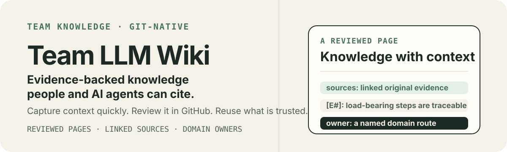
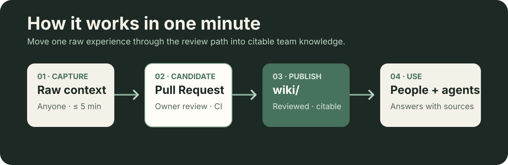
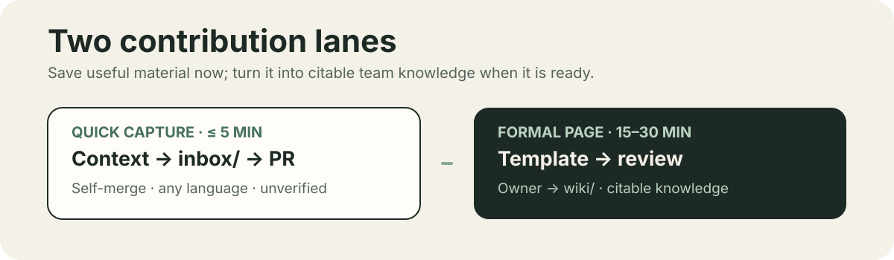
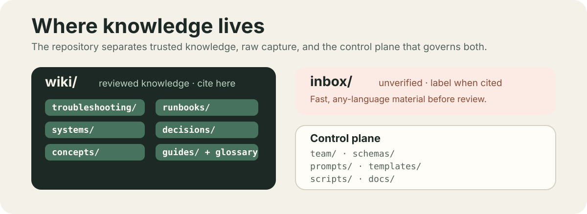
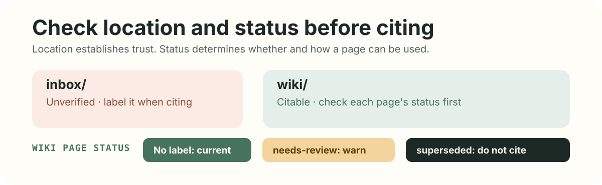

# Team LLM Wiki

> 中文版: [README.zh-CN.md](README.zh-CN.md)

<p align="center">
  
</p>

> A git-managed, evidence-backed team knowledge base. Capture production context quickly, review it through pull requests, and give people and AI agents knowledge they can cite.

## Start here

| If you want to… | Do this |
| --- | --- |
| **Find an answer** | Ask an agent connected to this repository. It reads [`INDEX.md`](INDEX.md), searches `wiki/`, reads the full page, and answers with citations. |
| **Save something useful** | Create `inbox/YYYY-MM-DD-<slug>.md` with the context in any language, then open and self-merge a PR. See [`prompts/capture.md`](prompts/capture.md). |
| **Publish trusted knowledge** | Copy a page type from [`templates/`](templates/), follow [`schemas/frontmatter.md`](schemas/frontmatter.md), and open a PR for the domain owner in [`team/people.md`](team/people.md). |

## How it works in one minute

<p align="center">
  
</p>

1. **Capture** raw material in `inbox/` in five minutes or less. It is intentionally unverified and needs no frontmatter.
2. **Review** the candidate in a GitHub pull request. Review notes, revisions, and the decision stay with the change.
3. **Publish** the approved page to `wiki/`. That is the only location agents may cite without a caveat.
4. **Maintain** the corpus in a biweekly gardening session: an agent drafts one maintenance PR and a rotating human gardener reviews it.

This keeps the low-friction path separate from the trusted path: `inbox/` is a dump, the PR is the candidate layer, and `wiki/` is reviewed team knowledge.

## Find answers

- **With AI**: use Copilot Chat / Copilot Space, Claude Code, opencode, or an internal model wired to [`prompts/query.md`](prompts/query.md). If no wiki page answers the question, the agent returns `unknown` and suggests which page should exist.
- **Without AI**: open [`INDEX.md`](INDEX.md) (one line per page) or use GitHub web search.

All supported agent entry points converge on [`AGENTS.md`](AGENTS.md): `.github/copilot-instructions.md` for Copilot, `CLAUDE.md` for Claude Code, and `AGENTS.md` for opencode/Codex and the de-facto standard.

## Contribute

<p align="center">
  
</p>

| Lane | When | How | Cost |
| --- | --- | --- | --- |
| **Quick capture** | You just solved an issue, had a useful discussion, or learned something worth keeping | Create `inbox/YYYY-MM-DD-<slug>.md` with context (any language, no frontmatter), open a PR, and **merge it yourself**. Or hand the material to an agent using [`prompts/capture.md`](prompts/capture.md). | ≤ 5 min |
| **Formal page** | The content is mature enough to become team knowledge | Copy the matching [`templates/`](templates/) page, fill its frontmatter using [`schemas/frontmatter.md`](schemas/frontmatter.md), then open a PR for the domain owner in [`team/people.md`](team/people.md). | 15–30 min |

You do not need to follow up on inbox entries. The gardening session promotes mature entries into `wiki/`; agents draft the changes and owners approve them.

## Bring in external content

Your job is only to deliver the content to an agent; converting and structuring it into Markdown is the agent's job.

1. **Copy-paste (covers ~90%)**: open the Confluence page, select all, and paste it into the agent chat. Lost formatting is fine; the agent restructures it against a template.
2. **Export a file**: export to Word, PDF, or View Storage Format, then drop the file into the chat or provide its path.
3. **Atlassian MCP**: if approved by your company, configure it once in your agent client; afterward the agent can fetch a pasted URL itself.

Describe important screenshots in words and link the originals in `sources:`. Do not bulk-mirror a whole space: migrate individual pages only when they are repeatedly needed, then make the wiki page authoritative and mark the old Confluence page as no longer maintained. See the worked dialogue examples in [`docs/llm-wiki-architecture-v3/05-工作流场景图解.md`](docs/llm-wiki-architecture-v3/05-工作流场景图解.md).

## What lives where

<p align="center">
  
</p>

| Path | Content |
| --- | --- |
| `wiki/troubleshooting/` | Production issues: symptoms → root cause → resolution |
| `wiki/runbooks/` | Operational procedures: preconditions → steps → verification → rollback |
| `wiki/systems/` | System pages: boundaries, dependencies, owners, known pitfalls |
| `wiki/decisions/` | Decision records (lightweight ADR) |
| `wiki/concepts/` | Domain concepts and background knowledge |
| `wiki/guides/` | How-tos and team practices |
| [`wiki/glossary.md`](wiki/glossary.md) | Team terms, one-line definitions |
| `inbox/` | Unreviewed quick captures (unverified, any language) |
| [`team/people.md`](team/people.md) | staff-id ↔ GitHub ↔ owned-domain routing table |
| [`schemas/`](schemas/) | Field rules, taxonomy, and source conventions |
| [`prompts/`](prompts/) | Task protocols: capture, query, and gardening |
| [`templates/`](templates/) | Bilingual page skeletons, one per page type |
| [`scripts/`](scripts/) | Dependency-free schema checks and index generation |
| [`docs/`](docs/) | Architecture docs, CI plan, and design history — not team knowledge |

## Trust and evidence

<p align="center">
  
</p>

- **Location is trust**: `wiki/` is citable; `inbox/` must be labeled unverified; `docs/` documents this repository itself.
- **Status has three states**: absent = current; `needs-review` = doubtful and needs a warning when cited; `superseded` = never cite — follow `superseded_by` instead.
- **Runbooks and troubleshooting pages carry evidence**: `sources:` links, verbatim Source excerpts, `[E#]` markers for load-bearing steps, an optional `verified:` date, and an Unevidenced claims list in agent-drafted PRs.

Read the complete rules in [`schemas/frontmatter.md`](schemas/frontmatter.md) and the agent protocol in [`AGENTS.md`](AGENTS.md).

## Local checks and CI

```bash
npm run check         # required fields, enums, links, owners, and supersede cycles
npm run build-index   # regenerate INDEX.md
```

The scripts require Node.js ≥ 22.6 and no `npm install`. `INDEX.md` staleness is a warning; a CI bot rebuilds it on `main`.

The merge gate is `npm run check` in the root [`Jenkinsfile`](Jenkinsfile) (J1). [`docs/ci.md`](docs/ci.md) also defines index rebuild on `main` (J2) and a gardening watchdog that alerts after 21 days without a maintenance PR (J3). The matching `.github/workflows/` files are reference implementations for environments that use GitHub Actions.

## Governance and language

- Formal knowledge changes through PRs only; domain ownership is enforced by CODEOWNERS. See [`docs/branch-protection.md`](docs/branch-protection.md).
- Every two weeks, an agent produces one maintenance PR under [`prompts/gardening.md`](prompts/gardening.md); a rotating gardener reviews and merges it.
- For a 150–200 person organization, plan for 15–25 seed or active contributors on the supply side and everyone on the consume side.
- Formal content (`wiki/`, control plane, `INDEX.md`, commit and PR text) is English. `inbox/` captures may be Chinese or mixed and are translated when compiled. Verbatim evidence remains in its original language with a one-line English gloss.
- [`README.zh-CN.md`](README.zh-CN.md) is the maintained Chinese mirror and the only sanctioned Chinese formal file.

## Design docs

Architecture, rationale for removed concepts, phase plans with upgrade triggers, workflow walkthroughs, and the adversarial review live in [`docs/llm-wiki-architecture-v3/`](docs/llm-wiki-architecture-v3/).
