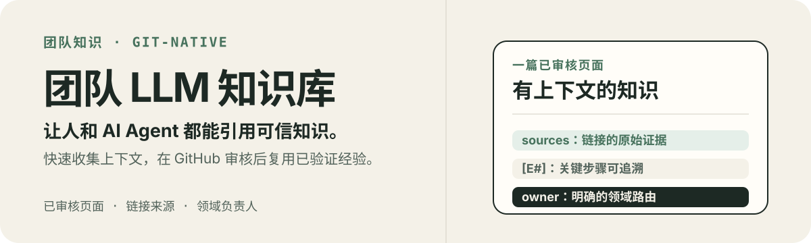
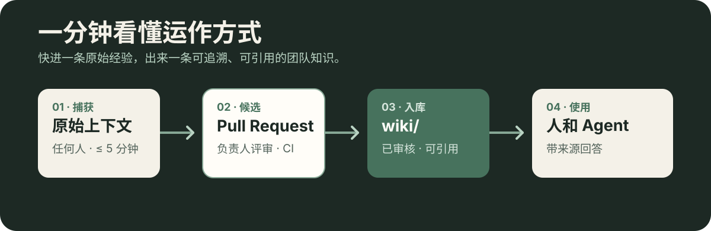
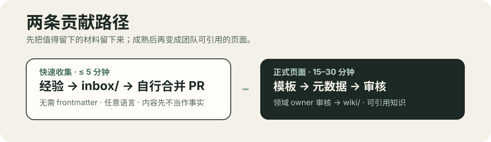
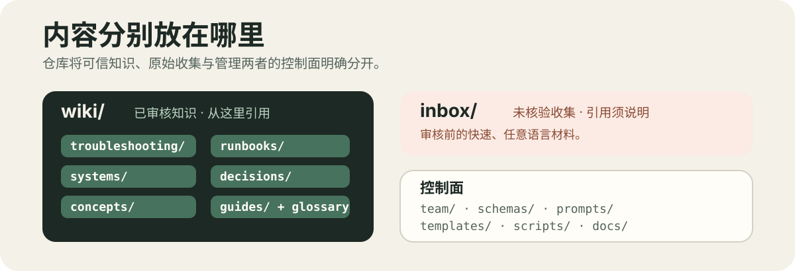
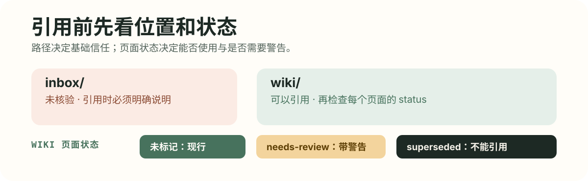

# Team LLM Wiki（中文版）

> English version: [README.md](README.md)
>
> 本文件是 README 的中文镜像，也是语言政策下唯一的中文正式文件；两份如有出入，以英文版为准。

<p align="center">
  
</p>

> 一个由 Git 管理、以证据为基础的团队知识库。快速收集生产上下文，经 Pull Request 审核后，让人和 AI Agent 都能引用可信知识。

## 从这里开始

| 你想要… | 这样做 |
| --- | --- |
| **找到答案** | 向接入本仓库的 agent 提问。它会读取 [`INDEX.md`](INDEX.md)、搜索 `wiki/`、阅读页面全文，并带引用回答。 |
| **保存有价值的内容** | 在 `inbox/YYYY-MM-DD-<slug>.md` 记录上下文，语言不限；然后开 PR 并自行合并。参见 [`prompts/capture.md`](prompts/capture.md)。 |
| **发布可信知识** | 从 [`templates/`](templates/) 复制页面类型，遵循 [`schemas/frontmatter.md`](schemas/frontmatter.md)，并向 [`team/people.md`](team/people.md) 中的领域负责人发起 PR。 |

## 一分钟看懂运作方式

<p align="center">
  
</p>

1. **捕获**：在五分钟内把原始材料放进 `inbox/`。它有意保持未核验状态，支持任意语言，也不需要 frontmatter。
2. **快速收集**：通过自行合并、无需审核的 PR 提交；内容仍留在 `inbox/`，尚不是团队知识。
3. **审核**：正式页面在 GitHub Pull Request 中经过领域 owner 审核和 CI 校验后，才成为英文 `wiki/` 页面。
4. **使用**：人通过 `INDEX.md` 或 GitHub 查找，Agent 给出带引用的回答；没有答案时，Agent 返回 `unknown` 并建议建页。
5. **维护**：每两周举行一次园艺维护：agent 起草一个维护 PR，轮值园丁审核它。

这条流程把低门槛路径与可信路径分开：`inbox/` 是原始材料区，PR 是候选层，`wiki/` 是已审核团队知识。

## 查找答案

- **使用 AI**：使用 Copilot Chat / Copilot Space、Claude Code、opencode，或接入 [`prompts/query.md`](prompts/query.md) 的内部模型。如果 wiki 无法回答，agent 会返回 `unknown` 并建议应补充哪种页面。
- **不使用 AI**：打开 [`INDEX.md`](INDEX.md)（每页一行）或使用 GitHub 网页搜索。

所有支持的 agent 入口都汇聚到 [`AGENTS.md`](AGENTS.md)：Copilot 使用 `.github/copilot-instructions.md`，Claude Code 使用 `CLAUDE.md`，opencode/Codex 和事实标准使用 `AGENTS.md`。

## 贡献

<p align="center">
  
</p>

| 路径 | 什么时候用 | 怎么做 | 成本 |
| --- | --- | --- | --- |
| **快速收集** | 刚解决一个问题、得到一段有价值的讨论，或学到值得留下的经验 | 在 `inbox/YYYY-MM-DD-<slug>.md` 写明上下文（任何语言、无需 frontmatter），开 PR 后**自行合并**。也可以按 [`prompts/capture.md`](prompts/capture.md) 把材料交给 agent。 | ≤ 5 分钟 |
| **正式页面** | 内容已经成熟，应成为团队知识 | 从 [`templates/`](templates/) 复制相应页面，按 [`schemas/frontmatter.md`](schemas/frontmatter.md) 填写 frontmatter，再向 [`team/people.md`](team/people.md) 中的领域负责人发起 PR。 | 15–30 分钟 |

inbox 条目无需你持续跟进。园艺维护会将成熟的条目晋升进 `wiki/`：agent 起草改动，负责人审批。

## 引入外部内容

你的工作只是把内容交给 agent；转换为 Markdown 并结构化是 agent 的工作。

1. **复制粘贴（约覆盖 90% 情况）**：打开 Confluence 页面，全选后粘贴进 agent 对话。格式丢失没有关系，agent 会按模板重组内容。
2. **导出文件**：导出 Word、PDF 或 View Storage Format，然后把文件拖入对话或提供路径。
3. **Atlassian MCP**：如果公司批准，在 agent 客户端配置一次；之后粘贴 URL 即可让 agent 自行获取。

重要截图应使用文字描述，并在 `sources:` 中链接原始材料。不要批量镜像整个空间：只迁移被反复使用的单页；迁移后使 wiki 页面成为权威，并将旧 Confluence 页面标为不再维护。参见 [`docs/llm-wiki-architecture-v3/05-工作流场景图解.md`](docs/llm-wiki-architecture-v3/05-工作流场景图解.md) 的完整对话示例。

## 内容分别放在哪里

<p align="center">
  
</p>

| 路径 | 内容 |
| --- | --- |
| `wiki/troubleshooting/` | 生产问题：症状 → 根因 → 解决方案 |
| `wiki/runbooks/` | 操作流程：前置条件 → 步骤 → 验证 → 回滚 |
| `wiki/systems/` | 系统页面：边界、依赖、负责人、已知风险 |
| `wiki/decisions/` | 决策记录（轻量 ADR） |
| `wiki/concepts/` | 领域概念与背景知识 |
| `wiki/guides/` | 操作指南和团队实践 |
| [`wiki/glossary.md`](wiki/glossary.md) | 团队术语与一行定义 |
| `inbox/` | 未审核的快速收集（未核验，任何语言） |
| [`team/people.md`](team/people.md) | staff-id ↔ GitHub ↔ 领域负责人路由表 |
| [`schemas/`](schemas/) | 字段规则、分类法和来源约定 |
| [`prompts/`](prompts/) | 任务协议：收集、查询和园艺维护 |
| [`templates/`](templates/) | 双语页面骨架，每种页面类型一个 |
| [`scripts/`](scripts/) | 无依赖的 schema 校验和索引生成 |
| [`docs/`](docs/) | 架构文档、CI 计划和设计历史——不是团队知识 |

## 信任与证据

<p align="center">
  
</p>

- **位置就是信任**：`wiki/` 可以引用；`inbox/` 被引用时必须标记为未核验；`docs/` 记录的是本仓库本身。
- **状态有三种**：未标记 = 现行；`needs-review` = 存疑，引用时需要警告；`superseded` = 绝不能引用，应改为沿 `superseded_by` 查找。
- **Runbook 和 troubleshooting 页面必须附带证据**：`sources:` 链接、原文 Source excerpts、关联关键步骤的 `[E#]` 标记、可选的 `verified:` 日期，以及 agent 起草 PR 中的 Unevidenced claims 列表。

完整规则见 [`schemas/frontmatter.md`](schemas/frontmatter.md)，agent 协议见 [`AGENTS.md`](AGENTS.md)。

## 本地校验与 CI

```bash
npm run check         # 必填字段、枚举、链接、负责人和 supersede 环
npm run build-index   # 重新生成 INDEX.md
```

脚本要求 Node.js ≥ 22.6，且无需 `npm install`。`INDEX.md` 过期只是警告，CI bot 会在 `main` 重建它。

PR 合并门禁是根目录 [`Jenkinsfile`](Jenkinsfile) 中的 `npm run check`（J1）。[`docs/ci.md`](docs/ci.md) 还定义了 `main` 上的索引重建（J2）和园艺看门狗（连续 21 天没有维护 PR 时告警，J3）。匹配的 `.github/workflows/` 文件是使用 GitHub Actions 环境的参考实现。

## 治理与语言

- 正式知识只能通过 PR 修改；领域所有权由 CODEOWNERS 强制。参见 [`docs/branch-protection.md`](docs/branch-protection.md)。
- 每两周，agent 会按 [`prompts/gardening.md`](prompts/gardening.md) 产出一个维护 PR；轮值园丁审核并合并。
- 面向 150–200 人组织时，供给侧宜有 15–25 名种子或活跃贡献者，消费侧为所有人。
- 正式内容（`wiki/`、控制面、`INDEX.md`、commit 和 PR 文本）使用英语。`inbox/` 内容可为中文或混合语言，编译时再翻译；证据原文保留其原始语言，并附一行英文解释。
- [`README.zh-CN.md`](README.zh-CN.md) 是维护中的中文镜像，也是唯一获准使用中文的正式文件。

## 设计文档

架构、移除概念的理由、带升级触发器的阶段计划、工作流图解和对抗性审查都在 [`docs/llm-wiki-architecture-v3/`](docs/llm-wiki-architecture-v3/)。
