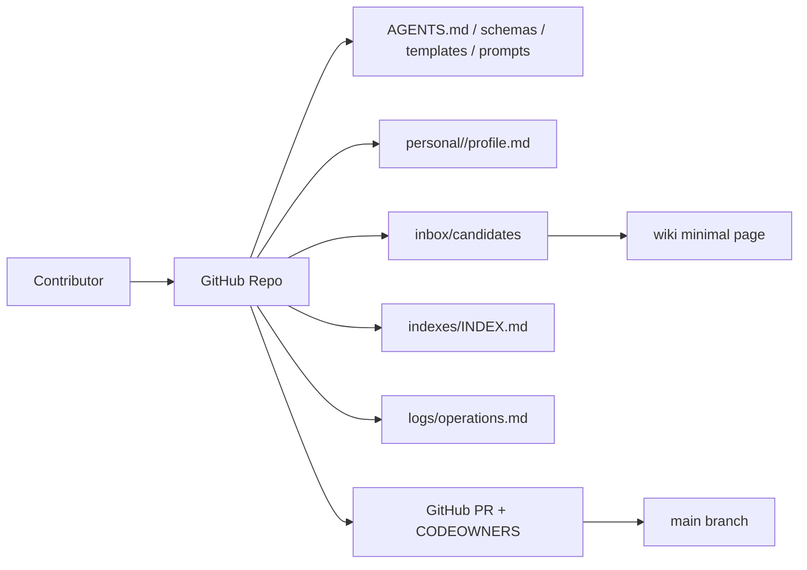

# Phase 0 - 启动与基线建设

> 目标：建立一个可被人和 AI agent 共同理解的 GitHub repo 知识库骨架。  
> 成功标准：不用向量库、站点或自动化服务，也能让团队通过 PR 提交、审核、合并一条最小知识。  
> Phase 定位：奠定权威层、身份层、Schema Pack、协作层和最小候选流转。

## 目录

- [1. Phase 0 范围](#1-phase-0-范围)
- [2. Phase 0 架构](#2-phase-0-架构)
- [3. 目录创建清单](#3-目录创建清单)
- [4. 必备文件](#4-必备文件)
  - [4.1 `README.md`](#41-readmemd)
  - [4.2 `AGENTS.md`](#42-agentsmd)
  - [4.3 `prompts/compile-wiki.md`](#43-promptscompile-wikimd)
  - [4.4 `prompts/prepare-wiki-patch.md`](#44-promptsprepare-wiki-patchmd)
  - [4.5 `.github/CODEOWNERS`](#45-githubcodeowners)
- [5. `personal/` 基线](#5-personal-基线)
  - [5.1 创建 profile 模板](#51-创建-profile-模板)
  - [5.2 创建第一批个人空间](#52-创建第一批个人空间)
- [6. Schema Pack 基线](#6-schema-pack-基线)
- [7. 页面模板](#7-页面模板)
- [8. 最小 demo corpus](#8-最小-demo-corpus)
- [9. Phase 0 prompt](#9-phase-0-prompt)
  - [9.1 初始化 repo prompt](#91-初始化-repo-prompt)
  - [9.2 Phase 0 自检 prompt](#92-phase-0-自检-prompt)
- [10. TypeScript 脚本草案](#10-typescript-脚本草案)
- [11. 风险点](#11-风险点)
- [12. 验收标准](#12-验收标准)
- [13. 进入 Phase 1 条件](#13-进入-phase-1-条件)

## 1. Phase 0 范围

Phase 0 只做基础设施和规则，不追求“知识很多”。

必须完成：

- GitHub repo 初始化。
- 目录骨架。
- `README.md` 入口。
- `AGENTS.md` agent 行为协议和 Schema Pack 入口。
- `.github/CODEOWNERS` 初版。
- `.github/workflows/` 预留。
- `personal/<staff-id>/profile.md` staff-id 责任映射。
- 页面模板。
- frontmatter / source manifest / candidate / person profile schema 草案。
- source manifest 模板。
- 最小 prompts。
- `compile-wiki` 编译规则草案。
- `prepare-wiki-patch` 正式 patch 准备规则草案。
- `confluence-mirror/` 和 `inbox/candidates/` 预留。
- branch protection 规则建议。
- 1 个 demo raw source、1 个 candidate、1 个正式 wiki 页面。

明确不做：

- 不执行 Confluence 远端同步，只预留单向 mirror 流程目录。
- 不做 embedding。
- 不做 QMD。
- 不做复杂自动抽图或图数据库。
- 不做自动 ingest 守护进程。
- 不创建 `site/`。
- 不创建 `exports/`。

## 2. Phase 0 架构



Phase 0 的核心是让 repo 自己成为“可执行说明书”：

- 新成员打开 `README.md` 知道如何读和贡献。
- AI agent 打开 `AGENTS.md` 知道如何写候选知识。
- Schema Pack 让 agent 知道字段、模板和任务流程。
- CI 未完成前，人工先按 checklist 检查。
- 人员身份按 staff-id 固化，不等后续再迁移。

## 3. 目录创建清单

创建以下目录：

```text
.github/workflows/
.github/ISSUE_TEMPLATE/
raw/docs/
raw/runbooks/
raw/incidents/
raw/meetings/
raw/code-chunks/
raw/external/
confluence-mirror/glossary/
confluence-mirror/pages/
confluence-mirror/manifest/
personal/00000000/raw/
personal/00000000/wiki/
inbox/candidates/
inbox/reviews/
wiki/overview/
wiki/glossary/
wiki/concepts/
wiki/teams/
wiki/projects/
wiki/systems/
wiki/practices/
wiki/runbooks/
wiki/decisions/
wiki/learning/
wiki/mirrored/
schemas/
templates/
prompts/
scripts/
indexes/
graph/
logs/
```

每个空目录可临时放 `.gitkeep`。如果团队不喜欢 `.gitkeep`，也可以用目录下的 `README.md` 解释用途。

Phase 0/1 默认不创建：

```text
site/
exports/
```

## 4. 必备文件

### 4.1 `README.md`

应包含：

- 这个 repo 是什么。
- 谁可以贡献。
- 如何搜索。
- 如何新增来源。
- 如何开 PR。
- 如何处理 staff-id。
- 重要链接：`AGENTS.md`、`indexes/INDEX.md`、`personal/`、`prompts/`。

最小结构：

```md
# Team Knowledge Base

这是团队正式知识库。GitHub repo 是权威层，所有正式知识通过 PR 审核进入 main。

## 快速入口

- 知识总索引：indexes/INDEX.md
- 人员责任映射：personal/
- Agent 协议：AGENTS.md
- 新增来源模板：templates/source-manifest.md
- 贡献流程：见下方

## 贡献流程

1. 把原始资料放入 raw/<category>/<date>-<slug>/。
2. 使用 prompts/ingest-source.md 生成或更新 inbox/candidates/ 候选。
3. 使用 prompts/compile-wiki.md 生成 Wiki Proposal。
4. 使用 prompts/prepare-wiki-patch.md 准备正式 PR patch。
5. 等待 CODEOWNERS / owner review。
6. 合并后更新 indexes 和 logs。
```

### 4.2 `AGENTS.md`

`AGENTS.md` 是 Schema Pack 入口。它不替代所有 schema，但必须告诉 agent 去哪里读规则。

核心内容必须包括：

- repo 目录结构。
- 权威层、候选层、个人层、mirror 层、派生层的边界。
- 不直接修改 `wiki/` 正式页面，除非用户明确要求且通过 PR。
- 所有人员字段必须使用 `staff:########`。
- `raw/` 不可修改原文。
- 新知识先进 `inbox/candidates/`。
- 外部镜像内容先进 `*-mirror/`，Confluence 使用 `confluence-mirror/`。
- 回答问题必须先读 `indexes/INDEX.md`。
- 写入前必须检查 `schemas/` 和 `templates/`。
- prompt registry。

最小结构：

```md
# Team KB Agent Protocol

## Schema Pack

This repo uses AGENTS.md + schemas/ + templates/ + prompts/ as its Schema Pack.

## Authority Layer

GitHub repo is the authority layer. Formal knowledge lives under wiki/.

## Identity Rules

All employee references must use staff:########.

## Write Rules

1. raw/ stores source evidence and must not be rewritten.
2. personal/<staff-id>/ is personal space, not team truth.
3. AI-generated candidates must be written to inbox/candidates/.
4. wiki/ changes must go through prepare-wiki-patch, PR, CI, and owner review.
5. source_refs are required for formal pages.

## Prompt Registry

- ingest-source.md: source -> Source Understanding
- compile-wiki.md: Source Understanding -> Wiki Proposal
- prepare-wiki-patch.md: Wiki Proposal -> PR-ready patch
- query-wiki.md: question -> cited answer
- lint-wiki.md: wiki health audit
- sync-confluence.md: one-way Confluence mirror

## Query Rules

1. Read indexes/INDEX.md first.
2. Search wiki/ and personal/*/profile.md.
3. Do not answer from snippets alone.
4. Cite page paths or knowledge IDs.
5. Call out stale, disputed, superseded, and low-confidence pages.
```

### 4.3 `prompts/compile-wiki.md`

Phase 0 必须先定义 compile 规则，因为这是 agent 生成 wiki proposal 的核心协议。

最小内容：

```md
# Compile Wiki Protocol

## Role

You are the team knowledge compiler. You update a candidate's Wiki Proposal from source understanding, existing wiki pages, schemas, and templates.

## Inputs

- AGENTS.md
- schemas/*.md
- schemas/*.json
- templates/
- indexes/INDEX.md
- inbox/candidates/<candidate>.md
- related wiki pages
- related personal profiles

## Rules

1. Do not write formal wiki pages.
2. Update only the Wiki Proposal section of the candidate.
3. Keep Source Understanding for review traceability.
4. Add source_refs, related links, confidence rationale, and review checklist.
5. Conflicts go to inbox/reviews/.
6. PR checklist is not generated here; it belongs to prepare-wiki-patch.
```

### 4.4 `prompts/prepare-wiki-patch.md`

`prepare-wiki-patch` 是正式化动作，不等同于 `candidate_intent: promotion`。

最小内容：

```md
# Prepare Wiki Patch Protocol

## Role

You prepare PR-ready changes from a mature Wiki Proposal.

## Rules

1. Verify source_refs.
2. Verify owner and reviewer.
3. Verify target page path and page type.
4. Generate or patch wiki/<type>/ page.
5. Update indexes/INDEX.md draft.
6. Update logs/operations.md draft.
7. Set candidate_status: in_review.
8. Output PR checklist.
9. Do not merge and do not delete the candidate.
```

### 4.5 `.github/CODEOWNERS`

Phase 0 不一定有完整 team mapping，但要先表达治理意图。

示例：

```text
# Default knowledge admins
* @org/knowledge-admins

# Schemas and prompts are governed centrally
/AGENTS.md @org/knowledge-admins
/schemas/ @org/knowledge-admins
/templates/ @org/knowledge-admins
/prompts/ @org/knowledge-admins

# Personal profiles need admin review
/personal/*/profile.md @org/knowledge-admins

# Domain examples
/wiki/systems/payment/ @org/payment-platform
/wiki/runbooks/payment/ @org/payment-platform
```

注意：`CODEOWNERS` 使用 GitHub username/team，业务知识中的人员主键仍然是 staff-id。二者通过 `personal/<staff-id>/profile.md` 的 aliases 或单独映射表连接。

## 5. `personal/` 基线

### 5.1 创建 profile 模板

`templates/person.md`：

```md
---
id: staff:00000000
staff_id: "00000000"
type: profile
status: active
display_name: ""
aliases:
  github: ""
  email_hash: ""
teams: []
owns:
  systems: []
  projects: []
maintains:
  pages: []
knowledge_contributions: []
created_at: YYYY-MM-DD
updated_at: YYYY-MM-DD
---

# staff:00000000

## Responsibilities

## Maintained Pages

## Promoted Knowledge

## Notes
```

### 5.2 创建第一批个人空间

至少创建：

- 知识管理员 1 人。
- demo 系统 owner 1 人。
- demo contributor 1 人。

路径示例：

```text
personal/12345678/profile.md
personal/12345678/raw/
personal/12345678/wiki/
personal/23456789/profile.md
personal/34567890/profile.md
```

个人知识晋升路径：

```text
personal/<staff-id>/raw/
  -> personal/<staff-id>/wiki/
  -> inbox/candidates/
  -> prepare-wiki-patch
  -> PR review
  -> wiki/<formal-type>/
```

## 6. Schema Pack 基线

Phase 0 至少创建：

```text
schemas/
├── README.md
├── frontmatter.md
├── confidence-rules.md
├── page.schema.json
├── person.schema.json
├── source-manifest.schema.json
└── candidate.schema.json
```

`schemas/README.md` 说明 Schema Pack 的文件职责。

`schemas/frontmatter.md` 定义正式 wiki page 的通用字段和 page type 目录映射。

`schemas/confidence-rules.md` 定义：

```text
0.30-0.50: weak source or unreviewed candidate
0.50-0.75: source-backed and admin-triaged
0.75-0.90: owner-reviewed active page
0.90-1.00: ADR / production validation / audit / multi-source support
```

`schemas/candidate.schema.json` 定义：

```yaml
candidate_origin: raw | personal | mirror | query | manual
candidate_intent: ingest | compile | promotion | sync
candidate_status: proposed | in_review | promoted | rejected | superseded
```

Phase 0 不要求完成全部自动校验，但 schema 文件必须先存在。

## 7. 页面模板

Phase 0 至少创建：

- `templates/page-system.md`
- `templates/page-runbook.md`
- `templates/page-decision.md`
- `templates/page-learning.md`
- `templates/page-glossary.md`
- `templates/source-manifest.md`
- `templates/person.md`

`page-runbook.md` 示例：

```md
---
id: kb:runbook:<slug>
title: "<title>"
type: runbook
status: candidate
review_state: unreviewed
confidence: 0.50
visibility: internal
owners:
  - staff:00000000
maintainers: []
reviewers: []
knowledge_sources: []
source_refs: []
related: []
tags: []
verified_at:
review_after:
supersedes: []
superseded_by: []
created_at: YYYY-MM-DD
updated_at: YYYY-MM-DD
---

# <title>

## Summary

## Scope

## Prerequisites

## Procedure

## Verification

## Rollback

## Related Pages

## Sources And Evidence

## Maintenance Notes
```

## 8. 最小 demo corpus

Phase 0 要准备一个极小但完整的 demo：

```text
raw/runbooks/2026-05-31-demo-payment-runbook/
├── manifest.md
└── source.md
inbox/candidates/demo-payment-runbook.md
wiki/runbooks/payment/demo-payment-runbook.md
personal/12345678/profile.md
indexes/INDEX.md
logs/operations.md
```

这个 demo 不追求真实完整，只证明流程：

1. 来源进入 raw source folder。
2. `ingest-source` 生成候选的 `Source Understanding`。
3. `compile-wiki` 生成候选的 `Wiki Proposal`。
4. `prepare-wiki-patch` 准备正式 wiki patch。
5. PR 审核。
6. 合并到 wiki。
7. index/log 可追踪。

## 9. Phase 0 prompt

### 9.1 初始化 repo prompt

```md
请初始化团队 LLM Wiki repo 的基础骨架。

要求：
1. 创建 Phase 0 目录结构。
2. 创建 README.md、AGENTS.md、.github/CODEOWNERS 草案。
3. 创建 schemas、templates、prompts 初版。
4. 创建 personal/<staff-id>/profile.md 示例，所有人员 ID 使用 staff:########。
5. 创建 indexes/INDEX.md 和 logs/operations.md。
6. 创建 prompts/compile-wiki.md 和 prompts/prepare-wiki-patch.md 草案。
7. 创建 confluence-mirror/ 和 inbox/candidates/ 目录，但不执行 Confluence 同步。
8. 不创建搜索服务，不创建 site/，不创建 exports/，不做复杂自动抽图或图数据库。

输出：
- 创建文件清单。
- 仍需人工补充的 GitHub team / staff-id 映射。
- Phase 1 前的检查清单。
```

### 9.2 Phase 0 自检 prompt

```md
请检查当前 repo 是否满足 Phase 0 完成条件：

1. 是否存在 README.md、AGENTS.md、.github/CODEOWNERS。
2. 是否存在 raw、confluence-mirror、personal、inbox、wiki、schemas、templates、prompts、indexes、logs。
3. personal/ 下是否按 8 位 staff-id 建 profile.md。
4. AGENTS.md 是否明确禁止 AI 直接写正式 wiki。
5. prompts/compile-wiki.md 是否说明 Source Understanding -> Wiki Proposal。
6. prompts/prepare-wiki-patch.md 是否说明只有 PR patch 才写 wiki/。
7. 是否有最小 demo raw、candidate、wiki 页面。
8. indexes/INDEX.md 是否能导航到 demo 页面。
9. logs/operations.md 是否记录初始化动作。

输出：
- PASS/FAIL。
- 每个 FAIL 的修复建议。
```

## 10. TypeScript 脚本草案

Phase 0 默认使用 TypeScript `.ts` 脚本：

```text
scripts/
├── check-staff-id.ts
├── check-frontmatter.ts
├── check-source-refs.ts
├── check-candidates.ts
├── check-links.ts
└── init-skeleton.ts
```

`package.json` 最小入口：

```json
{
  "scripts": {
    "check": "node scripts/check-staff-id.ts && node scripts/check-frontmatter.ts && node scripts/check-source-refs.ts && node scripts/check-candidates.ts && node scripts/check-links.ts",
    "init": "node scripts/init-skeleton.ts"
  }
}
```

Phase 1 再增加：

```text
scripts/search.ts
scripts/related.ts
scripts/build-index.ts
scripts/lint.ts
scripts/new-source.ts
```

## 11. 风险点

| 风险 | 处理 |
| --- | --- |
| 团队想先做搜索平台 | 明确 Phase 0 成功与搜索无关 |
| staff-id 与 GitHub username 映射不清 | 先让 `personal/<staff-id>/profile.md` 支持 aliases，正式字段只用 staff-id |
| schema 过重导致没人写 | Phase 0 只要求最少字段 |
| 没有真实 demo | 选一个小系统或 runbook，宁可小但完整 |
| AI 直接改正式页 | `AGENTS.md`、`prepare-wiki-patch` 和 PR checklist 明确禁止 |
| 后续 Confluence 接入污染正式层 | Phase 0 先建立 `confluence-mirror/` 物理隔离 |

## 12. 验收标准

Phase 0 完成必须满足：

- `README.md` 能让新成员理解项目。
- `AGENTS.md` 能让 AI agent 理解写入边界。
- `personal/` 有至少 3 个 `staff:########` profile 示例。
- `templates/` 有至少 5 类页面模板。
- `schemas/` 有 page/person/source/candidate 的初版 schema 或文档。
- `prompts/compile-wiki.md` 已定义基础编译规则。
- `prompts/prepare-wiki-patch.md` 已定义正式 patch 准备规则。
- `confluence-mirror/` 和 `inbox/candidates/` 已存在，但没有执行远端同步。
- `indexes/INDEX.md` 能指向 demo 页面。
- `logs/operations.md` 有初始化记录。
- 至少一个 demo 知识走过 raw -> inbox/candidates -> wiki。
- GitHub 已配置或明确记录 branch protection / CODEOWNERS 后续配置项。

## 13. 进入 Phase 1 条件

满足以下条件才进入 Phase 1：

1. 团队接受 GitHub repo 是权威层。
2. 已确认 staff-id 规范和 `personal/` 结构。
3. 至少 1 名知识管理员和 1 名领域 owner 参与过 demo PR。
4. AI agent 能按 `AGENTS.md` 生成 candidate。
5. 团队不再争论目录主骨架，可以用真实资料试跑。

