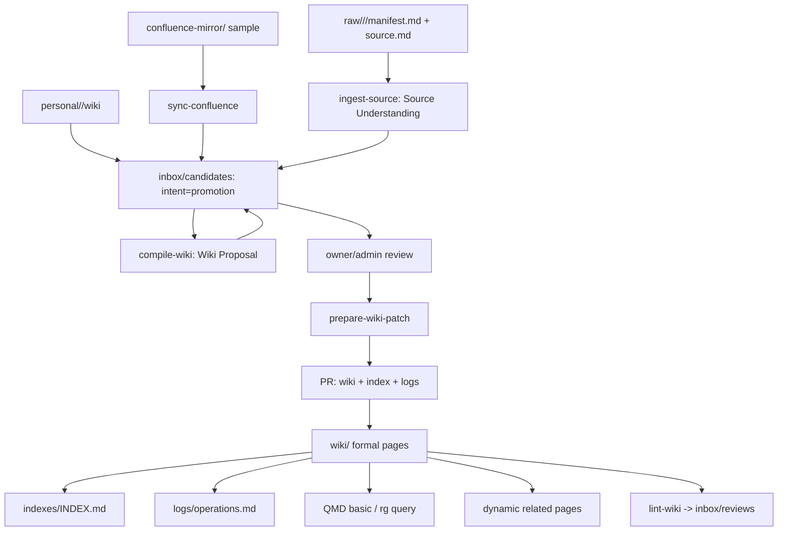
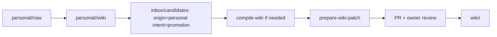

# Phase 1 - 人工闭环与最小可用知识库

> 目标：跑通 LLM Wiki 的最小团队闭环：`ingest -> compile -> prepare patch -> PR -> query -> lint`。  
> 成功标准：10-20 条真实知识通过 PR 进入正式 wiki，并能支持一次包含检索、personal 晋升、Confluence mirror 和轻量 related pages 的团队 demo。  
> Phase 定位：证明知识复利，同时让团队看到“能查、能关联、能追溯、能治理”。

## 目录

- [1. Phase 1 范围](#1-phase-1-范围)
- [2. Phase 1 架构](#2-phase-1-架构)
- [3. 建议首批知识样本](#3-建议首批知识样本)
- [4. Ingest / Compile / Prepare Patch 流程](#4-ingest--compile--prepare-patch-流程)
  - [4.1 Source folder 输入要求](#41-source-folder-输入要求)
  - [4.2 Candidate 文档结构](#42-candidate-文档结构)
  - [4.3 三个 prompt 的边界](#43-三个-prompt-的边界)
- [5. Personal 知识晋升流程](#5-personal-知识晋升流程)
- [6. Query 流程](#6-query-流程)
  - [6.1 查询 prompt](#61-查询-prompt)
  - [6.2 回答格式](#62-回答格式)
  - [6.3 QMD demo 命令](#63-qmd-demo-命令)
  - [6.4 轻量 related pages](#64-轻量-related-pages)
- [7. Confluence mirror 样例](#7-confluence-mirror-样例)
- [8. Lint 流程](#8-lint-流程)
- [9. Index 与 logs](#9-index-与-logs)
- [10. Phase 1 TypeScript 脚本草案](#10-phase-1-typescript-脚本草案)
- [11. 角色分工](#11-角色分工)
- [12. 风险点](#12-风险点)
- [13. 验收标准](#13-验收标准)
- [14. 进入 Phase 2 条件](#14-进入-phase-2-条件)

## 1. Phase 1 范围

必须做：

- 用真实资料填充 `raw/docs/`、`raw/runbooks/`、`raw/incidents/`、`raw/meetings/`、`raw/code-chunks/`、`raw/external/`。
- 每个 raw source 使用 `manifest.md + source.md`。
- 用 AI 生成或更新 `inbox/candidates/`。
- 人工审核后通过 `prepare-wiki-patch` 进入 `wiki/`。
- 维护 `indexes/INDEX.md`、`indexes/REVIEW_QUEUE.md`、`logs/ingest.md`、`logs/operations.md`。
- 建立 5 个核心人工流程：ingest、compile、prepare patch、query、lint。
- 建立 `ingest-source` / `compile-wiki` 分工：`ingest-source` 承担 Analysis，`compile-wiki` 承担 Context Reconciliation 与 Wiki Proposal Generation。
- 接入 Phase 1 demo 搜索：优先 QMD 基础全文模式，失败时用 `rg`。
- 提供轻量 related pages：基于 `[[wikilink]]`、frontmatter `related`、backlink、shared `source_refs` 动态计算。
- 准备 1-2 个 Confluence mirror 样例，验证单向 mirror 与候选晋升路径。
- 至少演示 1 条 personal 知识晋升到团队 wiki。
- 形成第一批可复用页面：glossary、system、runbook、decision、learning。

不做：

- 不做自动批量 ingest。
- 不做 Confluence 自动同步、全量同步、双向同步。
- 不让知识库裁决哪些 Confluence page 可以同步；同步范围由调用者显式指定。
- 不把 QMD 作为唯一入口；QMD 只是 demo 推荐，`rg` 必须可 fallback。
- 不做图数据库。
- 不做 graph traversal 主检索、复杂自动抽图或图数据库。
- 不做自动合并。
- 不创建 `site/` 或 `exports/`。

## 2. Phase 1 架构



Phase 1 关键不是“AI 写得多快”，而是每条知识都有：

- 来源。
- owner。
- staff-id。
- 页面类型。
- source_refs。
- review_state。
- confidence。
- index 入口。
- log 记录。
- related pages 依据。

## 3. 建议首批知识样本

首批 10-20 条知识建议覆盖：

| 类型 | 数量 | 示例 |
| --- | --- | --- |
| glossary | 3-5 | 内部缩写、系统代号、业务术语 |
| system | 2-3 | 关键服务、内部平台、数据链路 |
| runbook | 2-3 | 发布、回滚、故障处理 |
| decision | 1-2 | 技术选型、架构取舍 |
| learning | 2-3 | incident 复盘、项目经验 |
| team/project | 1-2 | 团队职责、项目边界 |
| personal promotion | 1-2 | 个人长期维护的经验或排障笔记 |

不要选择太大主题。优先选“团队每天会问，但答案散落在聊天、Confluence、个人笔记、人脑中”的内容。

## 4. Ingest / Compile / Prepare Patch 流程

### 4.1 Source folder 输入要求

每个 raw source 必须有 folder：

```text
raw/incidents/2026-05-31-payment-failover/
├── manifest.md
└── source.md
```

`manifest.md`：

```yaml
---
id: raw:incidents:2026-05-31-payment-failover
title: "Payment failover interview"
source_type: incident
collector: staff:12345678
collected_at: 2026-05-31
sensitivity: internal
origin:
  kind: manual
  url: ""
hash: ""
status: captured
---
```

`source.md` 保存原始内容，尽量保持原样。AI 不应为了适配 wiki 模板改写 source。

### 4.2 Candidate 文档结构

`inbox/candidates/<slug>.md` 同时是编译工作台和审阅审计记录：

```md
---
id: candidate:2026-05-31-payment-failover
title: "Payment Failover"
candidate_origin: raw
candidate_intent: ingest
candidate_status: proposed
source_refs:
  - raw:incidents:2026-05-31-payment-failover
personal_refs: []
target_pages:
  - kb:runbook:payment-failover
created_at: 2026-05-31
updated_at: 2026-05-31
---

# Payment Failover Candidate

## Source Understanding

## Wiki Proposal

## Review Notes

## Decision Log
```

字段含义：

- `candidate_origin`: `raw | personal | mirror | query | manual`
- `candidate_intent`: `ingest | compile | promotion | sync`
- `candidate_status`: `proposed | in_review | promoted | rejected | superseded`

### 4.3 三个 prompt 的边界

`ingest-source`：

- 更新 `Source Understanding`。
- 提取 source summary、facts、entities、concepts、source-level relationships、owner candidates、conflicts、gaps、可能 target pages。
- 不写正式 wiki。
- 不输出 PR checklist。

`compile-wiki`：

- 基于 `Source Understanding`、现有 `wiki/`、Schema Pack 和 templates，更新 `Wiki Proposal`。
- 不重新执行 source-level facts extraction；如果 `Source Understanding` 不完整，应先补跑 `ingest-source`，或在人工明确要求下以内联 ingest 方式补齐并写回 `Source Understanding`。
- 负责将已抽取素材与现有 wiki 对齐，判断新建、更新、合并、冲突、缺口、target pages 和 related links。
- 生成 proposed frontmatter、body、related links、confidence rationale、review checklist。
- 不写正式 wiki。
- 不输出 PR checklist。

`prepare-wiki-patch`：

- 基于成熟 `Wiki Proposal`，生成 `wiki/<type>/` patch。
- 更新 `indexes/INDEX.md` 草稿和 `logs/operations.md` 草稿。
- 将 `candidate_status` 改为 `in_review`。
- 输出 PR checklist。
- 只有 PR review 通过并 merge 后，知识才进入正式 wiki。

## 5. Personal 知识晋升流程

personal 空间不是团队正式知识：

```text
personal/<staff-id>/
├── profile.md
├── raw/
└── wiki/
```

晋升流程：



规则：

- `personal/<staff-id>/raw/` 可以随意写，是个人原始笔记。
- `personal/<staff-id>/wiki/` 是个人编译知识，不代表团队共识。
- `candidate_intent: promotion` 表示“申请晋升为团队知识”，不是正式化动作本身。
- 如果 personal wiki 已经足够成熟，可以直接进入 `prepare-wiki-patch`；否则先走 `compile-wiki`。

## 6. Query 流程

Phase 1 查询要能支持 demo。它不需要高级 hybrid search，但需要可展示的基础检索和引用。

1. 读取 `indexes/INDEX.md`。
2. 如果 QMD 可用，使用 QMD 基础全文搜索。
3. 如果 QMD 不可用，使用 `rg` 搜索 `wiki/`、`personal/*/profile.md`、`indexes/`。
4. 读取相关页面正文。
5. 动态计算 direct wikilink、backlink、shared `source_refs` 形成 related pages。
6. 检查 `status`、`review_state`、`confidence`、`source_refs`。
7. 生成带引用答案。
8. 判断是否需要回填到 `inbox/candidates/`。

### 6.1 查询 prompt

```md
请回答以下团队知识问题：

问题：<question>

规则：
1. 先读 indexes/INDEX.md。
2. 优先用 QMD basic search 检索 wiki/ personal/*/profile.md indexes/；不可用则用 rg。
3. 只基于 repo 中的正式知识和必要 source evidence 回答。
4. 每个关键结论都要引用页面路径或知识 ID。
5. 如果页面 status 不是 active，必须说明。
6. 如果页面 review_after 已过、status=stale/superseded 或 review_state=disputed，必须说明。
7. 列出 related pages，并说明 related 的依据。
8. 如果信息不足，输出“知识缺口”，并建议创建哪个 candidate。
9. 如果本次答案值得长期复用，建议写入 inbox/candidates/，candidate_origin=query，candidate_intent=promotion。
```

### 6.2 回答格式

```md
## 结论

## 依据

## Related Pages

## 不确定点

## 建议后续
```

### 6.3 QMD demo 命令

Phase 1 只使用 QMD 的基础全文能力，不使用 embedding、rerank 或高级 hybrid。

```text
qmd collection add ./wiki --name team-wiki
qmd update
qmd search "production support"
qmd get "wiki/runbooks/ops/production-support.md"
qmd status
```

如果团队环境无法安装 QMD，demo 改用：

```text
rg -n --glob "*.md" "production support" wiki personal indexes
```

### 6.4 轻量 related pages

Phase 1 要展示一点图能力，但不是 graph traversal 主检索。执行顺序是：先用 QMD/`rg` 找到命中页，再对命中页做 1-hop related 查询。

related pages 的 canonical signals：

| 信号 | 说明 | Phase 1 是否使用 |
| --- | --- | --- |
| direct wikilink | 页面正文中出现 `[[target]]` | 是 |
| frontmatter related | 页面显式维护 `related: []` | 是 |
| backlink | 其他页面正文中指向当前页 | 是 |
| shared source_refs | 两页来自同一个 raw/mirror/personal source | 是 |
| 2-hop traversal | 种子页面向外扩展两跳 | 否 |
| 加权融合 | direct/source/共同邻居/type affinity | 否，Phase 4 可评估 |

输出示例：

```md
## Related pages

- wiki/systems/payment/payment-gateway.md
  - reason: direct wikilink
- wiki/runbooks/payment/payment-failover.md
  - reason: shared source_refs raw:incidents:2026-05-31-payment-failover
```

`indexes/RELATED.md` 不作为权威源。related 事实来自页面正文、frontmatter 和 `source_refs`，脚本按需扫描。

## 7. Confluence mirror 样例

Phase 1 可以准备 1-2 个手工指定的 Confluence 样例页，用来展示外部源接入路径。

规则：

- 同步是手动触发。
- sync scope 由用户或管理员显式提供。
- 知识库不判断哪些 page “允许同步”。
- mirror 写入 `confluence-mirror/`。
- mirror 默认不进入正式主搜索。
- 若内容要长期沉淀，进入 `inbox/candidates/`，设置 `candidate_origin=mirror`、`candidate_intent=sync`，再走 PR。

目录示例：

```text
confluence-mirror/glossary/production-support--234567.md
confluence-mirror/pages/ps-playbook--345678.md
inbox/candidates/production-support-sync.md
```

## 8. Lint 流程

Phase 1 lint 可以人工执行，输出报告即可。

检查：

- 必填 frontmatter。
- staff-id 格式。
- `source_refs` 是否存在。
- wikilinks 是否明显断裂。
- `review_after` 是否已过期。
- 是否存在 `TODO/TBD`。
- low-confidence active 页面。
- `personal/` 或 `inbox/` 是否被误当作正式 wiki。
- mirror 是否误入正式搜索。

输出：

```text
logs/lint.md
inbox/reviews/
indexes/REVIEW_QUEUE.md
```

`inbox/reviews/` 的 review item：

```yaml
review_type: stale | conflict | missing-owner | low-confidence | broken-link
review_status: open | resolved | rejected
affected_pages:
  - kb:runbook:payment-failover
```

## 9. Index 与 logs

### `indexes/INDEX.md`

`INDEX.md` 是人和 agent 的第一入口，但不承担全量关系索引。

结构：

```md
# Team KB Index

## Overview

## Glossary

## Systems

## Runbooks

## Decisions

## Learning

## Teams and Projects

## Personal Profiles
```

每个条目：

```md
- [Payment Gateway](../wiki/systems/payment/payment-gateway.md) - payment gateway system; owner: staff:12345678; status: active; confidence: 0.86
```

### `indexes/REVIEW_QUEUE.md`

记录 stale、conflict、missing-owner、low-confidence、broken-link 等治理队列摘要。详细 review item 放在 `inbox/reviews/`。

### 不默认维护 `SOURCES.md` 和 `RELATED.md`

source 关系来自：

```text
raw/**/manifest.md
confluence-mirror/** metadata
personal/** source references
wiki/** frontmatter.source_refs
```

related 关系来自：

```text
[[wikilink]]
frontmatter.related
backlinks
shared source_refs
```

规模增长后可以生成 `graph/source-usage.jsonl`、`graph/backlinks.jsonl`、`graph/edges.jsonl`，但这些是可重建 sidecar，不是人工维护源。

### `logs/operations.md`

append-only 格式：

```md
## [2026-05-31] prepare-wiki-patch | kb:runbook:payment-failover

- actor: staff:12345678
- source: raw:incidents:2026-05-31-payment-failover
- candidate: candidate:2026-05-31-payment-failover
- pr: <url>
- result: active
```

## 10. Phase 1 TypeScript 脚本草案

Phase 1 推荐：

```text
scripts/
├── search.ts
├── related.ts
├── build-index.ts
├── lint.ts
└── new-source.ts
```

职责：

- `search.ts`：QMD 可用时调用 QMD，不可用时使用 `rg` fallback。
- `related.ts`：对一个 page 做 1-hop related 查询：direct wikilink、frontmatter related、backlink、shared `source_refs`。
- `build-index.ts`：从 `wiki/` 和 `personal/*/profile.md` 生成 `indexes/INDEX.md`。
- `lint.ts`：聚合 checks，并输出 `logs/lint.md` 草稿。
- `new-source.ts`：创建 `raw/<category>/<date>-<slug>/manifest.md` 和 `source.md`。

`package.json` 入口：

```json
{
  "scripts": {
    "search": "node scripts/search.ts",
    "related": "node scripts/related.ts",
    "index": "node scripts/build-index.ts",
    "lint": "node scripts/lint.ts",
    "new-source": "node scripts/new-source.ts"
  }
}
```

## 11. 角色分工

| 角色 | Phase 1 职责 |
| --- | --- |
| Contributor | 提供 raw source，提出问题，提交候选 |
| Knowledge Admin | 维护 Schema Pack、index、lint、QMD/rg demo，协助 PR |
| Domain Owner | 审核 active 页面，确认执行依据 |
| Manager | 选择高价值知识样本，推动 review |
| AI Agent | 执行 ingest、compile、prepare patch、总结、lint 建议，不直接合并 |

## 12. 风险点

| 风险 | 处理 |
| --- | --- |
| 候选太多无人 review | 每周限制候选数量，只做高价值样本 |
| 页面模板过重 | 允许 candidate 简化，但 active 必须补齐字段 |
| owner 不愿维护 | 管理者明确系统/页面 owner 责任 |
| AI 摘要偏差 | raw source 必须可追溯，reviewer 对照来源 |
| index 不更新 | 每次 PR checklist 要求更新 index/log |
| QMD 不可安装 | 保留 `rg` fallback，demo 不依赖 QMD 成败 |
| related pages 误导 | related 必须写 reason，Phase 1 不做 2-hop 主检索 |
| Confluence mirror 被误认为正式知识 | 物理隔离到 `confluence-mirror/`，晋升必须走 `inbox/candidates/` |
| personal 内容被误认为团队共识 | 查询默认不读 personal wiki，只读 personal profile；晋升必须走 candidate 和 PR |

## 13. 验收标准

Phase 1 完成必须满足：

- 至少 10 条真实来源进入 `raw/` source folders。
- 至少 10 个 candidate 进入 `inbox/candidates/`。
- 至少 8 个正式页面进入 `wiki/`。
- 至少覆盖 4 种页面类型。
- 所有 active 页面有 owner、source_refs、confidence。
- 所有 active 页面有 `review_after` 或说明为什么不需要周期复审。
- 所有人员引用使用 `staff:########`。
- `personal/` 至少有 3 个 profile，且至少 1 条 personal 知识完成晋升演示。
- `indexes/INDEX.md` 能导航主要页面。
- `logs/operations.md` 记录关键动作。
- QMD basic search 或 `rg` fallback 能完成 demo 查询。
- `related.ts` 或等价流程能展示 5 组 related pages。
- 至少 1 个 Confluence mirror 样例位于 `confluence-mirror/`。
- 至少 1 个 mirror -> `inbox/candidates/` -> PR 的晋升路径可演示。
- 至少执行 2 次 lint 并留下报告。
- 能用 query prompt 回答 5 个真实团队问题。

## 14. 进入 Phase 2 条件

满足以下条件才进入 Phase 2：

1. 人工闭环已经跑通，不再只是模板。
2. 团队认为 wiki 内容有实际价值。
3. review 过程暴露出的 schema 问题已修正。
4. Phase 1 demo 能展示 ingest、compile、prepare patch、搜索、related pages、personal promotion、Confluence mirror。
5. index/log/related 维护开始有负担，需要 PR checks 和自动化检查减负。
6. 主要 owner 认可 PR 审核模式。

