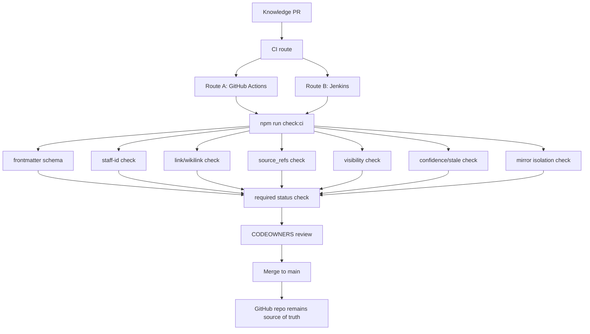

# Phase 2 - 质量门禁与 PR 检查

> 目标：把 Phase 1 的人工约束固化为 PR checks、CODEOWNERS review 和可重复执行的 TypeScript 检查脚本。  
> 成功标准：每个知识 PR 都能被自动检查；不满足 schema、staff-id、source_refs、link、sensitivity、mirror isolation 等规则时不能合并。  
> Phase 定位：CI 产品待决策。GitHub Actions 和 Jenkins 两条路线都完整保留，后续按公司可用性选择；知识库核心设计不绑定任一 CI。

## 目录

- [1. Phase 2 范围](#1-phase-2-范围)
- [2. CI 中立设计原则](#2-ci-中立设计原则)
- [3. Phase 2 架构](#3-phase-2-架构)
- [4. 必备检查](#4-必备检查)
- [5. 共享脚本与状态检查契约](#5-共享脚本与状态检查契约)
- [6. 路线 A：GitHub Actions](#6-路线-agithub-actions)
  - [6.1 适用条件](#61-适用条件)
  - [6.2 文件清单](#62-文件清单)
  - [6.3 实施步骤](#63-实施步骤)
  - [6.4 Workflow 草案](#64-workflow-草案)
  - [6.5 Branch protection 设置](#65-branch-protection-设置)
  - [6.6 常见坑](#66-常见坑)
- [7. 路线 B：Jenkins](#7-路线-bjenkins)
  - [7.1 适用条件](#71-适用条件)
  - [7.2 文件清单](#72-文件清单)
  - [7.3 实施步骤](#73-实施步骤)
  - [7.4 Jenkinsfile 草案](#74-jenkinsfile-草案)
  - [7.5 GitHub required check 设置](#75-github-required-check-设置)
  - [7.6 常见坑](#76-常见坑)
- [8. 两条路线对比](#8-两条路线对比)
- [9. Source / Related 派生策略](#9-source--related-派生策略)
- [10. Issue 反馈入口](#10-issue-反馈入口)
- [11. Phase 2 prompts](#11-phase-2-prompts)
  - [11.1 PR review prompt](#111-pr-review-prompt)
  - [11.2 CI failure prompt](#112-ci-failure-prompt)
- [12. 风险点](#12-风险点)
- [13. 验收标准](#13-验收标准)
- [14. 进入 Phase 3 条件](#14-进入-phase-3-条件)
- [15. 调研依据](#15-调研依据)

## 1. Phase 2 范围

必须做：

- PR check 流程。
- frontmatter schema 检查。
- staff-id 检查。
- link / wikilink 检查。
- source_refs 检查。
- sensitivity / visibility 检查。
- Markdown 基础 lint。
- `indexes/INDEX.md` 是否需要更新的检查。
- `confidence`、`review_after` 与 `review_state` 一致性检查。
- `confluence-mirror/` 默认不进入正式主搜索、正式 wiki 或后续导出输入的检查。
- GitHub issue 模板作为知识反馈入口。

暂不决策：

- 最终使用 GitHub Actions 还是 Jenkins。
- Jenkins 是否使用公司标准 shared library。
- GitHub Actions 是否可用 GitHub-hosted runner 或 self-hosted runner。

不做：

- 不做内部文档站。
- 不创建 `site/`。
- 不引入 MkDocs、TechDocs、Docusaurus。
- 不做高级语义搜索。
- 不做图数据库。
- 不做自动从外部源写正式知识。
- 不把 mirror 内容默认发布成正式知识。
- 不做复杂权限同步。

## 2. CI 中立设计原则

Phase 2 的核心资产不是 workflow YAML 或 Jenkins job，而是可复用的 TypeScript scripts。

```text
GitHub Actions route
  -> npm ci
  -> npm run check:ci
  -> GitHub status check

Jenkins route
  -> npm ci
  -> npm run check:ci
  -> Jenkins commit status

Same source of truth:
  scripts/*.ts
  schemas/
  templates/
  prompts/
  AGENTS.md
```

原则：

- CI 产品只负责执行和回写状态。
- 所有知识库规则放在 repo 内。
- 两条路线调用同一组 `npm run` 入口。
- GitHub branch protection 只依赖稳定的 required check 名称。
- 如果未来从 GitHub Actions 切到 Jenkins，业务规则无需重写。

## 3. Phase 2 架构



Phase 2 的关键变化：

- 质量不再靠人工记忆。
- GitHub repo 仍是唯一权威层。
- PR check 可以由 Jenkins 或 GitHub Actions 执行。
- `site/`、MkDocs、TechDocs、Docusaurus 不进入 Phase 2；如果未来确认公司有可用平台，再进入 Phase 7。
- source/related 索引不是手工维护源。Phase 2 只允许从 `raw/**/manifest.md`、wiki frontmatter、正文 `[[wikilink]]` 和 `source_refs` 生成检查报告或 artifact；完整 graph sidecar 延后到 Phase 4。
- `indexes/INDEX.md` 和 `indexes/REVIEW_QUEUE.md` 是人工可读导航/治理摘要，不承担全量 source/related 权威索引职责。

## 4. 必备检查

| 检查 | 阻断合并 | 说明 |
| --- | --- | --- |
| frontmatter schema | 是 | active 页面必须字段完整 |
| staff-id format | 是 | `staff:########` |
| personal profile path | 是 | `personal/########/profile.md` |
| source_refs exists | 是 | active 页面必须有来源 |
| source_refs valid | 是 | 必须能解析到 `raw/**/manifest.md`、mirror metadata 或明确外部 source |
| broken markdown links | 是 | 相对链接和 `[[wikilink]]` 必须可解析 |
| visibility leak | 是 | restricted/confidential 不得进入默认导出输入 |
| mirror isolation | 是 | `confluence-mirror/` 不得被误当成正式 wiki 或主搜索输入 |
| confidence exists | 是 | active 页面必须有 `0.00-1.00` 页面级 confidence |
| confidence consistency | 是 | `status/review_state/review_after` 与 confidence 不冲突 |
| CODEOWNERS touched | 是 | schema/templates/prompts 修改需管理员审核 |
| TODO/TBD in active | 否，先 warning | 可逐步加严 |
| review_after stale | 否，生成 REVIEW_QUEUE | 不阻断紧急修复 |

## 5. 共享脚本与状态检查契约

`package.json`：

```json
{
  "scripts": {
    "check:ci": "npm run check && npm run check:visibility && npm run check:mirror-isolation",
    "check": "tsx scripts/lint.ts",
    "check:frontmatter": "tsx scripts/check-frontmatter.ts",
    "check:staff-id": "tsx scripts/check-staff-id.ts",
    "check:source-refs": "tsx scripts/check-source-refs.ts",
    "check:links": "tsx scripts/check-links.ts",
    "check:visibility": "tsx scripts/check-visibility.ts",
    "check:mirror-isolation": "tsx scripts/check-mirror-isolation.ts",
    "check:confidence": "tsx scripts/check-confidence.ts",
    "build:index": "tsx scripts/build-index.ts --check"
  }
}
```

脚本职责：

| 脚本 | 作用 |
| --- | --- |
| `scripts/lint.ts` | 聚合执行 schema、frontmatter、link、candidate、source_refs 检查 |
| `scripts/check-frontmatter.ts` | 检查 active wiki 页面 frontmatter |
| `scripts/check-staff-id.ts` | 检查 `staff:########` 与 `personal/########/profile.md` |
| `scripts/check-source-refs.ts` | 检查 `source_refs` 是否能解析到 raw manifest、mirror metadata 或允许的外部 source |
| `scripts/check-links.ts` | 检查 Markdown links 和 `[[wikilink]]` |
| `scripts/check-visibility.ts` | 检查 restricted/confidential 不进入默认导出输入 |
| `scripts/check-mirror-isolation.ts` | 检查 `confluence-mirror/` 不进入正式 wiki、主搜索输入或默认导出输入 |
| `scripts/check-confidence.ts` | 检查 active 页面 confidence 与 review_after 状态 |
| `scripts/build-index.ts` | 半自动更新或检查 `indexes/INDEX.md` 与 `indexes/REVIEW_QUEUE.md` |

required status check 命名建议：

| 路线 | required check 名称 |
| --- | --- |
| GitHub Actions | `knowledge-ci / knowledge-checks` |
| Jenkins | `continuous-integration/jenkins/knowledge-checks` 或公司自定义 `knowledge-checks` |

一旦进入 branch protection，名称不要随意改；否则会造成 PR 无法合并。

## 6. 路线 A：GitHub Actions

### 6.1 适用条件

适合：

- repo 已在 GitHub 上。
- 公司允许启用 GitHub Actions。
- 检查只依赖 repo 内容和 npm registry。
- 不需要访问内网服务。
- 希望用最少平台配置做 demo 或 PoC。

不适合：

- 公司禁用 GitHub Actions。
- npm 依赖只能从内网私服下载，而 GitHub runner 访问不到。
- 合规要求所有 CI 必须在公司 Jenkins/runner 内执行。
- PR checks 必须沿用统一 Jenkins 审计。

### 6.2 文件清单

```text
.github/
├── CODEOWNERS
├── workflows/
│   └── knowledge-ci.yml
└── ISSUE_TEMPLATE/
    ├── knowledge-request.yml
    └── stale-report.yml
package.json
package-lock.json
scripts/
├── lint.ts
├── check-frontmatter.ts
├── check-staff-id.ts
├── check-source-refs.ts
├── check-links.ts
├── check-visibility.ts
├── check-mirror-isolation.ts
├── check-confidence.ts
└── build-index.ts
```

### 6.3 实施步骤

1. 添加 `package.json` scripts。
2. 添加 `scripts/*.ts`。
3. 添加 `.github/workflows/knowledge-ci.yml`。
4. 打开一个测试 PR。
5. 确认 PR 页面出现 `knowledge-ci / knowledge-checks`。
6. 故意制造一个错误，例如非法 `staff:abc` 或缺失 `source_refs`，确认 check 失败。
7. 修复错误，确认 check 通过。
8. 在 GitHub branch protection / ruleset 中要求：
   - require pull request before merging。
   - require approvals。
   - require review from Code Owners。
   - require status check `knowledge-ci / knowledge-checks`。
9. 再打开一个 PR，确认未通过 check 时不能合并。

### 6.4 Workflow 草案

注意：如果 required check 使用 `paths` 过滤，某些 PR 可能因为 workflow 被跳过而让 required check 长期 pending。因此推荐 required workflow 不使用 `paths` 过滤，而是在脚本内部快速判断是否需要执行重检查。

`.github/workflows/knowledge-ci.yml`：

```yaml
name: knowledge-ci

on:
  pull_request:
  push:
    branches:
      - main

permissions:
  contents: read

concurrency:
  group: knowledge-ci-${{ github.ref }}
  cancel-in-progress: true

jobs:
  knowledge-checks:
    runs-on: ubuntu-latest
    timeout-minutes: 10
    steps:
      - uses: actions/checkout@v6
      - uses: actions/setup-node@v5
        with:
          node-version: "24"
          cache: npm
      - name: Install dependencies
        run: npm ci
      - name: Run knowledge checks
        run: npm run check:ci
```

### 6.5 Branch protection 设置

GitHub 设置：

```text
Settings
  -> Branches or Rulesets
  -> Protect main
  -> Require a pull request before merging
  -> Require approvals
  -> Require review from Code Owners
  -> Require status checks to pass before merging
  -> Select: knowledge-ci / knowledge-checks
```

建议：

- required check 名称保持稳定。
- workflow job 名称保持唯一，避免多个 workflow 产生同名 status。
- Phase 2 初期先只要求 `knowledge-ci / knowledge-checks` 一个总状态，避免 required checks 过多导致治理复杂。

### 6.6 常见坑

| 问题 | 处理 |
| --- | --- |
| workflow 被 paths filter 跳过后 required check pending | required workflow 不使用 `paths`；脚本内部做快速跳过 |
| GitHub runner 无法访问 npm registry | 使用公司允许的 registry，或改用 Jenkins |
| check 名称改了导致 PR 卡住 | branch protection 同步更新 required check 名称 |
| GitHub Actions 额度或排队不稳定 | demo 可用；正式落地转 Jenkins |
| PR 来自 fork 时权限受限 | 内部 repo 默认不走 fork PR；如有 fork，限制写权限和 secret 使用 |

## 7. 路线 B：Jenkins

### 7.1 适用条件

适合：

- 公司已有 Jenkins PR checks 标准。
- Jenkins 可以访问 GitHub repo。
- Jenkins 可以访问内网 npm registry 或企业代理。
- 需要统一审计、统一 runner、统一凭据管理。
- GitHub Actions 可用性尚不确定。

不适合：

- 没有 Jenkins multibranch / GitHub Branch Source 能力。
- Jenkins 无法把 commit status 回写到 GitHub。
- Jenkins 队列很慢，且知识库 PR 需要高频轻量反馈。

### 7.2 文件清单

```text
Jenkinsfile
package.json
package-lock.json
scripts/
├── lint.ts
├── check-frontmatter.ts
├── check-staff-id.ts
├── check-source-refs.ts
├── check-links.ts
├── check-visibility.ts
├── check-mirror-isolation.ts
├── check-confidence.ts
└── build-index.ts
.github/
├── CODEOWNERS
└── ISSUE_TEMPLATE/
```

Jenkins 侧需要：

```text
Jenkins controller
GitHub Branch Source plugin or equivalent
GitHub credential/token with repo read + commit status permission
Node.js 24 toolchain or agent image
optional internal npm registry credential
```

### 7.3 实施步骤

1. 添加 `package.json` scripts。
2. 添加 `scripts/*.ts`。
3. 添加 `Jenkinsfile`。
4. 在 Jenkins 创建 Multibranch Pipeline 或 Organization Folder。
5. 配置 GitHub repository source。
6. 配置发现策略：
   - discover branches。
   - discover pull requests from origin。
   - 按公司策略决定是否发现 fork PR。
7. 配置 webhook 或定时 scan，让 PR 创建/更新能触发 Jenkins。
8. 配置 Jenkins GitHub credential，使 Jenkins 能读取 repo 并回写 commit status。
9. 打开测试 PR，确认 Jenkins 自动创建 PR job 并运行。
10. 确认 GitHub PR 页面出现 Jenkins status。
11. 故意制造错误，确认 Jenkins status 失败。
12. 在 GitHub branch protection / ruleset 中把 Jenkins status 设置为 required check。
13. 修复错误，确认 Jenkins status 通过后可合并。

### 7.4 Jenkinsfile 草案

Linux agent：

```groovy
pipeline {
  agent any

  options {
    timestamps()
    disableConcurrentBuilds(abortPrevious: true)
    timeout(time: 10, unit: 'MINUTES')
  }

  stages {
    stage('Install') {
      steps {
        sh 'npm ci'
      }
    }

    stage('Knowledge checks') {
      steps {
        sh 'npm run check:ci'
      }
    }
  }

  post {
    always {
      archiveArtifacts artifacts: 'reports/**/*', allowEmptyArchive: true
    }
  }
}
```

Windows agent 可选写法：

```groovy
pipeline {
  agent any

  options {
    timestamps()
    disableConcurrentBuilds(abortPrevious: true)
    timeout(time: 10, unit: 'MINUTES')
  }

  stages {
    stage('Install') {
      steps {
        bat 'npm ci'
      }
    }

    stage('Knowledge checks') {
      steps {
        bat 'npm run check:ci'
      }
    }
  }

  post {
    always {
      archiveArtifacts artifacts: 'reports/**/*', allowEmptyArchive: true
    }
  }
}
```

如果公司 Jenkins 已有 shared library，可以把安装 Node、npm registry、status context、artifact 归档封装到 shared library，但知识库 repo 仍保留最小 `Jenkinsfile`。

### 7.5 GitHub required check 设置

Jenkins status context 必须稳定。建议二选一：

```text
continuous-integration/jenkins/knowledge-checks
knowledge-checks
```

GitHub 设置：

```text
Settings
  -> Branches or Rulesets
  -> Protect main
  -> Require a pull request before merging
  -> Require approvals
  -> Require review from Code Owners
  -> Require status checks to pass before merging
  -> Select Jenkins status context
```

注意：

- 如果 Jenkins plugin 默认 status context 不符合团队命名，先在 Jenkins/GitHub Branch Source 配置里固定 context，再写入 branch protection。
- 不要频繁改 context 名称。
- 如果 Jenkins PR job 未回写 status，GitHub 无法作为 required check 使用。

### 7.6 常见坑

| 问题 | 处理 |
| --- | --- |
| Jenkins 没有发现 PR | 检查 Multibranch Pipeline scan、GitHub webhook、discover pull requests 策略 |
| GitHub PR 没有 Jenkins status | 检查 GitHub credential 权限、commit status permission、plugin status context |
| Jenkinsfile 使用 shell 和 agent OS 不匹配 | Linux 用 `sh`，Windows 用 `bat`，或使用公司标准 Node agent |
| npm registry 访问失败 | 配置 `.npmrc` 或 Jenkins credential；不要把 token 写入 repo |
| Jenkins 队列慢 | Phase 2 checks 保持轻量，目标 1-3 分钟完成 |
| shared library 难以迁移 | repo 内保留普通 npm scripts，shared library 只做执行包装 |

## 8. 两条路线对比

| 维度 | GitHub Actions | Jenkins |
| --- | --- | --- |
| 初始配置 | 更简单，一个 workflow YAML 即可 | 需要 Jenkins job / multibranch / credential 配置 |
| 与 GitHub PR 页面集成 | 原生 checks | 依赖 Jenkins 回写 commit status |
| 公司内网访问 | 取决于 runner 与网络策略 | 通常更适合内网 |
| 依赖安装 | 需要 GitHub runner 访问 npm registry | 可复用公司 npm registry、缓存和代理 |
| 排队和耗时 | 受 GitHub runner 队列、额度、镜像拉取影响 | 受 Jenkins 队列和 agent 资源影响 |
| 审计与合规 | 取决于公司是否允许 Actions | 通常更符合已有工程治理 |
| repo 自包含程度 | 高 | 中，Jenkins 配置部分在平台侧 |
| demo 速度 | 快 | 取决于 Jenkins 配置权限 |
| 正式落地推荐 | 公司允许时可用 | 公司已有 Jenkins 标准时优先 |

决策建议：

- demo repo：优先 GitHub Actions，因为配置最少。
- 公司正式落地：如果 Jenkins 是默认 PR checks 平台，优先 Jenkins。
- 不管选哪条，保留同一组 TypeScript scripts 和 npm scripts。
- 不同时强制两套 required checks；否则会增加等待时间和运维成本。
- 可以短期双跑 1-2 周收集耗时和失败率，但最终只保留一条 required route。

## 9. Source / Related 派生策略

Phase 2 不维护 `SOURCES.md` 或 `RELATED.md` 作为权威索引。

source 检查来源：

- `raw/**/manifest.md`
- `confluence-mirror/**` metadata
- wiki frontmatter `source_refs`
- candidate frontmatter

related 检查来源：

- 正文 `[[wikilink]]`
- frontmatter `related`
- backlinks
- shared `source_refs`

Phase 2 可以输出检查报告或 CI artifact，但这些 artifact 可随时重建。Phase 4 才生成 `graph/*.jsonl` sidecar。

## 10. Issue 反馈入口

`knowledge-request.yml`：

```yaml
name: Knowledge request
description: Request new or improved team knowledge.
title: "[Knowledge Request]: "
labels: ["knowledge-request"]
body:
  - type: input
    id: topic
    attributes:
      label: Topic
      description: What knowledge is missing or unclear?
    validations:
      required: true
  - type: textarea
    id: context
    attributes:
      label: Context
      description: Why is this needed?
    validations:
      required: true
  - type: input
    id: owner
    attributes:
      label: Suggested owner staff-id
      description: Use staff:######## if known.
```

`stale-report.yml`：

```yaml
name: Stale knowledge report
description: Report outdated or superseded knowledge.
title: "[Knowledge Stale]: "
labels: ["knowledge-stale"]
body:
  - type: input
    id: page
    attributes:
      label: Page path or ID
    validations:
      required: true
  - type: textarea
    id: reason
    attributes:
      label: Why is it stale?
    validations:
      required: true
```

## 11. Phase 2 prompts

### 11.1 PR review prompt

```md
请以知识库 reviewer 身份检查这个 PR：

检查：
1. 是否所有 active 页面都有 source_refs。
2. 是否人员字段都是 staff:########。
3. 是否 confidence 与来源、review、验证记录匹配。
4. 是否 review_after 到期但未进入 needs-review 或 confidence decay。
5. 是否有未声明的冲突或替代关系。
6. 是否更新了 indexes/INDEX.md；如涉及治理事项，是否更新 indexes/REVIEW_QUEUE.md。
7. 是否更新了 logs/operations.md。
8. 是否存在 restricted/confidential 内容进入默认导出输入的风险。
9. 是否误把 confluence-mirror/ 当成正式 wiki。
10. 是否需要 CODEOWNERS 中的额外 owner 审核。

输出：
- 必须修改项。
- 建议修改项。
- 可以合并的条件。
```

### 11.2 CI failure prompt

```md
请诊断知识库 PR check 失败：

输入：
- CI provider: GitHub Actions 或 Jenkins
- CI log
- changed files

规则：
1. 先定位是 schema、staff-id、source_refs、link、visibility、mirror isolation、confidence 还是 CI 平台配置问题。
2. 如果是 GitHub Actions，检查 workflow、job name、required check、runner、npm install。
3. 如果是 Jenkins，检查 Jenkinsfile、PR discovery、credential、status context、agent 环境。
4. 不要改业务知识内容来绕过检查。
5. 如果需要修改 wiki 页面正文，说明原因。
6. 输出最小修复 diff。
```

## 12. 风险点

| 风险 | 处理 |
| --- | --- |
| CI 太严导致贡献受阻 | 先 warning 后 blocking，分阶段加严 |
| Jenkins/GitHub Actions 两套配置分叉 | CI 只调用 npm scripts，产品无关逻辑放在 TypeScript |
| GitHub Actions 等待或额度问题 | demo 可用；正式落地根据公司策略决定 |
| Jenkins 配置比 repo 难审计 | Jenkinsfile 入 repo，关键脚本仍在 repo 内 |
| required check 名称变化导致 PR 卡住 | check 名称写入设计文档并保持稳定 |
| workflow paths filter 导致 required check pending | required workflow 不使用 paths filter，脚本内部快速跳过 |
| Jenkins 未回写 status | 先修 Jenkins/GitHub Branch Source 配置，再启用 branch protection |
| restricted 内容泄露到后续导出 | 默认导出输入由 `check-visibility.ts` 约束 |
| mirror 污染正式搜索 | 默认隔离，Phase 2 只做检查；受控 mirror search 在 Phase 3/5 再评估 |

## 13. 验收标准

Phase 2 完成必须满足：

- GitHub Actions route 有可运行 workflow 草案。
- Jenkins route 有可运行 Jenkinsfile 草案。
- 至少选择一条 route 跑通真实 PR。
- PR 会自动跑 checks。
- required status check 能阻止失败 PR 合并。
- CODEOWNERS review 仍是合并条件。
- staff-id 错误会失败。
- active 页面缺 source_refs 会失败。
- active 页面缺 confidence 会失败。
- broken link 会失败或至少进入明确报告。
- `confluence-mirror/` 不会被默认当成正式 wiki 或主搜索输入。
- 至少 5 个真实 PR 通过新门禁。
- 至少 1 个错误 PR 被 CI 拦截。
- `indexes/REVIEW_QUEUE.md` 可由 lint 生成或半自动维护。

路线决策验收：

- 如果选择 GitHub Actions：确认公司允许 Actions、runner、npm registry、billing/usage 策略。
- 如果选择 Jenkins：确认 Multibranch Pipeline、PR discovery、GitHub status context、Node/npm 环境、credential。
- 如果短期双跑：明确只有一个 required check，另一个先作为 non-blocking observation。

## 14. 进入 Phase 3 条件

满足以下条件再进入 Phase 3：

1. 内容规模达到约 50+ 页面或 100+ raw sources，`INDEX.md + rg` 开始不够用。
2. 团队开始频繁提问而不是只浏览。
3. 已有 20 个典型查询问题可作为评估集。
4. CI 能保证进入搜索索引的内容质量。
5. mirror 是否纳入搜索已有明确策略。
6. restricted/confidential 导出规则已稳定。
7. GitHub Actions 或 Jenkins 至少一条 CI route 已经稳定运行。

## 15. 调研依据

- GitHub Actions workflow 文件位于 `.github/workflows`，支持 `pull_request`、`push`、`paths` 等触发配置。
- GitHub branch protection 可以要求 status checks 通过后才能合并。
- Jenkins Multibranch Pipeline / Organization Folder 可以发现包含 `Jenkinsfile` 的分支和 PR。
- Jenkins GitHub Branch Source plugin 可基于 GitHub repo/organization 创建 job，并可配置 commit status context。

参考：

- [GitHub Actions workflow syntax](https://docs.github.com/actions/reference/workflows-and-actions/workflow-syntax)
- [GitHub protected branches and required status checks](https://docs.github.com/articles/about-required-status-checks)
- [Jenkins Multibranch Pipeline](https://www.jenkins.io/doc/book/pipeline/multibranch/)
- [Jenkins GitHub Branch Source plugin](https://plugins.jenkins.io/github-branch-source)

