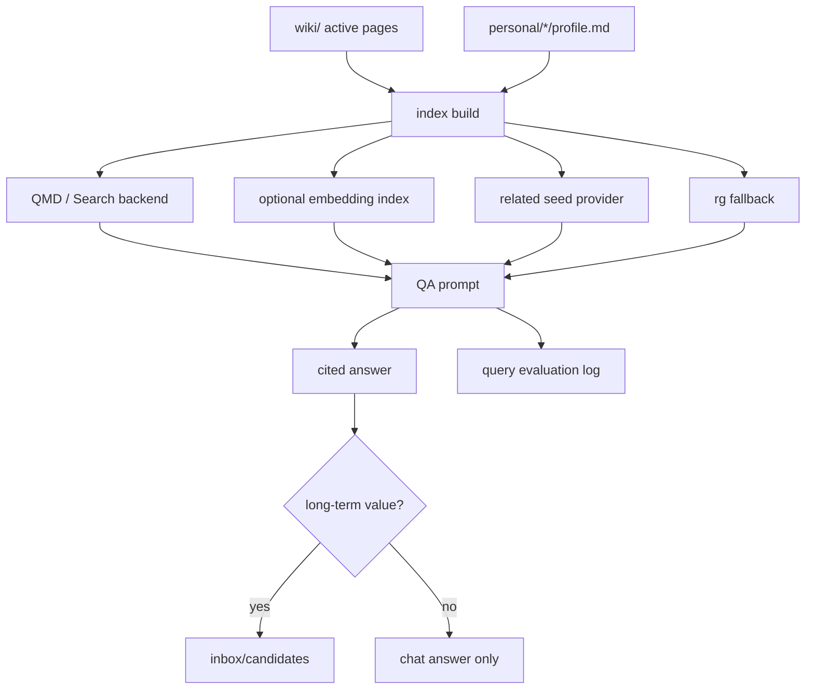
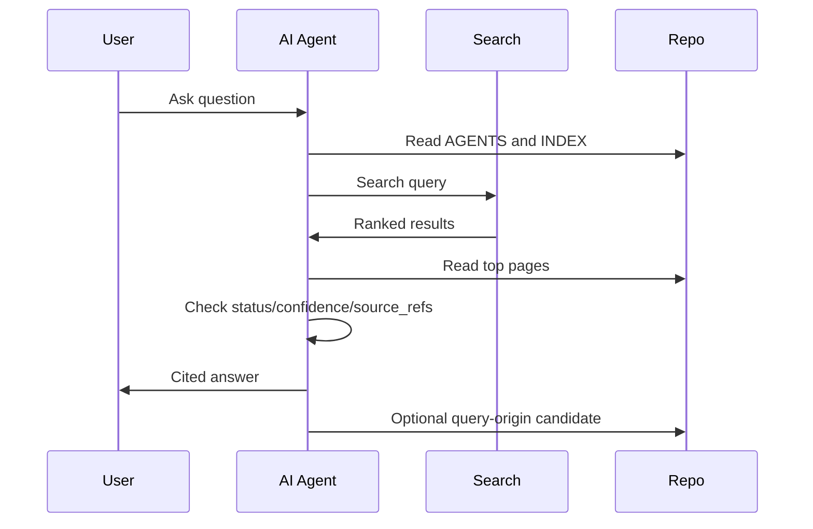

# Phase 3 - 检索、向量与问答增强

> 目标：在不破坏 Git repo 权威层的前提下，从 Phase 1 的 QMD basic/rg demo 升级为可评估、可替换、可治理的检索与问答层；当远程 embedding API 可用时，增量生成向量索引并做 hybrid search。  
> 成功标准：团队常见问题能被稳定检索、引用、回答；有评估集、fallback、search manifest；embedding API 可用时能重建向量索引。  
> Phase 定位：从“浏览 wiki”升级为“问 wiki”，但仍不是让 RAG 替代 wiki。

## 目录

- [1. Phase 3 范围](#1-phase-3-范围)
- [2. Phase 3 架构](#2-phase-3-架构)
- [3. 查询评估集](#3-查询评估集)
- [4. 搜索后端选型](#4-搜索后端选型)
  - [4.1 小团队默认：QMD 增强模式](#41-小团队默认qmd-增强模式)
  - [4.2 远程 embedding API 可用后的向量层](#42-远程-embedding-api-可用后的向量层)
  - [4.3 内部搜索服务](#43-内部搜索服务)
- [5. 搜索索引字段](#5-搜索索引字段)
- [6. Query 工作流](#6-query-工作流)
- [7. Query prompt](#7-query-prompt)
- [8. 检索脚本草案](#8-检索脚本草案)
  - [8.1 统一查询 wrapper](#81-统一查询-wrapper)
  - [8.2 评估 top-k](#82-评估-top-k)
  - [8.3 构建 search corpus](#83-构建-search-corpus)
  - [8.4 构建 chunk manifest](#84-构建-chunk-manifest)
  - [8.5 远程 embedding API 生成策略](#85-远程-embedding-api-生成策略)
- [9. QMD 接入建议](#9-qmd-接入建议)
  - [9.1 初始化](#91-初始化)
  - [9.2 查询](#92-查询)
  - [9.3 MCP](#93-mcp)
  - [9.4 Related seed 规则](#94-related-seed-规则)
- [10. 答案回填](#10-答案回填)
- [11. 风险点](#11-风险点)
- [12. 验收标准](#12-验收标准)
- [13. 进入 Phase 4 条件](#13-进入-phase-4-条件)

## 1. Phase 3 范围

必须做：

- 建立查询评估集。
- 保留 `INDEX.md + rg` fallback。
- 引入或增强一个可替换搜索后端。
- 搜索结果必须返回页面路径、标题、片段、confidence、status。
- 答案必须引用 wiki 页面和 source_refs。
- 查询后可生成 `candidate_origin=query`、`candidate_intent=promotion` 的 candidate。
- 为 Phase 4 轻量图遍历提供 search seeds，但 Phase 3 不把 graph 作为主召回。
- 远程 embedding API 可用后，建立 chunk manifest、embedding build 脚本和 hybrid 查询流程。

可选技术：

- QMD 本地 hybrid search。
- QMD basic -> hybrid/rerank 升级。
- 远程 embedding API + 本地或内部向量索引。
- 公司已有 OpenSearch / Elasticsearch。
- 轻量自研 SQLite FTS。

不做：

- 不把搜索索引作为权威知识源。
- 不让问答结果自动覆盖 wiki。
- 不做全公司多源搜索，除非 Phase 5。
- 不做大型自动抽图或图数据库。

## 2. Phase 3 架构



核心原则：

- Search 只读 `wiki/`、`personal/*/profile.md`、`indexes/`。
- `confluence-mirror/` 默认不进入主搜索；只有 Phase 2 策略允许的 mirror index 才可被单独查询。
- Search index 可以随时重建。
- 查询不依赖 `SOURCES.md` 或 `RELATED.md` 这类手工聚合文件；source 关系来自 `raw/**/manifest.md` 和 wiki frontmatter 的 `source_refs`，related seed 来自 `[[wikilink]]`、frontmatter `related`、backlink 和 shared `source_refs` 动态扫描。
- Answer 不直接写正式知识。
- Answer 的价值通过 `inbox/candidates/ -> prepare-wiki-patch -> PR` 沉淀。

## 3. 查询评估集

在 `eval/query-set.md` 或 `indexes/QUERY_EVAL.md` 维护 20-50 个问题。

示例：

```md
# Query Evaluation Set

## Q001

question: 支付网关故障时应该先看哪个 runbook？
expected_pages:
  - kb:runbook:payment-failover
  - kb:system:payment-gateway
must_not_use:
  - kb:runbook:legacy-payment-failover

## Q002

question: 谁负责 billing modernization 项目？
expected_pages:
  - kb:project:billing-modernization
  - staff:12345678
```

评估指标：

- top-5 是否包含 expected page。
- answer 是否引用正确页面。
- 是否误用 stale/superseded 页面。
- 是否能说出 unknown。
- 回答是否包含 source_refs。

## 4. 搜索后端选型

### 4.1 小团队默认：QMD 增强模式

优点：

- 本地运行。
- 支持 BM25、vector、rerank。
- 支持 MCP。
- 对 agent 工作流友好。

Phase 3 与 Phase 1 的差异：

- Phase 1：只用 QMD basic search 做 demo。
- Phase 3：建立 query eval，评估 tokenizer、BM25、embedding、rerank、top-k 命中和 stale 误用。
- Phase 3：只把 related pages 当作候选 seed，不做图遍历主检索。

注意：

- 模型下载、GPU/CPU、Windows 兼容性需要试跑。
- 中文语料要选合适 embedding 模型。
- 切换 embedding 模型需重建索引。

### 4.2 远程 embedding API 可用后的向量层

适用条件：

- 公司提供 embedding 模型 API 或内网 embedding endpoint。
- 可以确认模型、维度、tokenizer、数据出境和日志策略。
- 已有 Phase 1/2 的正式 wiki、schema、CI 与 review 流程。

处理方式：

- 将 `wiki/` 页面切 chunk，chunk id 稳定。
- 生成 `indexes/search/chunks.jsonl`，记录 page id、path、heading、hash、text range。
- 调用 embedding API 生成向量，写入 QMD、本地索引目录或内部搜索服务。
- repo 默认只提交 manifest 和构建脚本，不提交大体积向量。
- 页面 hash 变化时只重建受影响 chunk。
- 查询时执行 lexical + vector hybrid，并保留 `rg` fallback。

### 4.3 内部搜索服务

适用：

- 公司已有搜索基础设施。
- 需要权限、日志、观测、SLA。
- 对模型和索引有内部合规要求。

## 5. 搜索索引字段

无论使用什么后端，建议统一结果结构：

```json
{
  "id": "kb:runbook:payment-failover",
  "path": "wiki/runbooks/payment/payment-failover.md",
  "title": "Payment Failover",
  "type": "runbook",
  "status": "active",
  "review_state": "reviewed",
  "confidence": 0.86,
  "owners": ["staff:12345678"],
  "source_refs": ["raw:incidents:2026-05-31-payment-failover"],
  "tags": ["system/payment", "runbook"],
  "snippet": "When payment gateway fails...",
  "score": 0.87
}
```

## 6. Query 工作流



## 7. Query prompt

```md
你是团队知识库问答 agent。

问题：
<question>

流程：
1. 读取 AGENTS.md 和 indexes/INDEX.md。
2. 使用配置的 search backend 查询。
3. 如果 search backend 不可用，使用 rg fallback。
4. 读取 top 5 相关页面。
5. 忽略或降权 status=superseded/archived 的页面，除非问题询问历史。
6. 对 status=stale/superseded/archived、review_state=needs-review/disputed 或 confidence 低于 0.60 的页面明确标注。
7. 回答必须引用页面路径和知识 ID。
8. 如果 source_refs 缺失，说明证据不足。
9. 如果启用 related seed，必须说明扩展依据。
10. 如果发现知识缺口，输出建议创建的 candidate。

回答格式：
- 结论
- 依据
- 不确定点
- 可回填知识
```

## 8. 检索脚本草案

### 8.1 统一查询 wrapper

`scripts/search.ts` 统一封装查询：QMD/search backend 可用时调用后端，不可用时使用 `rg` fallback，范围为 `wiki/`、`personal/*/profile.md`、`indexes/`。

### 8.2 评估 top-k

`scripts/evaluate-search.ts` 读取查询评估集，输出 hit@5、stale misuse、citation quality 和 unknown correctness。

### 8.3 构建 search corpus

`scripts/build-search-corpus.ts` 从 `wiki/`、`personal/*/profile.md`、`indexes/` 构建 search corpus，并读取 `raw/**/manifest.md` 验证 `source_refs`。输出默认放入 `indexes/search/corpus.jsonl` 或搜索后端索引目录，不使用 `exports/` 作为 Phase 3 默认目录。

### 8.4 构建 chunk manifest

`scripts/build-chunks.ts` 生成 `indexes/search/chunks.jsonl`，记录 page id、path、heading、content hash、text range、frontmatter hash 和 source manifest hash。chunk 来源只包含正式 wiki、personal profile 和 index，不包含 `personal/*/raw`、`personal/*/wiki`、`inbox/` 或 mirror；source manifest 只作为 provenance 和重建判断输入。

### 8.5 远程 embedding API 生成策略

Phase 3 在 embedding API 可用后才执行本步骤。仓库保存 manifest 和重建脚本；向量本体默认进入 QMD、本地索引目录或内部搜索服务。embedding manifest 必须能从 raw manifest、wiki frontmatter 和 chunk manifest 重建，不依赖手工 source/related 聚合文件。

```text
indexes/search/chunks.jsonl
  -> call embedding API
  -> local/qmd/internal vector index
  -> indexes/search/embedding-manifest.json
```

`embedding-manifest.json` 至少记录：

```json
{
  "model": "company-embedding-model",
  "dimension": 1536,
  "input": "indexes/search/chunks.jsonl",
  "index_path": ".qmd/team-wiki",
  "created_at": "2026-05-31",
  "source_hash_policy": "rebuild changed chunks only"
}
```

## 9. QMD 接入建议

### 9.1 初始化

```text
qmd init
qmd add wiki/**/*.md
qmd add personal/**/profile.md
qmd add indexes/**/*.md
```

`qmd embed` 或同类向量命令只在 embedding 模型/API 已确认可用时启用。

### 9.2 查询

```text
qmd query "payment gateway failover owner" --json --top 10
```

### 9.3 MCP

```text
qmd mcp --transport http --port 8181
```

注意：具体命令以实际安装版本为准。Phase 3 文档应记录安装版本、模型、索引路径、重建步骤和 fallback。

### 9.4 Related seed 规则

Phase 3 可以从搜索 top results 中读取 related pages 作为补充 seed，但不做 Phase 4 的图遍历主能力：

```text
search query -> top seed pages -> read related/wikilink/source_refs -> optional 1-hop seed -> read pages -> cited answer
```

允许信号：

- direct wikilink。
- shared source_refs。
- explicit `related`。

暂不允许：

- 未审阅的 AI inferred edge 直接进入主召回。
- 2 跳以上扩展。
- graph-only answer。

输出必须标注：

- seed page。
- expanded page。
- expansion reason。
- 是否被最终引用。

## 10. 答案回填

Query 产生的答案只有满足以下条件才回填：

- 解决了反复出现的问题。
- 汇总了多个页面。
- 形成了新 runbook、decision、learning 或 FAQ。
- 有明确 owner。
- 不包含临时上下文。

回填路径：

```text
inbox/candidates/query-YYYY-MM-DD-<slug>.md
```

candidate metadata：

```yaml
candidate_origin: query
candidate_intent: promotion
candidate_status: proposed
```

## 11. 风险点

| 风险 | 处理 |
| --- | --- |
| 搜索结果看似权威但页面过期 | answer prompt 必须读取 status/review_state |
| 中文检索效果差 | 保留 BM25/rg，测试中文 embedding |
| QMD 模型下载阻塞 | 有 fallback，不作为唯一入口 |
| 向量结果缺精确术语 | hybrid search，BM25 权重不可去掉 |
| 问答幻觉 | 所有结论要引用页面和 source_refs |
| 搜索索引泄露 restricted 内容 | index build 读取 visibility 过滤 |
| related seed 引入噪声 | 只做 1-hop，必须标注 reason，answer 仍读原文 |

## 12. 验收标准

Phase 3 完成必须满足：

- 有 20+ 个查询评估问题。
- 每个问题有 expected page。
- 搜索后端能索引 `wiki/`、`personal/*/profile.md`、`indexes/`。
- top-5 命中率达到团队可接受阈值，建议先设 80%。
- 问答输出带页面引用。
- stale/superseded 页面不会被误当作当前事实。
- related seed 如启用，能解释每个扩展页面的 reason。
- 搜索后端不可用时可 fallback 到 `rg`。
- 至少 3 个 query answer 被回填为 `candidate_origin=query`、`candidate_intent=promotion` 的 candidate。
- 至少 1 次评估报告写入 `logs/`。

## 13. 进入 Phase 4 条件

满足以下条件才进入 Phase 4：

1. 搜索已经能稳定回答常见问题。
2. 团队开始问“依赖关系、影响范围、谁负责、什么替代了什么”这类图问题。
3. `related` 和 wikilink 已经不足以表达关系。
4. 页面数达到约 100+，手动维护关联开始困难。
5. 有明确的 graph schema 试点范围。

