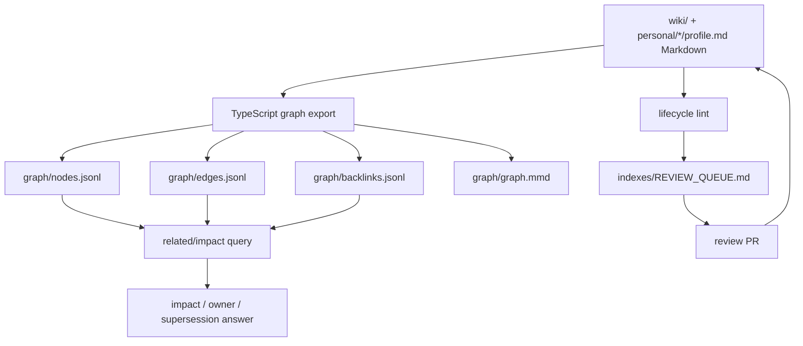
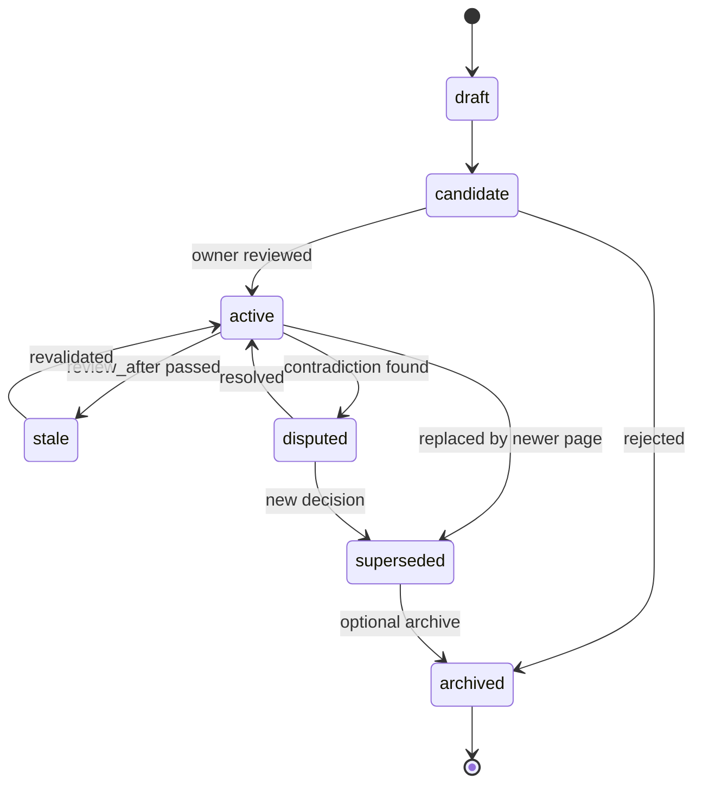

# Phase 4 - 轻量图遍历与生命周期治理

> 目标：在不引入图数据库和大型自动抽图平台的前提下，让团队知识具备基于 `[[wikilink]]`、frontmatter `related`、backlink、shared `source_refs` 的轻量图遍历能力，并叠加 confidence decay、supersession、stale review。  
> 成功标准：能回答“一跳相关页面有哪些、谁负责、被什么替代、哪些页面过期、改这个会影响谁”。  
> Phase 定位：从“可搜索知识库”升级为“可解释关系导航”，但 Markdown 仍是权威层。

## 目录

- [1. Phase 4 范围](#1-phase-4-范围)
- [2. Phase 4 架构](#2-phase-4-架构)
- [3. Graph schema](#3-graph-schema)
  - [3.1 Node](#31-node)
  - [3.2 Edge](#32-edge)
  - [3.3 Edge type](#33-edge-type)
- [4. 生命周期状态](#4-生命周期状态)
  - [4.1 状态机](#41-状态机)
  - [4.2 Review SLA](#42-review-sla)
  - [4.3 Confidence 升降级](#43-confidence-升降级)
- [5. Supersession 机制](#5-supersession-机制)
  - [5.1 页面头部提示](#51-页面头部提示)
  - [5.2 frontmatter 更新](#52-frontmatter-更新)
  - [5.3 graph edge](#53-graph-edge)
- [6. Graph-aware 查询](#6-graph-aware-查询)
  - [6.1 related/impact query prompt](#61-relatedimpact-query-prompt)
- [7. 脚本草案](#7-脚本草案)
  - [7.1 `scripts/export-nodes.ts`](#71-scriptsexport-nodests)
  - [7.2 `scripts/export-edges.ts`](#72-scriptsexport-edgests)
  - [7.3 `scripts/check-superseded-references.ts`](#73-scriptscheck-superseded-referencests)
  - [7.4 `scripts/render-graph.ts`](#74-scriptsrender-graphts)
- [8. 风险点](#8-风险点)
- [9. 验收标准](#9-验收标准)
- [10. 进入 Phase 5 条件](#10-进入-phase-5-条件)

## 1. Phase 4 范围

必须做：

- 定义轻量 node/edge JSONL。
- 从 Markdown/frontmatter `related`/`[[wikilink]]`/`source_refs` 生成 links/backlinks/related sidecar。
- 建立 supersession 流程。
- 建立 confidence decay 与 stale/review lifecycle。
- 建立 owner impact 查询。
- 可视化关键关系。

可选做：

- Mermaid/Graphviz/Obsidian graph 导出。
- 对高价值系统做人工维护的 typed edge，例如 `depends_on`、`runbook_for`。

不做：

- 不引入图数据库。
- 不让自动抽取 graph 覆盖 Markdown。
- 不把 LLM 抽取的 edge 直接当事实。
- 不做大型自动抽图或多跳融合检索。
- 不删除旧知识。

## 2. Phase 4 架构



核心边界：

- `graph/*.jsonl` 和 `graph/graph.mmd` 是派生产物。
- `indexes/INDEX.md` 和 `indexes/REVIEW_QUEUE.md` 只保留人工可读导航和治理摘要，不维护全量 source/related 清单。
- Markdown/frontmatter 是事实源。
- LLM 可建议 edge，但需要 PR。
- sidecar 输出只能辅助，不得自动改 active 页面。

## 3. Graph schema

### 3.1 Node

`graph/nodes.jsonl` 示例：

```json
{"id":"kb:system:payment-gateway","type":"system","title":"Payment Gateway","path":"wiki/systems/payment/payment-gateway.md","status":"active","confidence":0.86,"owners":["staff:12345678"]}
{"id":"staff:12345678","type":"profile","title":"staff:12345678","path":"personal/12345678/profile.md","status":"active"}
```

必填字段：

| 字段 | 说明 |
| --- | --- |
| `id` | 与 frontmatter id 一致 |
| `type` | system/runbook/decision/profile/source/team 等 |
| `title` | 展示标题 |
| `path` | repo 相对路径 |
| `status` | 生命周期状态 |
| `confidence` | 页面级可信度分数 |

### 3.2 Edge

`graph/edges.jsonl` 示例：

```json
{"from":"kb:runbook:payment-failover","to":"kb:system:payment-gateway","type":"wikilink","reason":"direct-wikilink","evidence":["wiki/runbooks/payment/payment-failover.md"]}
{"from":"kb:system:payment-gateway","to":"kb:runbook:payment-failover","type":"backlink","reason":"backlink","evidence":["wiki/runbooks/payment/payment-failover.md"]}
{"from":"kb:runbook:payment-failover","to":"kb:learning:payment-incident-2026-05","type":"shared_source","reason":"shared-source raw:incidents:2026-05-31-payment-failover","evidence":["raw:incidents:2026-05-31-payment-failover"]}
```

每条边必须有 `reason`。Phase 4 默认只信任 `direct-wikilink`、`backlink`、`shared-source`、`explicit-frontmatter`。

### 3.3 Edge type

| edge | 用途 |
| --- | --- |
| `owns` | staff/team 负责对象 |
| `maintains` | staff/team 维护页面 |
| `wikilink` | 正文显式链接 |
| `backlink` | 反向链接 |
| `shared_source` | 共享 source_refs |
| `depends_on` | 人工维护的系统/项目依赖 |
| `runbook_for` | 人工维护的 runbook 对应对象 |
| `supersedes` | 替代旧知识 |
| `contradicts` | 冲突 |
| `related_to` | 弱相关 |

## 4. 生命周期状态

### 4.1 状态机



注意：`disputed` 可作为 `review_state`，也可以在 graph 中以 `contradicts` 表示。建议：

- `status` 表示生命周期。
- `review_state` 表示审核状态。
使用页面级 numeric confidence 表达“降低/遗忘”，使用 `status` 和 `review_state` 表达硬门禁：

```text
confidence: 0.90 -> 0.85 -> 0.80 ... -> 0.40
status: active -> stale | superseded | archived
review_state: reviewed -> needs-review | disputed
```

### 4.2 Review SLA

建议：

| 页面类型 | 默认 review_after |
| --- | --- |
| runbook | 90 天 |
| system | 180 天 |
| decision | 365 天 |
| glossary | 365 天 |
| learning | 不强制过期，但可归档 |
| mirrored | 与源同步策略一致 |

### 4.3 Confidence 升降级

升级：

- 有 source_refs：可从候选低分提升到 `0.50+`。
- 知识管理员初审通过：可提升到 `0.60-0.75`。
- 领域 owner 审核通过：可提升到 `0.75-0.90`。
- 被正式 ADR、生产验证、审计、多源长期确认支持：可提升到 `0.90+`。

降级：

- 来源失效。
- owner 标记过期。
- 出现冲突。
- review_after 超期太久。

降级不是删除；它会降低 `confidence`，必要时同时改变 `review_state` 或 `status`。

## 5. Supersession 机制

### 5.1 页面头部提示

旧页面被替代后，正文顶部必须写：

```md
> [!STALE]
> This page is superseded by [[wiki/decisions/payment-provider-v2]].
> Do not use this page as current guidance unless you are researching history.
```

### 5.2 frontmatter 更新

旧页：

```yaml
status: superseded
superseded_by:
  - kb:decision:payment-provider-v2
```

新页：

```yaml
status: active
supersedes:
  - kb:decision:payment-provider-v1
```

### 5.3 graph edge

```json
{"from":"kb:decision:payment-provider-v2","to":"kb:decision:payment-provider-v1","type":"supersedes","reason":"explicit-frontmatter","evidence":["wiki/decisions/payment-provider-v2.md"]}
```

## 6. Graph-aware 查询

典型问题：

- 这个系统有哪些 runbook？
- 改这个系统会影响哪些项目？
- 谁是这个页面 owner？
- 这个决策替代了什么旧决策？
- 哪些 active 页面还引用了 superseded 页面？
- 哪些 runbook 过了 review_after？

### 6.1 related/impact query prompt

```md
请基于团队知识库轻量关系索引回答问题：

问题：
<question>

流程：
1. 读取 graph/nodes.jsonl、graph/edges.jsonl、graph/backlinks.jsonl。
2. 读取相关 wiki 页面或 personal/*/profile.md 确认事实。
3. 不要只凭 sidecar 回答，关系索引只是导航。
4. 每条关系必须输出 reason。
5. 对 superseded/stale/disputed 页面明确说明。

输出：
- 结论
- 关系路径
- 引用页面
- 风险或不确定点
```

## 7. 脚本草案

### 7.1 `scripts/export-nodes.ts`

输入：

- `wiki/**/*.md`
- `personal/*/profile.md`

输出：

- `graph/nodes.jsonl`

规则：

1. 读取 frontmatter 中的 `id`、`type`、`title`、`status`、`confidence`、`owners`。
2. 正式 wiki 页面必须有 `id`；个人 profile 的 `id` 必须是 `staff:########`。
3. `raw/`、`personal/*/raw/`、`personal/*/wiki/` 不作为默认 graph node；它们通过 `source_refs` 或 promotion candidate 间接参与关系。
4. 发现缺失 `id`、重复 `id`、非法 staff-id 时退出非零。

### 7.2 `scripts/export-edges.ts`

输入：

- `wiki/**/*.md`
- `personal/*/profile.md`
- `raw/**/manifest.md`
- `graph/nodes.jsonl`

输出：

- `graph/edges.jsonl`
- `graph/backlinks.jsonl`

规则：

1. 从正文 `[[wikilink]]` 生成 `wikilink` edge。
2. 从 `wikilink` 反向生成 `backlink` edge。
3. 从多个页面共享同一个 `source_refs` 生成 `shared_source` edge。
4. 从 frontmatter `related` 生成 `related_to` edge，并把 reason 标为 `explicit-frontmatter`。
5. 从 `owners` 生成 `owns` 或 `maintains` edge，owner 指向 `staff:########`。
6. 从 `supersedes`、`superseded_by` 生成 `supersedes` edge。
7. 所有 edge 必须有 `reason` 和 `evidence`。
8. LLM 推断关系不得直接写入 `graph/edges.jsonl`，只能先进入 PR proposal。

### 7.3 `scripts/check-superseded-references.ts`

输入：

- `wiki/**/*.md`
- `graph/edges.jsonl`

规则：

1. 找出 `status: superseded` 的页面 id。
2. 检查所有 `status: active` 页面是否仍把这些 id 作为当前执行依据。
3. 允许历史说明引用，但必须出现在明确的 history/context 段落或带有 superseded 提示。
4. 发现 active 页面无提示引用 superseded 页面时失败，并写入 `indexes/REVIEW_QUEUE.md` 的建议项。

### 7.4 `scripts/render-graph.ts`

输入：

- `graph/nodes.jsonl`
- `graph/edges.jsonl`

输出：

- `graph/graph.mmd`

规则：

1. 默认只渲染指定 topic、system、owner 或 candidate 的 1-hop 子图。
2. 2-hop 必须通过参数显式开启，避免图噪声过高。
3. Mermaid 节点 label 使用页面 title，节点 id 使用稳定的 graph id 转义结果。
4. 渲染结果只用于阅读和 demo，不作为事实源。

## 8. 风险点

| 风险 | 处理 |
| --- | --- |
| graph 与 Markdown 不一致 | Markdown 为准，graph sidecar 可重建 |
| AI 推断错误 edge | 默认只使用 direct-wikilink/backlink/shared-source/explicit-frontmatter |
| 关系类型膨胀 | Phase 4 限制少量核心 edge，不做全量 typed graph |
| supersession 忘记更新 index | CI 检查 active 引用 superseded |
| review_after 过期太多 | REVIEW_QUEUE 分 owner 排序 |
| 图遍历噪声过高 | 默认 1-hop，2-hop 必须人工指定 |

## 9. 验收标准

Phase 4 完成必须满足：

- `graph/nodes.jsonl` 可生成。
- `graph/edges.jsonl` 与 `graph/backlinks.jsonl` 可生成。
- 至少 `wikilink/backlink/shared_source/related_to/supersedes/owns` 有真实数据或可解释来源。
- 至少 3 个 supersession 案例跑通。
- `review_after` 过期页面进入 `REVIEW_QUEUE`。
- 能回答 5 个 related/impact 问题。
- active 引用 superseded 的情况能被检查出来。
- graph 可视化能展示一个团队或系统子图。
- LLM 不会只凭 sidecar 回答，必须回读 wiki 页面或 personal profile。

## 10. 进入 Phase 5 条件

满足以下条件才进入 Phase 5：

1. graph sidecar 能稳定重建。
2. lifecycle 规则被团队接受。
3. REVIEW_QUEUE 有 owner 处理机制。
4. 手动 ingest 外部材料成为瓶颈。
5. 团队需要接入 Confluence/Jira/Slack/GitHub 等外部源。

