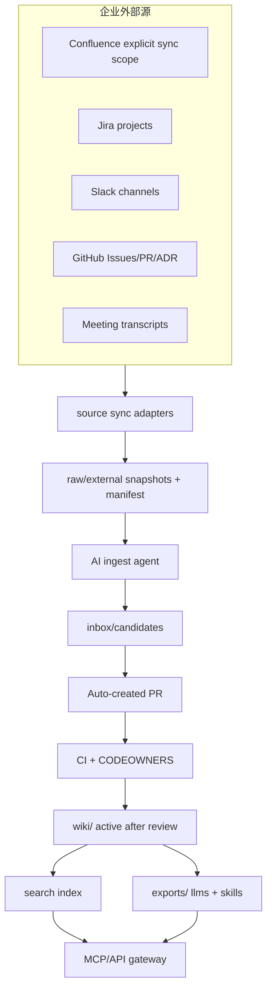
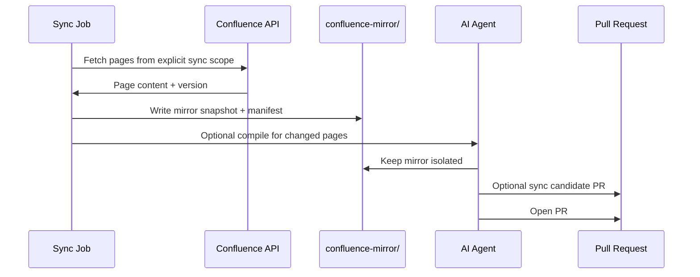

# Phase 5 - 自动化与企业集成

> 目标：把稳定的人工流程升级为受控自动化，并接入企业外部知识源和 AI agent 查询入口。  
> 成功标准：外部源可控进入 raw/confluence-mirror/inbox，agent 可通过 MCP/搜索查询知识库，自动化只开 PR 不直接合并。  
> Phase 定位：降低维护成本，但不牺牲审计和 owner gate。

## 目录

- [1. Phase 5 范围](#1-phase-5-范围)
- [2. Phase 5 架构](#2-phase-5-架构)
- [3. Confluence 接入](#3-confluence-接入)
  - [3.1 中立 sync scope 策略](#31-中立-sync-scope-策略)
  - [3.2 Manifest](#32-manifest)
  - [3.3 同步流程](#33-同步流程)
  - [3.4 Mirror 到正式 wiki 的流转](#34-mirror-到正式-wiki-的流转)
- [4. GitHub/Jira/Slack 接入](#4-githubjiraslack-接入)
  - [4.1 GitHub](#41-github)
  - [4.2 Jira](#42-jira)
  - [4.3 Slack / Teams](#43-slack-teams)
- [5. Agent 自动 PR](#5-agent-自动-pr)
  - [5.1 触发条件](#51-触发条件)
  - [5.2 PR 标题规范](#52-pr-标题规范)
  - [5.3 PR body 模板](#53-pr-body-模板)
- [6. MCP / API 查询入口](#6-mcp-api-查询入口)
  - [6.1 目标](#61-目标)
  - [6.2 MCP 权限](#62-mcp-权限)
- [7. AI-ready exports](#7-ai-ready-exports)
  - [7.1 `llms.txt`](#71-llmstxt)
  - [7.2 `skill.md`](#72-skillmd)
- [8. 敏感信息过滤](#8-敏感信息过滤)
  - [8.1 secret scan 草案](#81-secret-scan-草案)
- [9. Phase 5 prompts](#9-phase-5-prompts)
  - [9.1 external-source-ingest prompt](#91-external-source-ingest-prompt)
  - [9.2 crystallize-session prompt](#92-crystallize-session-prompt)
- [10. 风险点](#10-风险点)
- [11. 验收标准](#11-验收标准)
- [12. 进入 Phase 6 条件](#12-进入-phase-6-条件)

## 1. Phase 5 范围

必须做：

- Confluence 显式 sync scope 的单向只读 mirror。
- GitHub Issues/PR/ADR source ingest。
- 可选 Jira/Slack/meeting transcript source ingest。
- agent 自动生成 PR。
- MCP 或内部 API 查询入口。
- `llms.txt`、`llms-full.txt`、`skill.md` 导出。
- 敏感信息过滤。
- 权限与可见性策略。

不做：

- 不做默认全量同步。
- 不做无 owner 自动晋升。
- 不做自动合并正式知识。
- 不绕过外部系统权限。

## 2. Phase 5 架构



核心原则：

- 外部源进入 `raw/` 或 `confluence-mirror/`，不是直接进 `wiki/`。
- 自动化最多创建 PR。
- PR 仍走 CI 和 owner review。
- MCP 默认只读。
- restricted/confidential 根据权限和导出策略处理。

## 3. Confluence 接入

### 3.1 中立 sync scope 策略

将 Confluence 接入表述为中立的指定范围 mirror。更准确的边界是：

- Confluence 同步是无状态、手动触发、中立的单向转换流程。
- 哪些 page 可以被同步，不由本知识库决定；由调用者、外部权限系统、管理员输入或脚本参数决定。
- 只接收 sync scope，并把对应内容转换成 `confluence-mirror/` 快照。
- include/exclude 配置可以预留，但默认只是输入范围选择，不是权限审批。

sync scope 可来自：

- 指定 page id。
- 指定 space。
- 指定 ancestor/parent page。
- 指定 label。
- 本地导出的 Confluence HTML/Markdown 文件。

不允许：

- 全量 Confluence crawl。
- 隐式同步个人空间。
- 无人触发的自动周期同步。
- 写回 Confluence。
- 同步 restricted 内容到公开 exports。

### 3.2 Manifest

每个 Confluence page mirror snapshot：

```yaml
---
id: mirror:confluence:123456
source_type: confluence
confluence:
  page_id: "123456"
  space_key: "ENG"
  url: "https://confluence.example.com/pages/123456"
  version: 42
  title: "Payment Support Notes"
collector: staff:12345678
collected_at: 2026-05-31
sensitivity: internal
hash: "sha256:..."
mirror_status: synced
review_state: unreviewed
confidence: 0.50
---
```

### 3.3 同步流程



### 3.4 Mirror 到正式 wiki 的流转

```text
confluence-mirror/
  -> inbox/candidates/
  -> prepare-wiki-patch
  -> owner review
  -> wiki/<target>/
```

规则：

- mirror 本身不是正式知识。
- mirror 默认不参与正式主搜索。
- mirror 可以单独建立 mirror search，结果必须标注 source_system=confluence。
- mirror 进入候选时必须设置 `candidate_origin=mirror`、`candidate_intent=sync`。
- 晋升到正式 wiki 时必须重新整理，不直接复制原文当团队结论。
- 晋升后正式页使用 `source_refs` 指向 mirror snapshot 和原始 Confluence URL。

## 4. GitHub/Jira/Slack 接入

### 4.1 GitHub

适合来源：

- ADR PR。
- incident fix PR。
- architecture discussion issue。
- release note。

同步策略：

- 只读 labels：`knowledge-source`、`adr`、`incident`。
- 保留 issue/PR URL。
- 自动提取 title、participants、linked commits。

### 4.2 Jira

适合来源：

- Epic 背景。
- incident ticket。
- postmortem ticket。
- 需求决策。

同步策略：

- 只同步指定 project + label。
- 注意权限和客户数据脱敏。
- 不把 Jira 描述原文直接公开到 wiki。

### 4.3 Slack / Teams

适合来源：

- 明确标记的线程。
- 会议总结。
- 决策确认。

同步策略：

- 不全量同步频道。
- 必须人工标记或 bot command。
- 默认进入 `raw/meetings/` 或 `raw/external/`。
- 个人隐私和即时聊天噪声要过滤。

## 5. Agent 自动 PR

### 5.1 触发条件

允许自动开 PR：

- raw source 新增且 hash 变化。
- stale review 到期。
- lint 发现自动可修复问题。
- query answer 被用户标记“沉淀”。
- session crystallization 被用户明确触发。

不允许自动开 PR：

- 无来源知识。
- owner 不明确。
- restricted/confidential 内容未分类。
- 大规模替换。
- 删除正式知识。

### 5.2 PR 标题规范

```text
knowledge: ingest <source-title>
knowledge: prepare patch <candidate-title>
knowledge: lint fix <scope>
knowledge: supersede <old-id> with <new-id>
knowledge: crystallize <session-title>
```

### 5.3 PR body 模板

```md
## Automation source

## Changed files

## Source refs

## Owners

## Confidence

## Sensitive content check

## Reviewer checklist

- [ ] staff-id is correct
- [ ] source_refs are valid
- [ ] no restricted content leaked
- [ ] old pages superseded correctly
- [ ] index/log updated
```

## 6. MCP / API 查询入口

### 6.1 目标

让 AI coding agents 在 IDE / CLI / Chat 中查询团队知识库，而不是把整个 repo 塞进上下文。

MCP tools：

| tool | 功能 |
| --- | --- |
| `wiki_search` | 搜索 wiki、personal profiles、index |
| `wiki_get_page` | 按 id/path 取页面 |
| `wiki_get_owner` | 查询 owner/maintainer |
| `wiki_get_related` | 查询 graph 邻居 |
| `wiki_report_gap` | 提交知识缺口 issue |
| `wiki_create_candidate` | 创建 inbox candidate，需权限 |

默认只读：

- `wiki_search`
- `wiki_get_page`
- `wiki_get_owner`
- `wiki_get_related`

写入工具需要更高权限，并且只能写 `inbox/` 或 issue。

### 6.2 MCP 权限

权限必须基于：

- 用户身份。
- repo 权限。
- 页面 `visibility`。
- 外部源原始权限。

如果暂时做不到精确权限同步：

- MCP 只暴露 `visibility: internal`。
- restricted/confidential 只允许本地 repo clone 查询，不进入远程 MCP。

## 7. AI-ready exports

### 7.1 `llms.txt`

内容：

```text
# Team Knowledge Base

This is the internal team knowledge base. Source of truth is the GitHub repo.

## Entry points

- indexes/INDEX.md
- wiki/overview/
- wiki/glossary/
- wiki/systems/
- wiki/runbooks/
- wiki/decisions/

## Rules

- People are identified by staff:########.
- Do not treat stale or superseded pages as current guidance.
- Cite page paths and source_refs.
```

### 7.2 `skill.md`

内容：

```md
---
name: team-wiki
description: Query and maintain the internal team LLM Wiki knowledge base.
license: internal
compatibility: Requires access to the team wiki GitHub repository.
---

# Team Wiki Skill

Use this when answering questions about team systems, runbooks, decisions, glossary, and operational learnings.

## Rules

1. Always search indexes/INDEX.md first.
2. Use staff:######## for people.
3. Cite wiki pages and source_refs.
4. Do not update active wiki pages directly.
5. Create inbox candidates for new knowledge.
```

## 8. 敏感信息过滤

检查项：

- token / API key。
- password。
- private customer data。
- personal data beyond staff-id。
- incident sensitive details。
- internal-only URL 是否允许导出。
- restricted/confidential 页面是否进入 MCP。

### 8.1 `scripts/check-secrets.ts`

输入：

- `raw/**/*.md`
- `inbox/**/*.md`
- `wiki/**/*.md`
- `personal/*/profile.md`
- `personal/*/wiki/**/*.md`

规则：

1. 用固定规则检测 token、API key、password、secret、private customer data 的明显模式。
2. 对 `restricted`、`confidential` 页面执行更严格检查。
3. 对 `confluence-mirror/` 和 `raw/external/` 允许保留内部 URL，但禁止进入默认 exports。
4. 输出文件路径、匹配规则、建议处理方式。
5. 发现高危 secret 时退出非零，阻断 PR。

## 9. Phase 5 prompts

### 9.1 external-source-ingest prompt

```md
请处理一个外部同步 source：

输入：
- raw source path
- manifest path
- source system: Confluence/Jira/Slack/GitHub

规则：
1. 检查 sensitivity 和 visibility。
2. 不把外部原文直接变成 active wiki。
3. 生成 inbox candidate。
4. 标记可能的 PII/secrets。
5. 搜索相关 wiki 页面。
6. 给出是否晋升的建议。
7. 如果适合晋升，生成 PR body。

输出：
- candidate 文件路径。
- 敏感信息风险。
- owner/reviewer 建议。
- 建议 PR 标题。
```

### 9.2 crystallize-session prompt

```md
请把一次 AI/人工工作会话结晶为团队知识候选：

输入：
- session transcript path
- topic
- participant staff-id list

步骤：
1. 提取问题、过程、结论、决策、教训、后续任务。
2. 判断哪些内容适合进入 wiki。
3. 对每条候选知识标注 type、owner、source_refs、confidence。
4. 不写 active wiki。
5. 写入 `inbox/candidates/`，并设置 `candidate_origin=manual`、`candidate_intent=promotion`。

输出：
- 候选知识列表。
- 不应入库的内容及原因。
- 建议 reviewer。
```

## 10. 风险点

| 风险 | 处理 |
| --- | --- |
| 外部源权限失真 | sync scope 由外部权限/调用者决定，mirror 保留 manifest，不公开 restricted |
| 自动 PR 噪声太多 | 限流、按 label/owner 分组、每周批处理 |
| Slack 噪声污染 | 只接人工标记线程 |
| Confluence 旧页污染 | hash/version + review_after + owner review |
| MCP 泄露敏感知识 | 默认只读 internal，restricted 单独鉴权 |
| Agent 自动化越权 | 只能写 inbox/issue，不能 merge |

## 11. 验收标准

Phase 5 完成必须满足：

- Confluence 显式 sync scope 可手动 mirror 10+ 页到 `confluence-mirror/`。
- 至少 5 个外部 source 生成候选 PR。
- 自动 PR 不会绕过 CI 和 CODEOWNERS。
- `llms.txt` 和 `skill.md` 可生成。
- MCP/API 能只读查询 4 类工具。
- restricted/confidential 内容不会进入默认 exports。
- secret scan 至少能阻断明显 token/password。
- 至少 3 个 AI agent 查询场景跑通。

## 12. 进入 Phase 6 条件

满足以下条件才进入 Phase 6：

1. 单团队自动化稳定运行至少 4 周。
2. 外部源 mirror/同步没有造成明显噪声。
3. owner review SLA 可接受。
4. 至少另一个团队希望复用这套模式。
5. 需要 schema registry、模板化 repo、统一指标。

