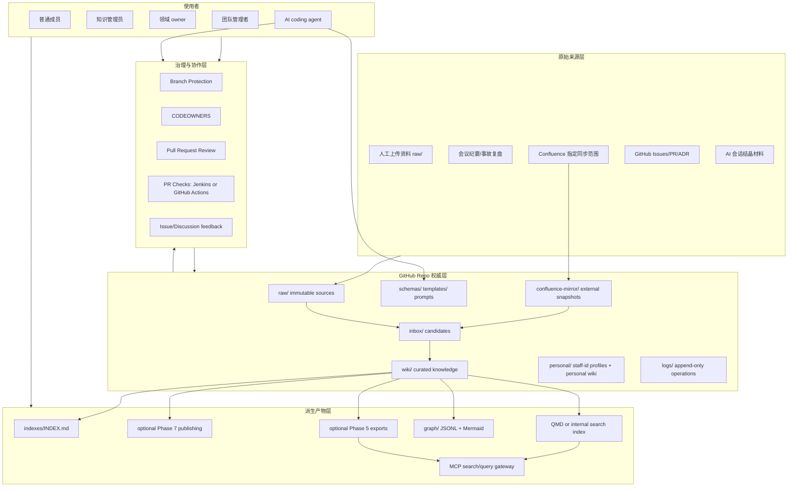
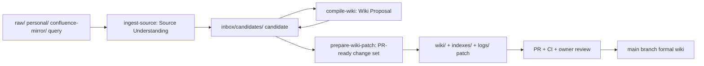
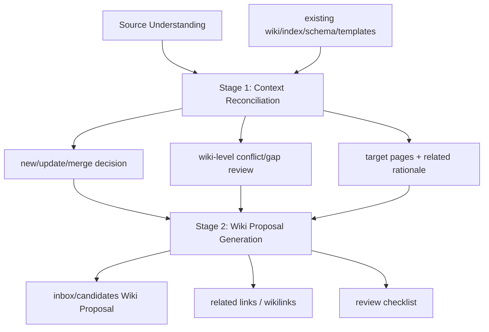
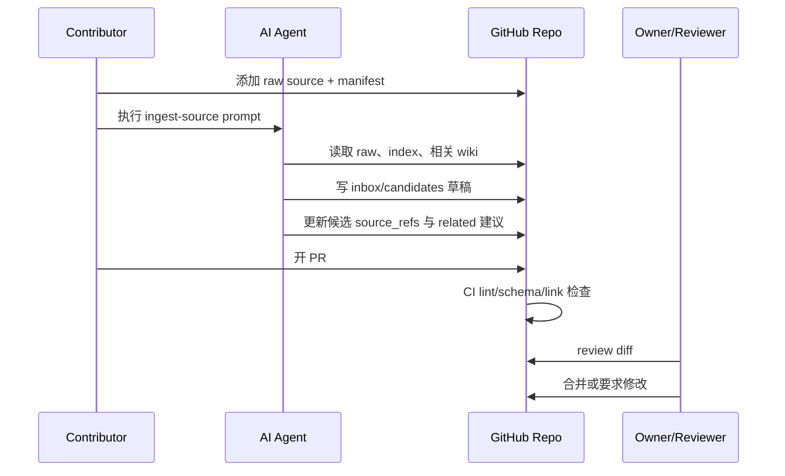
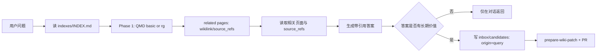
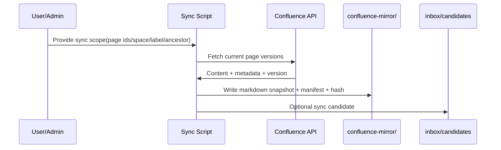
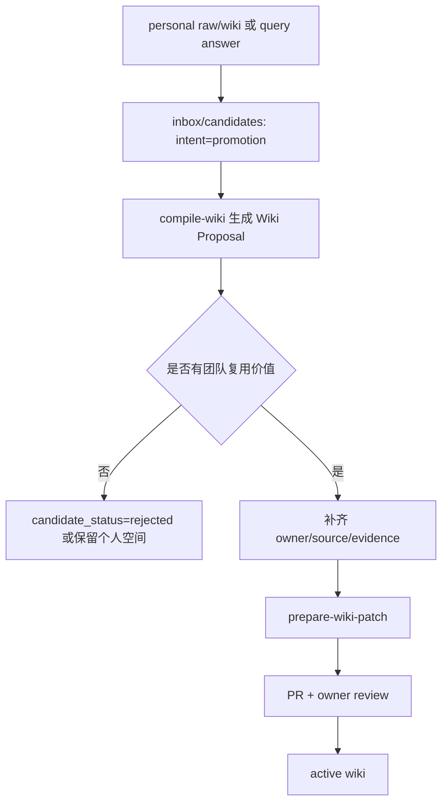
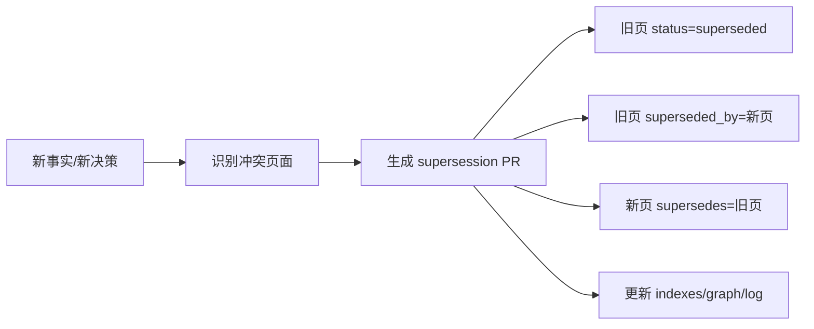
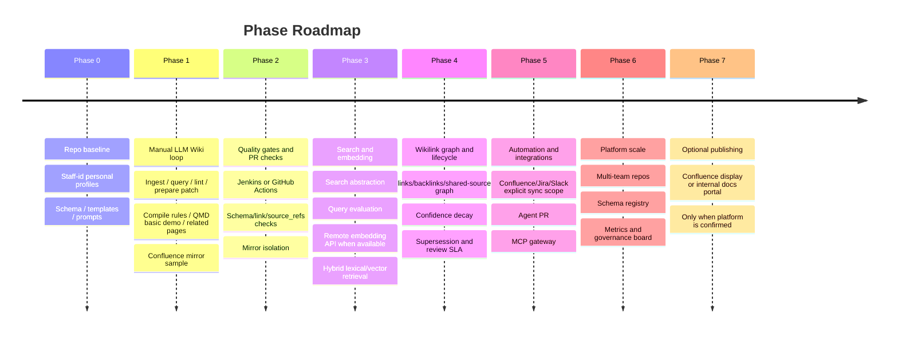

# 总体设计方案 - 基于 GitHub Repo 的团队 LLM Wiki 知识库

> 日期：2026-05-31  
> 状态：主设计基线，已按 V1/V2 已确认约束修订  
> 适用对象：企业内部研发团队、平台团队、知识管理员、团队管理者、AI coding agents。  
> 核心结论：GitHub repo 是权威层和审计层；LLM 是知识编译器和维护助手；正式知识只能通过 PR、CI 和 owner review 进入主干。

## 目录

- [1. 设计目标](#1-设计目标)
- [2. 非目标](#2-非目标)
- [3. 核心原则](#3-核心原则)
  - [3.1 Git repo 是权威层](#31-git-repo-是权威层)
  - [3.2 LLM 是 compiler，不是数据库管理员](#32-llm-是-compiler不是数据库管理员)
  - [3.3 人类负责判断，AI 负责维护成本](#33-人类负责判断ai-负责维护成本)
  - [3.4 先手工闭环，再自动化](#34-先手工闭环再自动化)
  - [3.5 页面级 confidence + 状态治理](#35-页面级-confidence-+-状态治理)
  - [3.6 V1/V2 对齐原则](#36-v1v2-对齐原则)
- [4. 总体架构](#4-总体架构)
  - [4.1 参考实现借鉴落点](#41-参考实现借鉴落点)
- [5. 推荐 repo 目录结构](#5-推荐-repo-目录结构)
  - [5.1 目录职责](#51-目录职责)
- [6. 正式页面 frontmatter schema](#6-正式页面-frontmatter-schema)
  - [6.1 通用页面字段](#61-通用页面字段)
  - [6.2 字段解释](#62-字段解释)
  - [6.3 正文结构](#63-正文结构)
- [7. `personal/` staff-id 与个人知识空间](#7-personal-staff-id-与个人知识空间)
  - [7.1 路径与 ID](#71-路径与-id)
  - [7.2 profile 页面模板](#72-profile-页面模板)
  - [7.3 人员引用规则](#73-人员引用规则)
- [8. 知识对象与关系模型](#8-知识对象与关系模型)
  - [8.1 知识对象类型](#81-知识对象类型)
  - [8.2 typed relationship](#82-typed-relationship)
  - [8.3 `[[wikilink]]` 与 `source_refs` 规则](#83-wikilink-与-source_refs-规则)
- [9. 核心工作流](#9-核心工作流)
  - [9.0.0 端到端执行顺序](#900-端到端执行顺序)
  - [9.0 Compile wiki 编译规则](#90-compile-wiki-编译规则)
  - [9.1 Ingest 新来源](#91-ingest-新来源)
  - [9.2 Query 查询与答案回填](#92-query-查询与答案回填)
  - [9.2.1 Confluence 单向 mirror 流程](#921-confluence-单向-mirror-流程)
  - [9.3 Lint 健康检查](#93-lint-健康检查)
  - [9.4 Promote 个人或候选知识](#94-promote-个人或候选知识)
  - [9.5 Supersede 替代旧知识](#95-supersede-替代旧知识)
  - [9.6 Crystallize 会话结晶](#96-crystallize-会话结晶)
- [10. 团队角色与完整使用流程](#10-团队角色与完整使用流程)
  - [10.1 普通团队成员](#101-普通团队成员)
  - [10.2 知识管理员](#102-知识管理员)
  - [10.3 领域 owner](#103-领域-owner)
  - [10.4 团队管理者](#104-团队管理者)
  - [10.5 AI coding agent](#105-ai-coding-agent)
- [11. 技术选型](#11-技术选型)
  - [11.1 Phase 0-1 默认技术](#111-phase-0-1-默认技术)
  - [11.2 Phase 2 质量门禁与 PR 检查](#112-phase-2-质量门禁与-pr-检查)
  - [11.3 Phase 3 检索与向量](#113-phase-3-检索与向量)
  - [11.4 Phase 4 轻量图遍历](#114-phase-4-轻量图遍历)
  - [11.5 Phase 5-6 企业集成](#115-phase-5-6-企业集成)
- [12. Prompt 指令模板](#12-prompt-指令模板)
  - [12.0 compile-wiki prompt](#120-compile-wiki-prompt)
  - [12.1 ingest-source prompt](#121-ingest-source-prompt)
  - [12.2 query-wiki prompt](#122-query-wiki-prompt)
  - [12.2.1 sync-confluence prompt](#1221-sync-confluence-prompt)
  - [12.3 lint-wiki prompt](#123-lint-wiki-prompt)
  - [12.4 prepare-wiki-patch prompt](#124-prepare-wiki-patch-prompt)
  - [12.5 supersede-page prompt](#125-supersede-page-prompt)
- [13. 脚本草案](#13-脚本草案)
  - [13.1 Phase 0 最小脚本](#131-phase-0-最小脚本)
  - [13.2 Phase 1 增量脚本](#132-phase-1-增量脚本)
  - [13.3 package.json 入口](#133-packagejson-入口)
- [14. LLM Wiki / LLM Wiki v2 对标矩阵](#14-llm-wiki-llm-wiki-v2-对标矩阵)
- [15. Phase 总路线](#15-phase-总路线)
- [16. 实施阶段清单](#16-实施阶段清单)
- [17. 关键风险与对策](#17-关键风险与对策)
- [18. 最小成功定义](#18-最小成功定义)
- [19. 推荐下一步](#19-推荐下一步)

## 1. 设计目标

建设一个企业内部团队知识库，使团队能够：

1. 以 GitHub repo 管理团队知识，获得版本历史、PR 审核、CODEOWNERS、CI、可回滚审计。
2. 符合 LLM Wiki 的 `raw sources -> compiled wiki -> schema` 思想，让知识不是每次查询重新 RAG，而是持续被编译、更新和交叉链接。
3. 吸收 LLM Wiki v2 的 lifecycle、typed graph、hybrid search、quality、automation、collaboration、privacy/governance 思想，但按 Phase 渐进落地。
4. 支持团队成员、知识管理员、领域 owner、管理者、AI agent 的不同使用流程。
5. 以公司 8 位数字 staff-id 作为员工唯一标识，避免姓名、邮箱、GitHub username 变化导致知识责任链断裂。
6. 最终形成可被人阅读、可被 AI agent 调用、可被 CI 检查、可被平台集成的团队知识资产。

## 2. 非目标

明确不做这些事：

- 不把知识库设计成只会回答问题的 RAG 系统。
- 不在 Phase 0/1 引入强依赖向量数据库、自动抽图平台、自动守护进程或多源全量同步。
- 不允许 LLM 自动直接写入正式知识并合并到主干。
- 不把 Confluence、搜索平台、开发门户或未来可选发布入口作为唯一事实源。
- 不用姓名、英文名、邮箱、GitHub username 作为人员主键。
- 不用无法解释的 confidence；所有分数必须能回溯到来源、review、验证和衰减规则。
- 不让知识库承担 Confluence page 权限裁决职责；Confluence 同步范围由调用者或外部权限系统决定。

## 3. 核心原则

### 3.1 Git repo 是权威层

所有正式知识以 Markdown + YAML frontmatter 存在于 GitHub repo。

以下内容都是派生产物：

- 可选发布入口。
- 搜索索引。
- graph sidecar。
- `llms.txt`。
- MCP 查询服务。
- JSON-LD 导出。
- 页面贡献统计。

派生产物可以自动生成、重建、删除；正式知识必须通过 Git 历史恢复。

### 3.2 LLM 是 compiler，不是数据库管理员

LLM 的角色：

- 读取 raw sources。
- 生成候选 summary。
- 更新草稿页。
- 找出相关页面。
- 建议 cross-links。
- 生成 PR diff。
- 执行 lint 修复建议。
- 生成 demo、报告、导出。

LLM 不能：

- 无人审阅直接覆盖 active 页面。
- 删除 source-of-truth。
- 自动把外部源全量晋升为团队知识。
- 自行决定组织级规范。

### 3.3 人类负责判断，AI 负责维护成本

人类负责：

- 选源。
- 判断哪些知识值得进入团队 wiki。
- 审核冲突。
- 确认责任人。
- 批准 supersession。
- 定义 schema。

AI 负责：

- 摘要、改写、交叉链接。
- 索引更新。
- 模板填充。
- 候选差异检查。
- 生成任务清单。
- 提醒 stale/review。

### 3.4 先手工闭环，再自动化

自动化上线顺序：

1. 手动执行 prompt，生成草稿。
2. 手动提交 PR。
3. CI 检查格式和链接。
4. owner review。
5. 合并。
6. 只有当流程稳定后，再让 agent 自动开 PR。

### 3.5 页面级 confidence + 状态治理

保留 V2 已确认的页面级 `confidence: 0.00-1.00`。原因是它能支持 LLM Wiki v2 中的过期、遗忘、降低和搜索排序，比纯枚举状态更容易做连续衰减。

但 `confidence` 不能成为不可解释的“神秘分数”。规定：

- `status` 是硬门禁，决定页面是否能作为当前事实使用。
- `review_state` 是人工审核状态，决定是否需要 owner 介入。
- `confidence` 是页面级软分数，用于排序、降权、stale 候选和 query 提示。
- `source_refs`、`verified_at`、`review_after`、`superseded_by` 是 confidence 的证据和衰减依据。

不在 Phase 1 做 claim-level confidence；正文只保留 `[!UNCERTAIN]`、`[!CONTRADICTION]`、`[!STALE]`、`[!CORRECTION]` 这类局部标记。

### 3.6 V1/V2 对齐原则

不是推翻 V1/V2 的所有讨论，而是重新排序和修正：

- 保留 V1 的 compile 思想：`prompts/compile-wiki.md` 是核心协议，`ingest-source` 只是其中一个入口。
- 保留 V1 对参考实现的借鉴，但按企业落地复杂度分期，不把重平台能力提前。
- 保留 V2 的 demo 优先原则：Phase 1 demo 必须展示基础检索和轻量 related pages。
- 保留 V2 的 Confluence mirror 隔离层，但将同步入口定义为“用户显式指定 sync scope”。
- 保留 V2 的 stale / supersession / review 思想，并采用页面级 numeric confidence 支持后续过期、遗忘和降权。

### 3.7 Schema Pack 设计

不把所有规则压进单个 `SCHEMA.md`。为了让规则可读、可维护、可被脚本校验，将 LLM Wiki 方法论中的 schema 拆为一组 Schema Pack：

```text
Schema Pack = AGENTS.md + schemas/ + templates/ + prompts/
```

职责边界：

- `AGENTS.md`：schema 入口和 agent 总协议，说明目录结构、写入边界、查询顺序、prompt registry、健康检查标准和禁止事项。
- `schemas/`：字段、frontmatter、source manifest、person profile、candidate 和 confidence 的结构契约。
- `templates/`：不同页面类型的正文结构。
- `prompts/`：具体任务协议，如 ingest、compile、query、lint、sync 和 prepare patch。

因此，外部文章里提到的 `SCHEMA.md` 在本方案中对应的是 Schema Pack，而不是某一个文件。`AGENTS.md` 是入口，但不独自承担全部 schema。

## 4. 总体架构



架构要点：

- `raw/` 只追加，不修改原始材料。
- `confluence-mirror/` 是外部页面快照层，和 `wiki/` 物理隔离。
- `inbox/` 是候选和治理 review 层，默认只保留 `candidates/` 和 `reviews/`。
- `wiki/` 是正式知识。
- `personal/` 是以 staff-id 分区的个人知识空间，包含 `profile.md`、个人 raw notes 和个人 wiki。
- `schemas/`、`templates/`、`prompts/` 与 `AGENTS.md` 共同组成 Schema Pack。
- `logs/` 记录 ingest、compile、prepare patch、lint、supersede 等动作。
- `indexes/` 是短导航和治理队列，不保存全量 source/related 关系；`graph/` 是可重建 sidecar。
- `site/` 不进入 Phase 0-6 默认目录；只有未来确认存在内部文档站或 Confluence 展示需求时，才在 Phase 7 作为可选发布入口加入。`exports/` 属于 Phase 5/6 的 AI-ready export。
- CI 和 owner review 是正式知识写入门禁。

### 4.1 参考实现借鉴落点

| 参考实现 | 可取之处 | 落点 |
| --- | --- | --- |
| nashsu/llm_wiki | 两阶段 ingest、图关系、搜索管线 | Phase 1 将两阶段编译拆为 `ingest-source` Analysis 与 `compile-wiki` Generation；Phase 1 只展示 related pages；Phase 4 只做轻量 wikilink/backlink/shared-source 图遍历 |
| team-wiki-compiler | 无向量起步、BYOAI、增量编译、团队/个人知识并存 | Phase 0/1 不依赖向量库；compile provider 可替换；个人/会话知识经 promotion 晋升 |
| foteev/llm-it-wiki-template | AI 永不可 commit、4-Tier 查询、raw 不可变、权限隔离 | 保留 PR owner gate、raw immutable、query 四层协议；双仓库延后到平台化或安全专项 |
| Pawpaw/llm-wiki | Scope-gated ingest、MCP、嵌入式全文搜索 | 用 sync scope/source manifest 控制输入；Phase 5 暴露 MCP gateway |
| Kosh | 中心 API + MCP 工具模型 | Phase 5 作为 MCP/API gateway 参考 |
| Arkon | RBAC、pgvector、容器化企业方案 | 不进入 Phase 0/1；作为 Phase 6 平台化参考 |
| QMD | 本地 Markdown 搜索、MCP、agent workflow 友好 | Phase 1 demo 使用基础全文模式；Phase 3 再评估 hybrid/vector/rerank |

## 5. 推荐 repo 目录结构

```text
team-wiki/
├── README.md
├── AGENTS.md
├── .github/
│   ├── CODEOWNERS
│   ├── PULL_REQUEST_TEMPLATE.md
│   ├── workflows/
│   │   ├── lint.yml
│   │   ├── compile-check.yml
│   │   └── sync-check.yml
│   ├── ISSUE_TEMPLATE/
│   │   ├── knowledge-request.yml
│   │   ├── stale-report.yml
│   │   └── correction-request.yml
├── raw/
│   ├── docs/
│   ├── runbooks/
│   ├── incidents/
│   ├── meetings/
│   ├── code-chunks/
│   └── external/
├── confluence-mirror/
│   ├── glossary/
│   ├── pages/
│   └── manifest/
├── personal/
│   └── 12345678/
│       ├── profile.md
│       ├── raw/
│       └── wiki/
├── inbox/
│   ├── candidates/
│   └── reviews/
├── wiki/
│   ├── overview/
│   ├── glossary/
│   ├── concepts/
│   ├── teams/
│   ├── projects/
│   ├── systems/
│   ├── practices/
│   ├── runbooks/
│   ├── decisions/
│   ├── learning/
│   └── mirrored/
├── schemas/
│   ├── README.md
│   ├── frontmatter.md
│   ├── confidence-rules.md
│   ├── page.schema.json
│   ├── person.schema.json
│   ├── source-manifest.schema.json
│   └── candidate.schema.json
├── templates/
│   ├── page-system.md
│   ├── page-runbook.md
│   ├── page-decision.md
│   ├── page-learning.md
│   ├── page-glossary.md
│   ├── source-manifest.md
│   └── person.md
├── prompts/
│   ├── ingest-source.md
│   ├── compile-wiki.md
│   ├── prepare-wiki-patch.md
│   ├── query-wiki.md
│   ├── lint-wiki.md
│   ├── supersede-page.md
│   └── sync-confluence.md
├── scripts/
│   ├── check-staff-id.ts
│   ├── check-frontmatter.ts
│   ├── check-source-refs.ts
│   ├── check-candidates.ts
│   ├── check-links.ts
│   ├── init-skeleton.ts
│   ├── new-source.ts
│   ├── search.ts
│   ├── related.ts
│   ├── build-index.ts
│   └── lint.ts
├── indexes/
│   ├── INDEX.md
│   ├── README.md
│   └── REVIEW_QUEUE.md
├── graph/
│   ├── nodes.jsonl
│   ├── edges.jsonl
│   ├── graph.mmd
│   └── graph-report.md
├── logs/
│   ├── operations.md
│   ├── ingest.md
│   ├── lint.md
│   └── decisions.md
```

Phase 0-6 默认不创建 `site/`。如果未来确认公司有 Confluence 展示空间或内部文档站，`site/` 或等价发布输入只在 Phase 7 讨论。`exports/` 属于 Phase 5/6 的 AI-ready export。

每个 raw source 采用 folder 结构：

```text
raw/<category>/<yyyy-mm-dd>-<slug>/
├── manifest.md
└── source.md
```

- `source.md` 保存原始内容，尽量保持原样。
- `manifest.md` 保存 source id、title、source_type、collector、collected_at、sensitivity、origin、hash、status 等元数据。
- wiki 页面引用稳定 source id，例如 `raw:incidents:2026-05-31-payment-failover`，而不是直接引用文件路径。

### 5.1 目录职责

| 目录 | 职责 | 是否权威 | 是否允许 AI 直接修改 |
| --- | --- | --- | --- |
| `raw/` | 原始资料，尽量不可变 | 是，来源权威 | 只允许新增 manifest，不改原始正文 |
| `confluence-mirror/` | Confluence 指定页面的 Markdown 快照 | 外部来源快照 | 可由手动 sync 脚本重建，不直接进正式知识 |
| `personal/` | 个人 profile、个人 raw notes、个人 wiki | 个人层，不是团队正式知识 | 只能由本人或授权流程修改 |
| `inbox/candidates/` | 所有可能进入正式 wiki 的候选 | 否 | 允许 |
| `inbox/reviews/` | 冲突、过期、低可信、缺 owner 等治理事项 | 否 | 允许 |
| `wiki/` | 正式团队知识 | 是 | 只能通过 PR |
| `schemas/` | 结构与校验规则 | 是 | 只能由管理员 PR |
| `templates/` | 页面模板 | 是 | 管理员 PR |
| `prompts/` | agent 工作协议 | 是 | 管理员 PR |
| `scripts/` | 本地与 CI 工具脚本 | 是 | 工程 owner PR |
| `indexes/` | 短导航与 review queue | 派生/治理辅助 | 可由脚本更新，PR 合并 |
| `graph/` | 图谱 sidecar | 派生 | 可由脚本更新，PR 合并 |
| `logs/` | 操作记录 | 审计权威 | append-only |

`indexes/` 不保存全量 source 或 related 关系。source 关系来自 `raw/**/manifest.md` 和页面 `source_refs`；related 关系来自 `[[wikilink]]`、frontmatter `related`、backlink 和 shared `source_refs` 动态扫描。规模增长后可生成 `graph/*.jsonl` sidecar 或 CI artifact，而不是长期手工维护 `SOURCES.md` / `RELATED.md`。

## 6. 正式页面 frontmatter schema

### 6.1 通用页面字段

```yaml
---
id: kb:system:payment-gateway
title: Payment Gateway
type: system
status: active
review_state: reviewed
confidence: 0.86
visibility: internal
owners:
  - staff:12345678
maintainers:
  - staff:23456789
reviewers:
  - staff:34567890
knowledge_sources:
  - staff:12345678
source_refs:
  - raw:docs:2026-05-31-payment-gateway-interview
  - decision:adr-2026-004
related:
  - kb:runbook:payment-failover
  - kb:decision:payment-gateway-provider
tags:
  - system/payment
  - domain/billing
verified_at: 2026-05-31
review_after: 2026-08-31
supersedes: []
superseded_by: []
created_at: 2026-05-31
updated_at: 2026-05-31
---
```

### 6.2 字段解释

| 字段 | 必填 | 说明 |
| --- | --- | --- |
| `id` | 是 | 稳定知识 ID，不随文件名轻易变化 |
| `title` | 是 | 页面标题 |
| `type` | 是 | `overview/glossary/concept/team/project/system/practice/runbook/decision/learning/mirrored` |
| `status` | 是 | `draft/candidate/active/stale/superseded/archived` |
| `review_state` | 是 | `unreviewed/reviewed/needs-review/disputed` |
| `confidence` | 是 | 页面级可信度分数，`0.00-1.00`，由来源、review、验证、过期和冲突规则维护 |
| `visibility` | 是 | `internal/restricted/confidential` |
| `owners` | 是 | 当前内容责任人，必须为 `staff:########` |
| `maintainers` | 否 | 日常维护人 |
| `reviewers` | 否 | 最近一次审核人 |
| `knowledge_sources` | 否 | 贡献知识的人或材料来源人 |
| `source_refs` | 是 | 可追溯来源 |
| `related` | 否 | 相关知识 ID |
| `tags` | 否 | 分类标签 |
| `verified_at` | 否 | 最近确认日期 |
| `review_after` | 否 | 下次审查日期；到期后触发 `needs-review` 与 confidence decay |
| `supersedes` | 否 | 本页替代的旧页面或旧 claim |
| `superseded_by` | 否 | 替代本页的新页面 |
| `created_at` | 是 | 创建日期 |
| `updated_at` | 是 | 更新日期 |

### 6.3 正文结构

每个正式页面建议遵守：

```md
# 页面标题

## 摘要

## 当前结论

## 适用范围

## 关键事实

## 操作或使用方式

## 相关页面

## 来源与证据

## 维护记录
```

不同页面类型可扩展：

- `runbook` 增加 `前置条件`、`操作步骤`、`回滚步骤`、`验证方式`。
- `decision` 增加 `背景`、`选项`、`取舍`、`决定`、`影响`、`替代关系`。
- `learning` 增加 `事件`、`根因`、`教训`、`防复发规则`。
- `system` 增加 `owner`、`依赖`、`SLO`、`入口`、`runbook`。

## 7. `personal/` staff-id 与个人知识空间

### 7.1 路径与 ID

每个员工使用 8 位 staff-id 作为目录名：

```text
personal/12345678/
├── profile.md
├── raw/
└── wiki/
```

人员 canonical id 必须是：

```text
staff:12345678
```

`profile.md` 替代旧设计中的单一人员页。`personal/<staff-id>/raw/` 是个人原始笔记，`personal/<staff-id>/wiki/` 是个人编译知识；二者都不是团队正式知识。只有进入 `inbox/candidates/` 并通过 PR 后，才会成为 `wiki/` 下的团队正式知识。

禁止作为主键：

- 中文名。
- 英文名。
- 拼音。
- 邮箱。
- GitHub username。
- IM nickname。

### 7.2 profile 页面模板

```yaml
---
id: staff:12345678
staff_id: "12345678"
type: profile
status: active
display_name: ""
aliases:
  github: ""
  email_hash: ""
teams:
  - kb:team:platform
owns:
  systems:
    - kb:system:payment-gateway
  projects:
    - kb:project:billing-modernization
maintains:
  pages:
    - kb:runbook:payment-failover
knowledge_contributions:
  - kb:learning:payment-incident-2026-05
created_at: 2026-05-31
updated_at: 2026-05-31
---

# staff:12345678

## 责任范围

## 维护页面

## 已晋升知识贡献

## Notes
```

### 7.3 人员引用规则

页面中所有涉及人员的字段必须使用：

```yaml
owners:
  - staff:12345678
reviewers:
  - staff:23456789
knowledge_sources:
  - staff:34567890
```

正文中首次出现可写：

```md
责任人：[[staff:12345678]]
```

个人知识晋升流程：

```text
personal/<staff-id>/raw/
  -> personal/<staff-id>/wiki/
  -> inbox/candidates/
  -> prepare-wiki-patch
  -> PR review
  -> wiki/<formal-type>/
```

## 8. 知识对象与关系模型

### 8.1 知识对象类型

| 类型 | 目录 | 示例 |
| --- | --- | --- |
| overview | `wiki/overview/` | 团队知识地图 |
| glossary | `wiki/glossary/` | 术语、缩写 |
| concept | `wiki/concepts/` | 架构概念、领域模型 |
| team | `wiki/teams/` | 团队职责、边界 |
| project | `wiki/projects/` | 项目上下文、里程碑 |
| system | `wiki/systems/` | 服务、应用、平台组件 |
| practice | `wiki/practices/` | 标准流程、规范 |
| runbook | `wiki/runbooks/` | 可执行操作手册 |
| decision | `wiki/decisions/` | ADR、技术选型、组织决策 |
| learning | `wiki/learning/` | 复盘、经验、反模式 |
| mirrored | `wiki/mirrored/` | 经过审阅后进入正式 wiki 的外部源摘要，不是原文拷贝 |
| profile | `personal/<staff-id>/profile.md` | staff-id 责任映射 |

外部 Confluence 快照不放入 `wiki/mirrored/` 起步，而是放入顶层 `confluence-mirror/`。只有经过 `inbox/candidates/` 和 owner review 后，才可晋升为 `wiki/glossary/`、`wiki/runbooks/`、`wiki/practices/` 或 `wiki/mirrored/`。

### 8.2 typed relationship

使用两层关系：

1. Markdown 人类可读关系：`[[wikilink]]`、`related`、正文引用。
2. 由脚本解析生成的轻量 sidecar：Phase 1 可以按需输出临时报告；Phase 4 后可生成 `graph/nodes.jsonl`、`graph/edges.jsonl`、`graph/backlinks.jsonl`。

Phase 1/4 的图能力只来自 repo 内已有信号，不引入图数据库、自动抽图框架或大型图检索平台：

- 正文中的 `[[target-page-id]]` 或 `[[target-page-id|展示文本]]`。
- frontmatter 中的 `related[]`。
- 两个页面共享同一个 `source_refs[]`。
- 反向链接：别的页面链接到当前页。

边类型建议：

| edge type | 含义 |
| --- | --- |
| `owns` | staff/team 拥有系统、项目或页面 |
| `maintains` | staff/team 维护页面 |
| `depends_on` | 系统/项目依赖另一个对象 |
| `uses` | 使用某技术、流程、系统 |
| `supersedes` | 替代旧知识 |
| `contradicts` | 与某知识冲突 |
| `derived_from` | 从来源生成 |
| `confirmed_by` | 被某来源或人员确认 |
| `related_to` | 弱相关 |
| `runbook_for` | runbook 对应系统/流程 |
| `decision_for` | decision 对应系统/项目 |
| `lesson_from` | learning 来自事故/项目/会议 |

`graph/edges.jsonl` 示例：

```json
{"from":"kb:runbook:payment-failover","to":"kb:system:payment-gateway","type":"runbook_for","evidence":["raw:incidents/2026-05-payment"],"created_at":"2026-05-31"}
{"from":"staff:12345678","to":"kb:system:payment-gateway","type":"owns","evidence":["personal/12345678/profile.md"],"created_at":"2026-05-31"}
```

### 8.3 `[[wikilink]]` 与 `source_refs` 规则

`[[wikilink]]` 是人类可读的显式关系，`source_refs` 是证据关系。二者不能混用：

- `[[wikilink]]` 表示“这个页面和另一个知识对象有关”，用于阅读导航和轻量图遍历。
- `source_refs` 表示“这个页面的内容来自哪些原始材料”，用于证据追踪、confidence 计算和 shared-source related。
- `related[]` 可以由 agent 建议，但必须由 reviewer 接受；Phase 1 related 查询默认动态扫描页面，不把 `indexes/RELATED.md` 作为权威关系源。

Phase 1 related pages 生成规则：

```text
输入：命中页面 page A
1. 解析 A 正文中的 [[...]]，得到 direct out-links
2. 扫描 wiki/ 中指向 A.id 的 [[...]]，得到 backlinks
3. 找出 source_refs 与 A 有交集的页面，得到 shared-source links
4. 合并去重，只保留 depth=1
5. 每条 related 必须输出 reason: direct-wikilink | backlink | shared-source
```

Phase 1 不做 2-hop 主召回，不做图与全文分数融合；Phase 4 才允许有限 2-hop 查询，并且必须显示路径和 reason。

## 9. 核心工作流

### 9.0.0 端到端执行顺序

把“原始数据进入正式 wiki”拆成 3 个明确动作，避免 `ingest-source`、`compile-wiki`、`prepare-wiki-patch` 混在一起：



| 动作 | 输入 | 输出 | 是否进入 `wiki/` |
| --- | --- | --- | --- |
| `ingest-source` | 单个 raw source、personal note、mirror snapshot、query material | 同一份 candidate 的 `Source Understanding` 区块 | 否 |
| `compile-wiki` | candidate + 现有 wiki/index/schema/templates | 同一份 candidate 的 `Wiki Proposal` 区块 | 否 |
| `prepare-wiki-patch` | 成熟 candidate + reviewer 结论 | `wiki/`、`indexes/`、`logs/` 的 PR-ready patch | 只有 PR review 通过并 merge 后才进入 |
| `lint-wiki` | `wiki/` + `indexes/` + `logs/` | lint 报告、stale/conflict/review 队列 | 否 |

所以：

- `ingest-source` 是“理解来源并提供素材”。
- `compile-wiki` 是“加工素材并生成 wiki proposal”。
- `prepare-wiki-patch` 是“使用已加工素材产出正式 wiki patch”。
- 真正进入 `/wiki` 的动作只有 `prepare-wiki-patch`，并且必须经过 PR、CI、owner review。
- agent 不能把 raw 直接写进 `/wiki`，也不能把 compile 输出直接当正式知识。

`inbox/candidates/` 中的 candidate 使用三个字段表达来源、意图和生命周期：

```yaml
candidate_origin: raw | personal | mirror | query | manual
candidate_intent: ingest | compile | promotion | sync
candidate_status: proposed | in_review | promoted | rejected | superseded
```

- `candidate_origin` 表示候选来自团队 raw、个人知识、mirror、query 或人工创建。
- `candidate_intent` 表示当前主要用途。`promotion` 是 personal/query/manual 知识申请晋升为团队 wiki，不等同于 `prepare-wiki-patch` 动作。
- `candidate_status` 表示候选生命周期。

推荐 candidate 文档分区：

```md
## Source Understanding

## Wiki Proposal

## Review Notes

## Decision Log
```

`ingest-source` 更新 `Source Understanding`；`compile-wiki` 更新 `Wiki Proposal`；`prepare-wiki-patch` 只从已确认的 `Wiki Proposal` 生成正式 patch，不把完整 ingest 分析搬进 `wiki/`。

### 9.0 Compile wiki 编译规则

将 V1 中的“两阶段 CoT 编译”正式拆成两个 prompt：

- `ingest-source` = Analysis：读取 raw source、personal note、mirror snapshot 或 query material，抽取 source summary、facts、entities、concepts、source-level relationships、conflicts、gaps、owner candidates 和 suggested target pages。
- `compile-wiki` = Generation：读取 candidate 的 `Source Understanding`、现有 `wiki/`、Schema Pack 和 templates，生成可审阅的 `Wiki Proposal`。

因此 `compile-wiki` 不重新承担 source-level facts extraction。它的职责是把已抽取素材与现有知识库对齐，并生成候选 wiki 页面草案：



编译规则：

1. 先读 `AGENTS.md`、`schemas/`、`templates/`、`indexes/INDEX.md`。
2. Stage 1 - Context Reconciliation 只读取 `Source Understanding`，对照现有 wiki 判断新建、更新、合并、冲突、缺口、target pages 和 related links；不重新做 source-level facts extraction。
3. 如果 `Source Understanding` 不完整，应先回到 `ingest-source` 补齐；只有人工明确要求时才允许 `compile-wiki` 以内联 ingest 方式补齐，并且补齐内容必须写回 `Source Understanding`。
4. Stage 2 - Wiki Proposal Generation 更新 `inbox/candidates/` 中的 `Wiki Proposal`、`related` 字段和 `[[wikilink]]`。
5. 对 active 页面只能生成 patch proposal，不能直接覆盖。
6. 每个候选页必须包含 `source_refs`、`confidence`、`review_state`、`status`。
7. 每个正式候选页至少尝试生成 2 个可解释 related links，来源只能是 direct wikilink、backlink 或 shared source_refs。
8. 冲突进入 `inbox/reviews/`，不同来源并存时不强行合并。
9. 输出 review checklist，包括 owner、reviewer、source、未确认点和敏感信息检查；PR checklist 只由 `prepare-wiki-patch` 生成。

### 9.1 Ingest 新来源



验收点：

- raw source 不被覆盖。
- manifest 记录来源、采集人、hash、敏感级别。
- AI 输出先进 `inbox/`，不是直接进 `wiki/active`。
- PR 包含 source_refs。

### 9.2 Query 查询与答案回填



答案回填原则：

- 一次性问答不必入库。
- 跨系统分析、决策总结、操作步骤、常见问题值得入库。
- 回填必须进入 `inbox/`，再走 PR。

查询四层协议：

1. Wiki Truth：优先查 `wiki/` 正式页面。
2. Raw Evidence：必要时读 `source_refs` 指向的 raw 或 mirror。
3. Architectural Deduction：只能基于已读页面做明确推断，必须标注为推断。
4. Brutal Honesty：知识库没有就说 unknown，并创建 knowledge gap，不编造 Ghost Entity。

### 9.2.1 Confluence 单向 mirror 流程

把 Confluence 接入定义为无状态、手动触发、中立的单向转换流程：



规则：

- sync scope 是调用者输入，不是知识库审批机制。
- 不自动同步；每次同步都由人或外部调度显式触发。
- 不双向写回 Confluence。
- mirror 默认不进正式主搜索。
- mirror 要进入正式 wiki，必须走 `inbox/candidates/ -> prepare-wiki-patch -> PR -> owner review`。

### 9.3 Lint 健康检查

检查范围：

- frontmatter 是否缺字段。
- staff-id 是否格式错误。
- source_refs 是否存在。
- wikilink 是否断裂。
- active 页面是否过 review_after。
- superseded 页面是否仍被 active 页面引用。
- orphan 页面是否缺入口。
- duplicated glossary 是否冲突。
- restricted/confidential 是否被后续导出或发布流程错误收录。
- 页面 owner 是否为空或 inactive。

输出：

```text
logs/lint.md
inbox/reviews/
indexes/REVIEW_QUEUE.md
```

### 9.4 Personal / Query 知识晋升



团队化标准：

- 能减少重复沟通。
- 能指导后续执行。
- 有稳定 owner。
- 有来源或确认人。
- 不包含未经授权的个人隐私或敏感细节。

### 9.5 Supersede 替代旧知识



规则：

- 不删除旧知识。
- 旧页面顶部必须提示已被替代。
- 新页面必须说明为什么替代。
- index 默认隐藏 superseded，但可检索历史。

### 9.6 Crystallize 会话结晶

适用：

- 长时间调研。
- debugging。
- 架构讨论。
- incident 复盘。
- 客户问题分析。

输出：

- `raw/meetings/YYYY-MM-DD-session-title/manifest.md`
- `raw/meetings/YYYY-MM-DD-session-title/source.md`
- `inbox/candidates/session-title-summary.md` with `candidate_origin=query` or `candidate_origin=manual` and `candidate_intent=promotion`
- 若通过审核，晋升到 `wiki/learning/`、`wiki/decisions/`、`wiki/runbooks/` 等。

## 10. 团队角色与完整使用流程

### 10.1 普通团队成员

日常流程：

1. 搜索 `indexes/INDEX.md`、GitHub Markdown 或 QMD。
2. 如果找到答案，按页面执行并检查 `status`、`review_state`、`confidence`、`source_refs`。
3. 如果发现错误，用 GitHub issue 模板提交 correction request。
4. 如果有新材料，把资料放入 `raw/`，用 ingest prompt 生成候选。
5. 开 PR 或请知识管理员协助开 PR。

### 10.2 知识管理员

职责：

- 维护 schema、模板、prompts。
- 初审候选知识。
- 运行 lint。
- 维护 index 和 review queue。
- 协助 owner 处理冲突。
- 推动 stale 页面复审。

周流程：

1. 查看 `indexes/REVIEW_QUEUE.md`。
2. 处理 stale/conflict/promotion candidates。
3. 运行 lint。
4. 生成周报。
5. 跟进 owner review 超时项。

### 10.3 领域 owner

职责：

- 审核自己负责的系统/项目/流程页面。
- 确认知识是否适合执行。
- 批准 supersession。
- 对高 confidence 页面负责，并确认它们是否仍可执行。

触发点：

- PR 修改自己 owner 范围。
- 页面超过 `review_after`。
- 有 contradiction/disputed。
- incident 产生新 learning/runbook。

### 10.4 团队管理者

使用方式：

- 查看 `wiki/overview/` 和 demo view。
- 查看各系统 owner、stale 页面、知识缺口。
- 关注 review SLA 和知识增长趋势。
- 推动高价值知识从个人/会议/事故中晋升。

不建议：

- 直接绕过 owner 写 active 页面。
- 用知识库替代正式组织沟通。

### 10.5 AI coding agent

每次进入 repo 时必须：

1. 读取 `AGENTS.md`。
2. 读取 `indexes/INDEX.md`。
3. 对任务相关页面执行搜索。
4. 在回答或改代码前引用相关知识。
5. 若发现知识缺口，写 `inbox/` 建议或 issue。
6. 不直接修改 active 页面，除非用户明确要求并通过 PR 工作流。

## 11. 技术选型

### 11.1 Phase 0-1 默认技术

| 能力 | 默认选型 | 原因 |
| --- | --- | --- |
| 权威存储 | GitHub repo | 审计、PR、权限、CI 成熟 |
| 文档格式 | Markdown + YAML frontmatter | 人和 agent 都易读 |
| agent schema | Schema Pack：`AGENTS.md` + `schemas/` + `templates/` + `prompts/` | 约束 Codex/Claude/Cursor 等行为 |
| 脚本语言 | TypeScript `.ts` | 结构化 Markdown/JSON/frontmatter/graph 处理更稳定 |
| 基础检索 | `indexes/INDEX.md` + `rg` | 零基础设施 fallback |
| Phase 1 demo 搜索 | QMD 基础全文模式，可选 | 展示可检索价值，不作为硬依赖 |
| 审核 | PR + CODEOWNERS | GitHub 原生 |
| 日志 | `logs/*.md` append-only | 简单可读 |
| 轻量图关系 | wikilink + frontmatter `related` + shared `source_refs` | Phase 1 可展示 related pages |

### 11.2 Phase 2 质量门禁与 PR 检查

| 能力 | 推荐 | 替代 |
| --- | --- | --- |
| PR checks | Jenkins pipeline | GitHub Actions |
| 链接检查 | TypeScript checker | markdown link checker / lychee |
| Markdown 基础规范 | markdownlint 或自定义 TypeScript | Vale |
| schema 校验 | JSON Schema + 脚本 | 自研校验 |
| staff-id / source_refs / confidence / mirror isolation | TypeScript scripts | CI 平台内置脚本步骤 |

GitHub Actions 适合 demo repo 和最小 PoC；如果公司标准是 Jenkins，正式落地优先使用 Jenkins。两者都只调用同一组 `npm run check*` 入口。

### 11.3 Phase 3 检索与向量

| 场景 | 推荐 |
| --- | --- |
| 小规模、低运维 | `rg` + generated `INDEX.md` |
| 中等规模、本地 agent 检索 | QMD |
| 远程 embedding API 可用后 | 生成 chunk manifest + embedding index，做 lexical + vector hybrid |
| 中文语料 | 选择支持中文的 embedding 模型或 tokenizer，并保留 BM25/rg fallback |

向量处理进入 Phase 3，不进入 Phase 1/2。默认不把大体积向量直接提交到 Git repo；repo 中只保留 `indexes/search/manifest.jsonl`、chunk id、source hash、embedding model、生成时间和重建脚本。小规模 PoC 可临时保存 `indexes/search/embeddings.sample.jsonl`，但正式运行应把向量放在 QMD、本地索引目录或内部搜索服务中。

### 11.4 Phase 4 轻量图遍历

| 能力 | 推荐 |
| --- | --- |
| 源头结构 | frontmatter + `[[wikilink]]` + `source_refs` |
| 派生索引 | `graph/nodes.jsonl`、`graph/edges.jsonl`、`graph/backlinks.jsonl` |
| 可视化 | Mermaid / Obsidian / Graphviz |
| 查询范围 | 默认 1-hop，人工指定时最多 2-hop |
| 禁止项 | 不引入图数据库，不做大型自动抽图，不让派生图覆盖 wiki 原文 |

### 11.5 Phase 5-6 企业集成

| 能力 | 推荐 |
| --- | --- |
| Confluence 同步 | 手动触发的指定 sync scope + source manifest |
| 多源权限搜索 | 内部已有搜索平台或后续专项，不作为 主线前提 |
| Agent 查询 | MCP gateway |
| AI-ready export | `llms.txt`、`llms-full.txt`、`skill.md` |
| 平台化 | schema registry + repo template + dashboards |

## 12. Prompt 指令模板

### 12.0 compile-wiki prompt

```md
你是团队知识库 compiler。请把 candidate 的 Source Understanding 编译成可审阅的 Wiki Proposal。

输入：
- candidate path: <inbox/candidates/path.md>
- target scope: <optional wiki dirs>
- mode: reconcile-only | generate-proposal

必须读取：
1. AGENTS.md
2. schemas/*.md 和 schemas/*.json
3. templates/
4. indexes/INDEX.md
5. 相关 wiki 页面和 personal/<staff-id>/profile.md
6. candidate 中的 Source Understanding、source_refs 和 target_pages

Stage 1 - Context Reconciliation:
1. 读取 candidate 的 Source Understanding、source_refs 和 target_pages。
2. 对照现有 wiki/index/schema/templates，判断应新建、更新、合并还是进入 review。
3. 识别 wiki-level owner_candidates、reviewer_candidates、conflicts、stale risks 和 knowledge gaps。
4. 生成 related candidates，并说明依据。
5. 不重新执行 source-level facts extraction；如果 Source Understanding 不完整，先要求补跑 ingest-source，或在用户明确要求下以内联 ingest 方式补齐并写回 Source Understanding。

Stage 2 - Wiki Proposal Generation:
1. 只更新 inbox/candidates/ 中的 Wiki Proposal。
2. 不直接覆盖 wiki/ active 页面。
3. 候选必须包含 candidate_origin、candidate_intent、candidate_status、source_refs。
4. 至少尝试生成 2 个可解释 related links。
5. 冲突写入 inbox/reviews/。
6. 输出 review checklist，不输出 PR checklist。

输出：
- created/updated/proposed files
- reconciliation summary
- unresolved questions
- reviewer checklist
- review checklist
```

### 12.1 ingest-source prompt

```md
你是团队知识库 maintainer。请按以下步骤处理一个 raw source：

输入：
- source manifest path: <path>
- source content path: <path>
- 目标知识类型候选：<system/runbook/decision/learning/glossary/concept>

规则：
1. 先读取 AGENTS.md、schemas/*.md、schemas/*.json、indexes/INDEX.md。
2. 读取 raw source 与 manifest。
3. 搜索 wiki 中相关页面，列出可能需要更新的页面。
4. 不要直接修改 wiki/active 页面。
5. 在 inbox/candidates/ 下创建或更新 candidate 的 Source Understanding。
6. 候选必须包含 candidate_origin、candidate_intent、candidate_status、source_refs、owner candidates。
7. 如果发现冲突，写入 inbox/reviews/。
8. 更新 logs/ingest.md 的 append-only 草稿条目。

输出：
- 创建/修改的文件列表。
- 需要 reviewer 判断的问题。
- 建议的 PR 标题和说明。
```

### 12.2 query-wiki prompt

```md
你是团队知识库查询助手。回答问题前必须：

1. 读取 indexes/INDEX.md。
2. 使用 QMD basic search 或 rg fallback 检索 wiki/、personal/*/profile.md 和 indexes/。
3. 读取最相关页面的正文和 source_refs。
4. 明确区分 active、needs-review、stale、superseded、disputed、unknown。
5. 回答必须引用页面路径或知识 ID。
6. 输出 related pages，依据 direct wikilink、backlink 或 shared source_refs。
7. 如果答案具有长期复用价值，建议写入 inbox/candidates/，并设置 candidate_origin=query、candidate_intent=promotion。

问题：
<question>
```

### 12.2.1 sync-confluence prompt

```md
请处理一次 Confluence 单向 mirror。

输入：
- sync scope: page ids / space / label / ancestor / local exported files
- output: confluence-mirror/

规则：
1. sync scope 是调用者显式输入，不是知识库审批机制。
2. 只读取 Confluence，不写回 Confluence。
3. 不做自动周期同步。
4. 写入 confluence-mirror/<type>/<slug>--<page_id>.md。
5. 保留 source_page_id、source_version、source_url、hash、last_synced_at。
6. 默认不进入 wiki/，不进入主搜索。
7. 如果内容有长期团队价值，生成 inbox/candidates/ 候选，设置 candidate_origin=mirror、candidate_intent=sync。

输出：
- mirrored files
- changed page list
- unchanged page list
- optional sync candidates
```

### 12.3 lint-wiki prompt

```md
请执行团队知识库健康检查：

范围：
- wiki/
- personal/*/profile.md
- inbox/
- indexes/
- graph/

检查项：
1. frontmatter 必填字段。
2. staff-id 格式必须是 staff:########。
3. source_refs 是否存在。
4. wikilink 是否断裂。
5. active 页面是否缺 owner。
6. review_after 是否过期。
7. superseded 页面是否仍被 active 页面当作当前事实引用。
8. restricted/confidential 页面是否被后续导出或发布流程错误收录。
9. orphan 页面是否缺入口。
10. glossary 是否重复或冲突。

输出：
- logs/lint.md 新增一条报告。
- indexes/REVIEW_QUEUE.md 更新建议。
- inbox/reviews/ 候选项。
```

### 12.4 prepare-wiki-patch prompt

```md
请将成熟 Wiki Proposal 准备为正式 PR patch：

输入：
- candidate path: <path>
- target type: <type>
- owner staff-id: staff:########

规则：
1. 检查 source_refs。
2. 检查是否已有重复页面。
3. 选择正确模板。
4. 生成 wiki/<type>/ 下的新页面或更新 patch。
5. 如果 reviewer/owner 未明确确认，confidence 不得高于 0.75。
6. 更新 indexes/INDEX.md 草稿和 logs/operations.md 草稿。
7. 更新 candidate_status 为 in_review。
8. 不合并，不删除候选源。

输出：
- PR diff 摘要。
- PR checklist。
```

### 12.5 supersede-page prompt

```md
请处理知识替代关系：

输入：
- old page: <path or id>
- new page: <path or id>
- reason: <why superseded>

规则：
1. 旧页 status 改为 superseded。
2. 旧页 superseded_by 指向新页。
3. 新页 supersedes 指向旧页。
4. 旧页正文顶部增加替代提示。
5. 更新 INDEX、graph edges、logs/operations.md。
6. 不删除旧页。

输出：
- 影响页面列表。
- 需要人工确认的问题。
```

## 13. 脚本草案

默认脚本语言为 TypeScript，文件后缀为 `.ts`，通过 `node scripts/<name>.ts` 或 `package.json` scripts 调用。

### 13.1 Phase 0 最小脚本

```text
scripts/
├── check-staff-id.ts
├── check-frontmatter.ts
├── check-source-refs.ts
├── check-candidates.ts
├── check-links.ts
└── init-skeleton.ts
```

职责：

- `check-staff-id.ts`：检查所有 staff 引用必须是 `staff:########`。
- `check-frontmatter.ts`：检查 `wiki/`、`personal/*/profile.md`、`inbox/candidates/` 的必填字段。
- `check-source-refs.ts`：检查 `wiki/` 的 `source_refs` 是否能解析到 raw/personal/mirror source。
- `check-candidates.ts`：检查 `candidate_origin`、`candidate_intent`、`candidate_status` 是否合法。
- `check-links.ts`：检查 `[[wikilink]]` 是否能找到目标 page id 或 slug。
- `init-skeleton.ts`：初始化目录骨架。

### 13.2 Phase 1 增量脚本

```text
scripts/
├── search.ts
├── related.ts
├── build-index.ts
├── lint.ts
└── new-source.ts
```

职责：

- `search.ts`：QMD 可用时调用 QMD，不可用时使用 `rg` fallback。
- `related.ts`：对一个 page 做 1-hop related 查询：direct wikilink、backlink、shared `source_refs`。
- `build-index.ts`：从 `wiki/` 和 `personal/*/profile.md` 生成 `indexes/INDEX.md`。
- `lint.ts`：聚合 Phase 0 checks，并输出 `logs/lint.md` 草稿。
- `new-source.ts`：创建 `raw/<category>/<date>-<slug>/manifest.md` 和 `source.md`。

### 13.3 package.json 入口

```json
{
  "scripts": {
    "check": "node scripts/check-staff-id.ts && node scripts/check-frontmatter.ts && node scripts/check-source-refs.ts && node scripts/check-candidates.ts && node scripts/check-links.ts",
    "init": "node scripts/init-skeleton.ts",
    "new-source": "node scripts/new-source.ts",
    "search": "node scripts/search.ts",
    "related": "node scripts/related.ts",
    "index": "node scripts/build-index.ts",
    "lint": "node scripts/lint.ts"
  }
}
```

## 14. LLM Wiki / LLM Wiki v2 对标矩阵

| 方法论点 | 对应设计 | Phase |
| --- | --- | --- |
| Raw sources immutable | `raw/` + source manifest + hash | 0 |
| Wiki is compiled artifact | `compile-wiki` + `wiki/` curated pages, AI 辅助维护 | 1 |
| Schema is key config | Schema Pack：`AGENTS.md`、`schemas/`、`templates/`、`prompts/` | 0 |
| Ingest | `raw -> inbox/candidates -> prepare-wiki-patch -> PR -> wiki` | 1 |
| Query | QMD basic or rg + cited answers + optional promotion | 1/3 |
| Lint | CI + prompt lint + REVIEW_QUEUE | 1/2 |
| index.md | `indexes/INDEX.md` | 1 |
| log.md | `logs/operations.md`、`logs/ingest.md`、`logs/lint.md` | 1 |
| Good answers filed back | `inbox/candidates/` with `candidate_origin=query` and `candidate_intent=promotion` | 1 |
| Confidence scoring | 页面级 `confidence: 0.00-1.00` + status/review_state/source_refs/review_after | 1/2 |
| Supersession | `supersedes/superseded_by` + graph edge | 2/4 |
| Forgetting/retention | 用 `review_after` 触发 confidence decay、needs-review、stale/archive | 2/4 |
| Consolidation tiers | raw / personal / inbox / wiki | 1 |
| Typed knowledge graph | Phase 4 简化为 wikilink/backlink/shared-source 图索引 | 4 |
| Hybrid search | Phase 1 只用 QMD basic；Phase 3 接入远程 embedding API 后做 hybrid | 1/3 |
| Automation hooks | agent creates PR, not direct merge | 5 |
| Quality scoring | CI/lint/review/evidence gates | 2 |
| Multi-agent collaboration | PR queue、MCP、schema registry | 5/6 |
| Privacy/governance | sensitivity、visibility、permission-aware exports | 2/5 |
| Crystallization | `raw/meetings 或 raw/external -> inbox/candidates -> wiki` | 5 |
| Output beyond Markdown | optional site、llms.txt、JSON-LD、MCP、slides | 2/5/6 |

## 15. Phase 总路线



## 16. 实施阶段清单

| 阶段 | 必做文件/能力 | 成功标准 |
| --- | --- | --- |
| 0 | `README`、`AGENTS`、目录、模板、Schema Pack、staff-id personal profile、CODEOWNERS 草案 | 新 repo 可被 agent 正确识别并生成候选知识 |
| 1 | compile-wiki、prepare-wiki-patch、raw/inbox/wiki/index/log、QMD basic 或 rg、related pages、Confluence mirror 样例、人工 PR | 能做一场展示编译、检索、轻量图关系、Confluence mirror 的团队 demo |
| 2 | Jenkins/GitHub Actions PR checks、link check、frontmatter check、source_refs、confidence、visibility、mirror isolation、feedback issue | PR 不通过检查不能合并，mirror 不污染正式层 |
| 3 | search abstraction、QMD/rg fallback、query prompt、召回评估集、embedding index manifest、hybrid search PoC | 20 个常见问题有可引用答案；远程 embedding API 可用时能重建向量索引 |
| 4 | `graph/*.jsonl`、backlinks、shared-source graph、confidence decay、supersession、stale review | 能查询一跳/有限二跳 related、owner、依赖、替代、过期 |
| 5 | Confluence/Jira/Slack/GitHub 显式 scope 同步、agent PR、MCP | 外部源按调用者指定范围进入 mirror/raw/inbox，agent 可查知识库 |
| 6 | 多团队模板、schema registry、dashboard、运营制度 | 可复制到多个团队并持续运营 |
| 7 | 可选 Confluence 展示或内部文档站 | 仅作为派生阅读入口，不改变 GitHub repo 权威地位 |

## 17. 关键风险与对策

| 风险 | 影响 | 对策 |
| --- | --- | --- |
| LLM 写入错误知识 | 高 | 所有正式写入走 PR 和 owner review |
| 知识库变成文件垃圾堆 | 高 | schema、templates、lint、review_after |
| 人员标识混乱 | 高 | `personal/<staff-id>/profile.md` 只用 `staff:########` |
| 搜索不准 | 中 | 保留 INDEX/rg fallback，引入评估集 |
| Confluence 同步噪声 | 高 | 手动显式 scope、manifest、hash、mirror 隔离、只经 `inbox/candidates/` 与 PR 晋升 |
| graph 自动抽取错误 | 中 | graph 是 sidecar，不覆盖 Markdown |
| 维护者疲劳 | 高 | Phase 1 控制范围，先做高价值场景 |
| 敏感信息泄露到后续导出或 Phase 7 发布入口 | 高 | sensitivity/visibility + CI visibility/export check |
| 过度平台化 | 中 | 每个 Phase 有进入条件，不跳级 |

## 18. 最小成功定义

Phase 1 结束时，系统即使没有向量库、没有站点、没有复杂图平台，也算成功，只要满足：

1. 有清晰 repo 结构。
2. 有 `AGENTS.md` 指导 agent。
3. 有 `prompts/compile-wiki.md` 或等价 compile 规则。
4. 有 `personal/<staff-id>/profile.md` staff-id 责任映射。
5. 有真实 raw source。
6. 有 AI 生成的候选知识。
7. 有通过 PR 审核的正式 wiki 页面。
8. 有 `INDEX.md` 和 `logs/`。
9. 能用 QMD basic 或 `rg` 回答一个真实团队问题，并引用 wiki 页面。
10. 能展示 related pages 的依据：`[[wikilink]]`、backlink 或 shared `source_refs`。
11. 有一个 Confluence mirror 样例，且没有直接污染正式 wiki。
12. 能发现一个 stale/冲突/缺失知识项。
13. 团队成员看完 demo 后知道如何贡献、查询和纠错。

## 19. 推荐下一步

按照以下顺序执行：

1. 按 `phase-0-启动与基线建设.md` 建 repo skeleton。
2. 选 1 个真实系统、1 个真实 runbook、1 个真实 glossary、1 个真实 learning 作为 demo corpus。
3. 准备 1 个 Confluence mirror 样例和 1 个 related pages 示例。
4. 按 `phase-1-人工闭环与最小可用知识库.md` 跑 10 次人工 ingest/compile/prepare patch。
5. 在 Phase 1 做第一次团队 demo，展示基础检索与轻量图关系。
6. 再进入 Phase 2 做 PR checks 和 mirror isolation；Phase 3 才处理远程 embedding API，Phase 4 才处理轻量图遍历。发布入口不进入主路线，未来按 Phase 7 单独评估。


