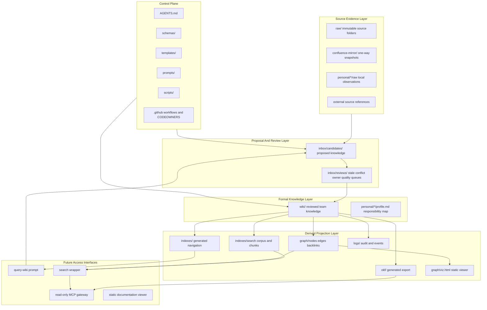
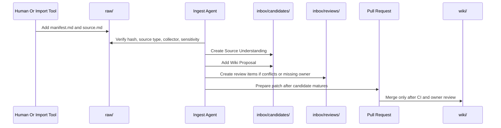
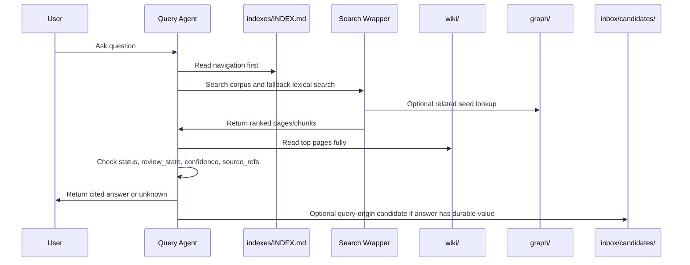
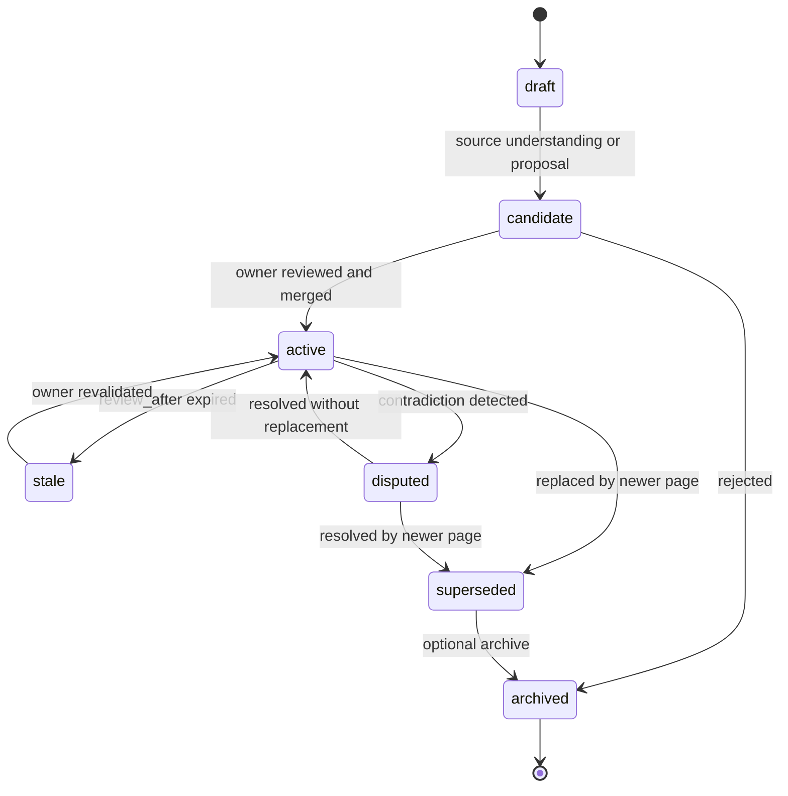

# New System Architecture

> Purpose: redesigned system architecture for the next version of the team LLM Wiki.

## 1. Architecture Overview

The redesigned architecture separates canonical knowledge from generated projections and future platform interfaces.



## 2. Canonical Versus Derived

### 2.1 Canonical Inputs

Canonical inputs are the files humans and agents must treat as source-of-truth or governance source:

```text
raw/**/manifest.md
raw/**/source.md
confluence-mirror/**
personal/*/profile.md
wiki/**/*.md
AGENTS.md
schemas/**
templates/**
prompts/**
scripts/**
.github/CODEOWNERS
.github/workflows/**
```

### 2.2 Derived Outputs

Derived outputs must be rebuildable:

```text
indexes/INDEX.md
indexes/REVIEW_QUEUE.md
indexes/search/corpus.jsonl
indexes/search/chunks.jsonl
graph/nodes.jsonl
graph/edges.jsonl
graph/backlinks.jsonl
graph/graph-report.md
graph/viz.html
okf/**
```

### 2.3 Excluded Material

Presentation and persuasion material is excluded from formal knowledge processing:

```text
design-draft/html-ppt-assets/
design-draft/html-slide-design-scheme/
```

The broader `design-draft/` folder is useful as historical design context, but should not be included in formal staff-id, wikilink, source-ref, search, or graph checks unless a dedicated documentation check is explicitly created.

## 3. Data Flow

### 3.1 Source Ingest Flow



### 3.2 Query Flow



### 3.3 Lifecycle Flow



## 4. Knowledge Object Model

### 4.1 Source

A source is raw evidence.

```text
raw/<category>/<yyyy-mm-dd>-<slug>/manifest.md
raw/<category>/<yyyy-mm-dd>-<slug>/source.md
```

Required qualities:

- Source id is stable.
- Source content hash is real.
- Source body is not rewritten in place.
- Source sensitivity is explicit.
- Collector is a valid staff id.

### 4.2 Candidate

A candidate is a proposal, not truth.

Candidate sections:

```text
Source Understanding
Wiki Proposal
Review Notes
Decision Log
Quality Notes
Open Questions
```

Candidate status:

```text
proposed -> in_review -> promoted | rejected | superseded
```

### 4.3 Formal Page

A formal page is reviewed team knowledge.

Required traits:

- Valid frontmatter.
- Valid owner.
- Non-empty source refs for active pages.
- Clear lifecycle fields.
- Review metadata.
- Related links explainable by deterministic signals.

### 4.4 Claim Reference

A claim reference is optional at first but required for high-risk content.

Use it when a statement is operationally important, likely to change, or potentially disputed.

```yaml
claim_refs:
  - claim_id: claim:payment:failover-requires-degradation-confirmation
    source_ref: raw:runbooks:2026-06-01-demo-payment-runbook
    source_path: raw/runbooks/2026-06-01-demo-payment-runbook/source.md
    start_line: 1
    end_line: 3
    quote_hash: sha256:<hash>
    confidence: 0.78
    last_confirmed_at: 2026-06-01
```

### 4.5 Graph Edge

Graph edges are derived unless explicitly stored in frontmatter.

Trusted deterministic edge sources:

```text
owners -> owns
maintainers -> maintains
source_refs shared by pages -> shared_source
markdown links -> wikilink
reverse markdown links -> backlink
related frontmatter -> related_to
supersedes/superseded_by -> supersedes
```

LLM-inferred edges must enter `inbox/candidates/` or `inbox/reviews/`, not direct graph sidecars.

## 5. Trust Boundaries

### 5.1 AI Write Boundary

AI may write:

```text
inbox/candidates/
inbox/reviews/
proposed PR patches
generated reports
derived sidecars
```

AI must not silently write or merge:

```text
wiki/ active pages
schemas/
prompts/
templates/
raw/source.md rewrites
```

### 5.2 Mirror Boundary

`confluence-mirror/` is external snapshot evidence, not formal team truth.

Mirror content can support candidates but should not be searched as current guidance by default unless an explicit index policy allows it.

### 5.3 Personal Boundary

`personal/<staff-id>/` is not team truth. Personal notes can inspire candidates, but promotion requires review.

### 5.4 Presentation Boundary

`html-ppt*` and similar material is communication collateral. It should be ignored by formal knowledge checks.

## 6. Runtime Modes

### 6.1 Phase 0 Runtime

```text
manual source addition
manual prompt execution
manual PR
CI validation
owner review
```

### 6.2 Phase 1 Runtime

```text
candidate quality gates
source hash checks
index generation
review queue generation
claim refs for high-risk content
```

### 6.3 Phase 2 Runtime

```text
search corpus generation
query eval
search wrapper
rg fallback
```

### 6.4 Phase 3 Runtime

```text
graph sidecar generation
related and impact queries
static graph viewer
supersession checks
```

### 6.5 Phase 4 Runtime

```text
OKF export
read-only generated bundle
standard markdown link export
root index.md and log.md compatibility
```

### 6.6 Phase 5 Runtime

```text
event logs
automation hooks
automated PR generation
session crystallization
read-only MCP gateway
```

## 7. Architecture Decision

The system should remain file-first and repo-first until all core governance gates are reliable.

Do not introduce a mandatory database, hosted service, or graph platform in the early phases. Those can be consumers of the repo, not replacements for it.
