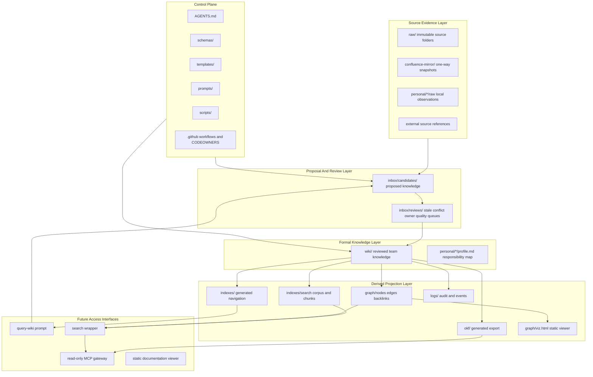
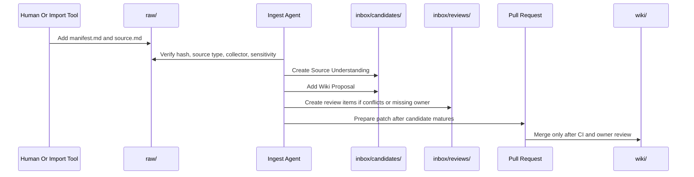
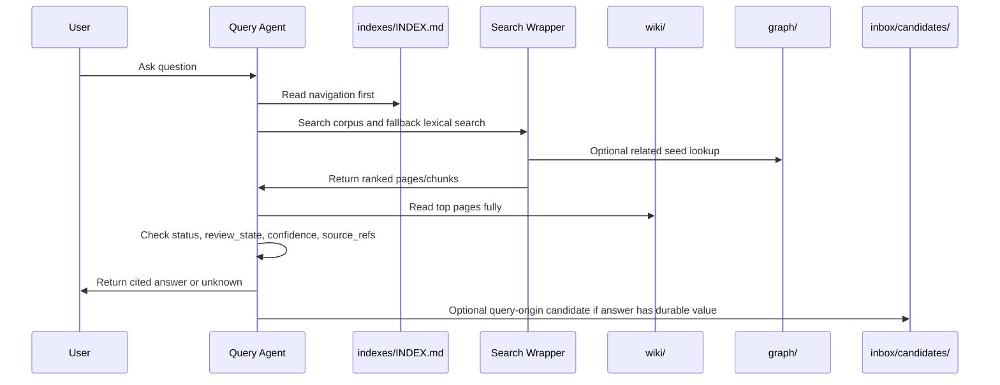
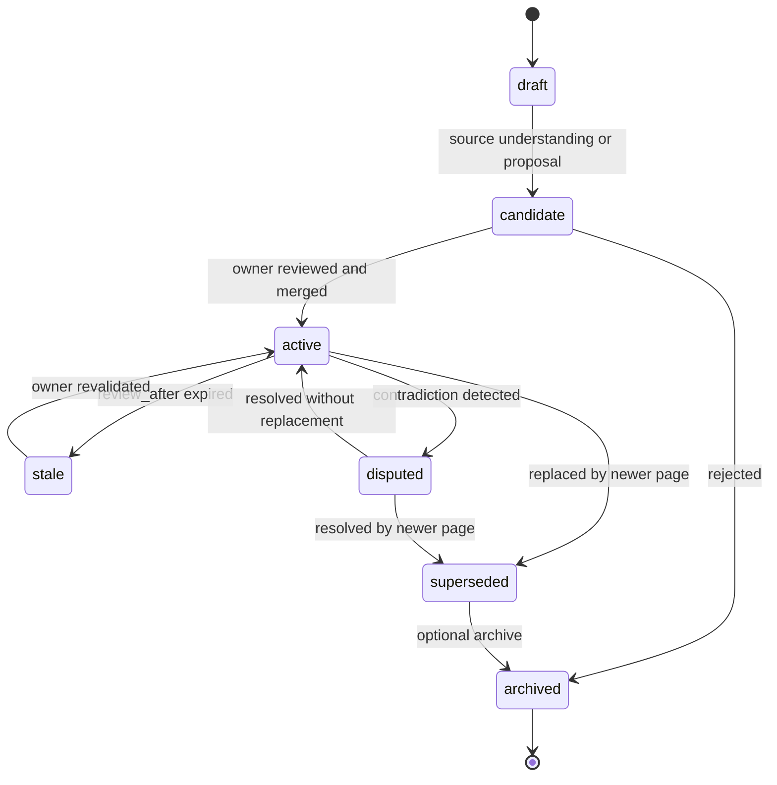

# 新系统架构 (New System Architecture)

> 目的：为团队 LLM Wiki 下一版本重新设计的系统架构。

## 1. 架构概述 (Architecture Overview)

重新设计的架构将规范知识 (canonical knowledge) 与生成的投影 (generated projections) 以及未来平台接口 (future platform interfaces) 分离开来。



## 2. 规范与派生 (Canonical Versus Derived)

### 2.1 规范输入 (Canonical Inputs)

规范输入是人类和 agent 必须视为事实来源 (source-of-truth) 或治理来源 (governance source) 的文件：

```text
raw/**/manifest.md
raw/**/source.md
confluence-mirror/**
personal/*/profile.md
wiki/**/*.md
AGENTS.md
schemas/**
templates/**
prompts/**
scripts/**
.github/CODEOWNERS
.github/workflows/**
```

### 2.2 派生输出 (Derived Outputs)

派生输出必须是可重建的 (rebuildable)：

```text
indexes/INDEX.md
indexes/REVIEW_QUEUE.md
indexes/search/corpus.jsonl
indexes/search/chunks.jsonl
graph/nodes.jsonl
graph/edges.jsonl
graph/backlinks.jsonl
graph/graph-report.md
graph/viz.html
okf/**
```

### 2.3 排除材料 (Excluded Material)

展示和说服性材料 (presentation and persuasion material) 被排除在正式知识处理之外：

```text
design-draft/html-ppt-assets/
design-draft/html-slide-design-scheme/
```

更广泛的 `design-draft/` 文件夹作为历史设计上下文是有用的，但除非专门创建了专用的文档检查，否则不应纳入正式的 staff-id、wikilink、source-ref、search 或 graph 检查中。

## 3. 数据流 (Data Flow)

### 3.1 来源摄取流 (Source Ingest Flow)



### 3.2 查询流 (Query Flow)



### 3.3 生命周期流 (Lifecycle Flow)



## 4. 知识对象模型 (Knowledge Object Model)

### 4.1 来源 (Source)

来源 (source) 是原始证据 (raw evidence)。

```text
raw/<category>/<yyyy-mm-dd>-<slug>/manifest.md
raw/<category>/<yyyy-mm-dd>-<slug>/source.md
```

必需的品质：

- 来源 ID (Source id) 是稳定的。
- 来源内容哈希 (Source content hash) 是真实的。
- 来源正文 (Source body) 不应在原位重写。
- 来源敏感性 (Source sensitivity) 是明确的。
- 收集者 (Collector) 是一个有效的 staff id。

### 4.2 候选 (Candidate)

候选 (candidate) 是一个提案，而非事实。

候选部分：

```text
Source Understanding
Wiki Proposal
Review Notes
Decision Log
Quality Notes
Open Questions
```

候选状态：

```text
proposed -> in_review -> promoted | rejected | superseded
```

### 4.3 正式页面 (Formal Page)

正式页面 (formal page) 是经过评审的团队知识。

必需特征：

- 有效的前置元数据 (Valid frontmatter)。
- 有效的负责人 (Valid owner)。
- 活跃页面有非空的来源引用 (Non-empty source refs)。
- 清晰的生命周期字段 (Clear lifecycle fields)。
- 评审元数据 (Review metadata)。
- 相关链接可通过确定性信号解释。

### 4.4 声明引用 (Claim Reference)

声明引用 (claim reference) 一开始是可选的，但对于高风险内容是必需的。

当某个陈述在操作上很重要、可能发生变化或可能引起争议时使用它。

```yaml
claim_refs:
  - claim_id: claim:payment:failover-requires-degradation-confirmation
    source_ref: raw:runbooks:2026-06-01-demo-payment-runbook
    source_path: raw/runbooks/2026-06-01-demo-payment-runbook/source.md
    start_line: 1
    end_line: 3
    quote_hash: sha256:<hash>
    confidence: 0.78
    last_confirmed_at: 2026-06-01
```

### 4.5 图边 (Graph Edge)

图边 (graph edge) 是派生的，除非显式存储在前置元数据中。

可信的确定性边来源：

```text
owners -> owns
maintainers -> maintains
source_refs shared by pages -> shared_source
markdown links -> wikilink
reverse markdown links -> backlink
related frontmatter -> related_to
supersedes/superseded_by -> supersedes
```

LLM 推断的边必须进入 `inbox/candidates/` 或 `inbox/reviews/`，而不是直接的图 sidecar。

## 5. 信任边界 (Trust Boundaries)

### 5.1 AI 写入边界 (AI Write Boundary)

AI 可以写入：

```text
inbox/candidates/
inbox/reviews/
proposed PR patches
generated reports
derived sidecars
```

AI 不得静默写入或合并：

```text
wiki/ active pages
schemas/
prompts/
templates/
raw/source.md rewrites
```

### 5.2 镜像边界 (Mirror Boundary)

`confluence-mirror/` 是外部快照证据，而非正式团队事实。

镜像内容可以支持候选，但默认不应作为当前指南进行搜索，除非有明确的索引策略允许这样做。

### 5.3 个人边界 (Personal Boundary)

`personal/<staff-id>/` 不是团队事实。个人笔记可以启发候选，但提升需要评审。

### 5.4 展示边界 (Presentation Boundary)

`html-ppt*` 及类似材料是沟通辅助材料。正式的知識检查应忽略它们。

## 6. 运行时模式 (Runtime Modes)

### 6.1 阶段 0 运行时 (Phase 0 Runtime)

```text
manual source addition
manual prompt execution
manual PR
CI validation
owner review
```

### 6.2 阶段 1 运行时 (Phase 1 Runtime)

```text
candidate quality gates
source hash checks
index generation
review queue generation
claim refs for high-risk content
```

### 6.3 阶段 2 运行时 (Phase 2 Runtime)

```text
search corpus generation
query eval
search wrapper
rg fallback
```

### 6.4 阶段 3 运行时 (Phase 3 Runtime)

```text
graph sidecar generation
related and impact queries
static graph viewer
supersession checks
```

### 6.5 阶段 4 运行时 (Phase 4 Runtime)

```text
OKF export
read-only generated bundle
standard markdown link export
root index.md and log.md compatibility
```

### 6.6 阶段 5 运行时 (Phase 5 Runtime)

```text
event logs
automation hooks
automated PR generation
session crystallization
read-only MCP gateway
```

## 7. 架构决策 (Architecture Decision)

在所有核心治理门控 (core governance gates) 可靠之前，系统应保持以文件优先和以仓库优先 (file-first and repo-first)。

在早期阶段不要引入强制性的数据库、托管服务或图平台。这些可以作为仓库的消费者，而不是替代品。
