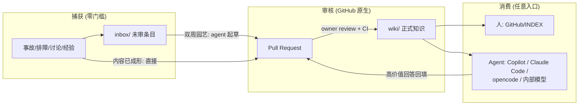
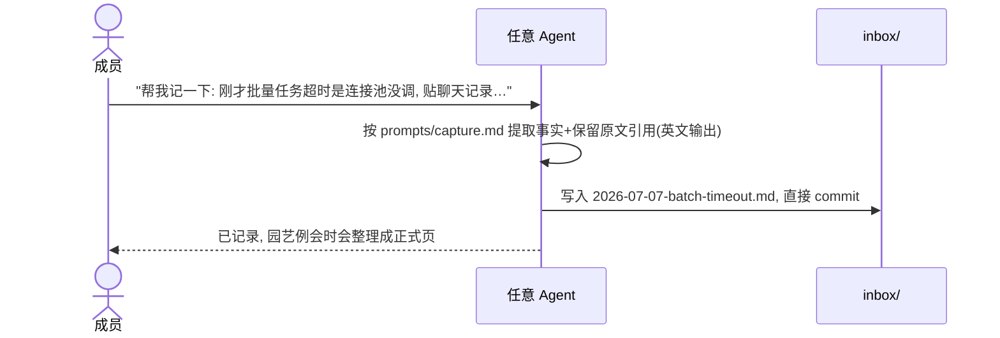
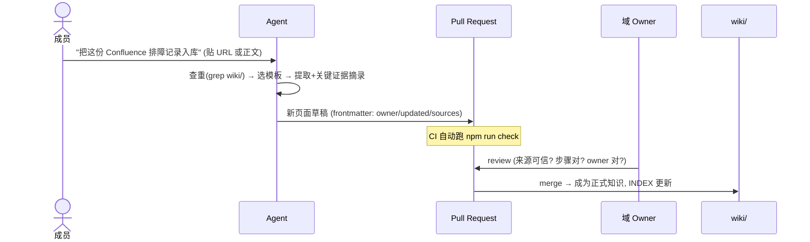
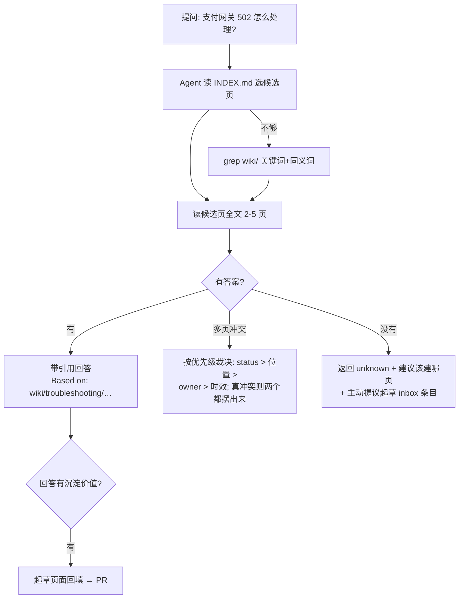
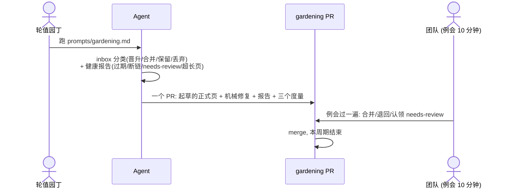
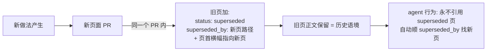
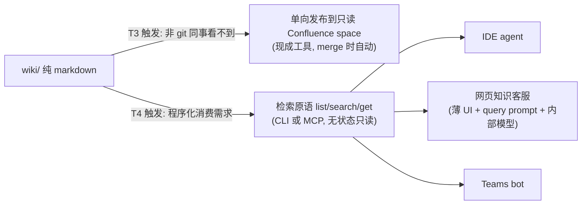

# 05 — 工作流场景图解（宣讲版）

> 用途: 团队宣讲会材料。每个场景 = 一张图 + 编号步骤 + 成本标注。
> mermaid 图在 GitHub 网页端直接渲染。

## 0. 全景：三层结构 + 一条流水线

一句话讲给团队听：**inbox 随手扔，PR 是审核台，wiki 是可信区；AI 干整理的活，人只做判断。**

三个角色：

| 角色 | 做什么 | 成本 |
| --- | --- | --- |
| 每个成员 | 遇到值得记的事扔进 inbox（或让 agent 整理）；有问题先问 agent | ≤5 分钟/次 |
| 轮值园丁（每期 1 人） | 双周跑一次园艺 prompt，审 agent 产出的整理 PR | ~1 小时/两周 |
| 域 owner | 审自己领域的知识 PR | 随 PR 发生 |

---

## 场景 A：快速捕获（刚解决了一个生产问题）

步骤：① 把材料丢给 agent（贴 URL / 粘聊天记录 / 口述）→ ② agent 生成 inbox 条目（英文，含 Raw notes 原文引用）→ ③ 直接 commit，结束。**没有 frontmatter、没有审批、没有格式要求。**

> 不用 AI 的版本：自己建个 md 文件写三行，一样合法。

## 场景 B：原始资料 → 正式 wiki 页面

步骤：① 递材料 → ② agent 查重、选模板、编译成英文页面（sources 指回原链接 + 关键原文摘进 "Source excerpts"）→ ③ 开 PR，CI 校验格式/链接/owner → ④ 域 owner 审核合并。**候选层就是 PR 本身**——审核意见、修改记录、拍板结论全在 PR 里，不需要额外流程。

## 场景 C：查询（日常使用最高频）

上下文预算（讲给关心"塞爆上下文"的同事）：协议 ~1k + INDEX ~2-5k + 命中页 ~3-10k tokens，**15k 以内**，内部小模型也够用。

## 场景 D：双周园艺（唯一的例行治理）

节拍：每两周 30 分钟例会 + 园丁 1 小时。三个度量写在 PR 描述里：回答率 / 鲜活度 / 贡献面。**inbox 的质量债在这里还，不在捕获时卡。**

## 场景 E：知识过时与取代（supersede）

存疑但还没有替代品时：只标 `status: needs-review`，agent 引用时自动附带"此页待确认"警告，园艺例会认领核实。**没有 confidence 打分，只有三种状态：现行 / 待确认 / 已取代。**

## 场景 F（未来，触发后才建）：对外发布与搜索层

宣讲话术：**今天不建任何服务**。知识是纯文件，未来所有服务都只是"会读文件的客户端"——所以什么时候建都不晚，且永远可以整体重建。

落地前的剩余待办见 [03-实施方案](03-实施方案-phase-0-4.md) 的 "Phase 0 剩余 TODO"。
