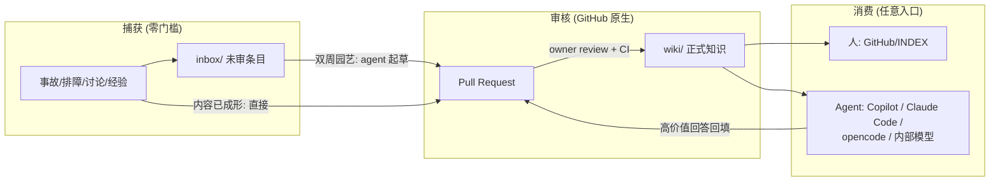
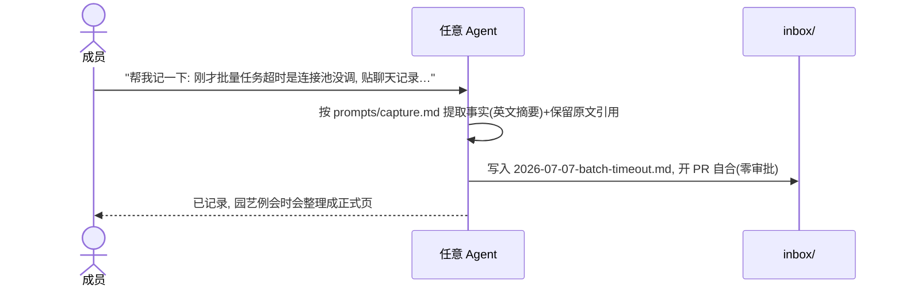
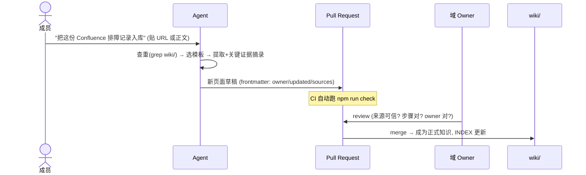
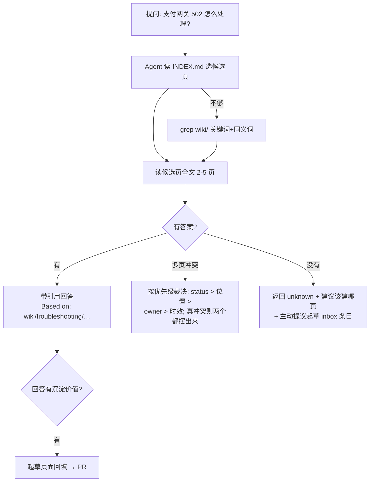
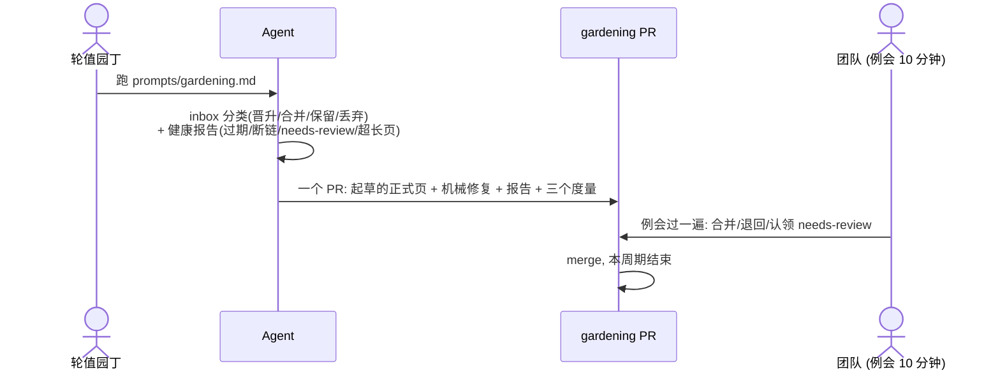
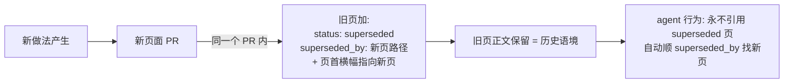
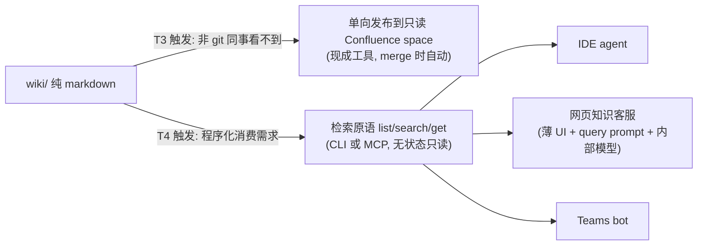

# 05 — 工作流场景图解（宣讲版）

> 用途: 团队宣讲会材料。每个场景 = 一张图 + 编号步骤 + 成本标注。
> mermaid 图在 GitHub 网页端直接渲染。

## 0. 全景：三层结构 + 一条流水线



一句话讲给团队听：**inbox 随手扔，PR 是审核台，wiki 是可信区；AI 干整理的活，人只做判断。**

三个角色：

| 角色 | 做什么 | 成本 |
| --- | --- | --- |
| 每个成员 | 遇到值得记的事扔进 inbox（或让 agent 整理）；有问题先问 agent | ≤5 分钟/次 |
| 轮值园丁（每期 1 人） | 双周跑一次园艺 prompt，审 agent 产出的整理 PR | ~1 小时/两周 |
| 域 owner | 审自己领域的知识 PR | 随 PR 发生 |

---

## 场景 A：快速捕获（刚解决了一个生产问题）



步骤：① 把材料丢给 agent（贴 URL / 粘聊天记录 / 口述）→ ② agent 生成 inbox 条目（英文摘要 + Raw notes 原文引用）→ ③ 开 PR 自己合并（inbox 零审批），结束。**没有 frontmatter、没有 review、没有语言要求——中文/混杂的原始材料原样进来，编译成 wiki 页时才转英文。**

> 不用 AI 的版本：自己建个 md 文件写三行中文，发 PR 自合，一样合法。

**伪对话（刚在 Teams 处理完一个告警）：**

```text
Dev:   @agent 帮我记到知识库: 刚才 orders-api 的 504 又是 Redis 连接风暴,
       这次跑了预热脚本 warmup.sh 提前建连接就恢复了, ticket 是 OPS-2233。
       当时的排查片段给你: (粘贴 10 行日志和聊天记录, 中文)
Agent: 已按 prompts/capture.md 整理:
       1. 查重: wiki/troubleshooting/ 下没有 Redis 连接风暴相关页面
       2. 新建 inbox/2026-07-08-orders-api-504-redis-storm.md
          - 顶部一句话英文摘要 + 系统/时间/OPS-2233 链接
          - "## Raw notes" 保留你贴的中文原文 (附英文 gloss)
       3. 已开 PR #41 (只改 inbox/, 无需任何人审批)
Dev:   (点 Merge。全程 3 分钟, 之后不用再管——园艺例会时会整理它)
```

## 场景 B：原始资料 → 正式 wiki 页面



步骤：① 递材料 → ② agent 查重、选模板、编译成英文页面（sources 指回原链接 + 关键原文摘进 "Source excerpts"）→ ③ 开 PR，CI 校验格式/链接/owner → ④ 域 owner 审核合并。**候选层就是 PR 本身**——审核意见、修改记录、拍板结论全在 PR 里，不需要额外流程。

**外部材料（Confluence/Jira/网页）的三条进入通道**——关键认知：agent 并不天然具备"访问并转换 Confluence"的能力，但它也不需要；**用户的职责只是把"内容"送到 agent 面前**（任何形式的文本都行），markdown 化和结构化是 agent 的活：

| 通道 | 用户具体动作 | 适用 |
| --- | --- | --- |
| ① 复制粘贴（默认，覆盖 90% 场景） | 打开 Confluence 页 → Ctrl+A 全选 → Ctrl+C → 粘贴进 agent 对话框。富文本会变成纯文本/近似表格，格式丢失没关系——agent 按模板重新结构化 | 单页、几百行以内 |
| ② 导出文件 | 页面右上 `⋯` → Export to Word / PDF（或 `⋯` → View Storage Format 复制源码）→ 把文件拖进对话（Copilot/Claude Code 都支持附件），或存盘后把路径给 agent | 长页面、含大表格 |
| ③ Atlassian MCP（若公司批准） | 在自己的 agent 客户端配置一次 Atlassian MCP server，之后只需贴 URL，agent 自己抓取 | 高频使用者的一次性投资 |

两个补充约定：**图片/截图**不随粘贴进来——重要的截图内容用文字转述进页面，原图靠 sources 链接回 Confluence 看（权威源还在那里）；**批量迁移整个 space 不做**——策略是按需搬运被反复查询的单页（02 §9），不是镜像。

**伪对话（通道①，agent 无任何外部工具）：**

```text
Dev:   @agent 把这页对账 runbook 收进 wiki:
       https://confluence.company.com/pages/123456
Agent: 我没有访问 Confluence 的工具, 请任选一种方式给我内容:
       1) 打开页面全选复制, 直接粘贴到这里 (最快)
       2) 页面 ⋯ → Export → Word/PDF, 把文件拖进来
       3) 若你配置了 Atlassian MCP, 告诉我, 我可以自己取
Dev:   (全选粘贴了约 200 行中文正文)
Agent: 完成, PR #42 已开:
       - wiki/runbooks/payment/reconciliation-restart.md (英文, 用
         templates/runbook.md; 高危步骤标了 [E1]-[E3], 对应 Source
         excerpts 里的原文摘录)
       - frontmatter: sources 指回原 Confluence URL; owner 建议
         staff:12345678 (people.md 里 payment 域的 owner)
       - PR 描述: "Unevidenced claims: none"
Dev:   (owner review 合并后, 在原 Confluence 页顶部加一行:
       "Migrated to <repo>, this page is no longer maintained.")
```

## 场景 C：查询（日常使用最高频）



上下文预算（讲给关心"塞爆上下文"的同事）：协议 ~1k + INDEX ~2-5k + 命中页 ~3-10k tokens，**15k 以内**，内部小模型也够用。

**伪对话（含命中、unknown、回填三种结局）：**

```text
Dev:   @agent 支付对账任务卡住了怎么重启?
Agent: (读 INDEX → 命中 runbook → 读全文)
       按 wiki/runbooks/payment/reconciliation-restart.md:
       1. 确认无并发批次在跑 (verify: job dashboard 无 RUNNING)
       2. ... 3. 执行重启 [E2] —— 注意此步标注 [approval required],
       需 oncall 审批。
       Based on: wiki/runbooks/payment/reconciliation-restart.md
       (verified: 2026-07-01, 7 天前真实执行过, 可信)
Dev:   如果是月末大批量的场景呢?
Agent: unknown —— wiki 里没有月末场景的记录。建议在该 runbook 补一节
       "Month-end variant"。你现在口述要点的话, 我先建一条 inbox 条目。
Dev:   (口述 3 句) 
Agent: inbox/2026-07-08-reconciliation-month-end.md 已建, PR #43 自合。
       另外刚才这轮问答里"卡住原因的三种判别"是我跨两页综合出来的,
       值得沉淀——要我起草成 troubleshooting 页面回填吗? (回填走审核 PR)
```

## 场景 D：双周园艺（唯一的例行治理）



节拍：每两周 30 分钟例会 + 园丁 1 小时。三个度量写在 PR 描述里：回答率 / 鲜活度 / 贡献面。**inbox 的质量债在这里还，不在捕获时卡。**

**"inbox 如何变成标准 wiki 页"就发生在这里**——promote 判定的条目由 agent 套模板起草成正式页（同一个 gardening PR 内：新页 + 删掉对应 inbox 文件），owner 在 PR 里审核后合并。伪对话：

```text
园丁:  @agent 跑 prompts/gardening.md
Agent: gardening: 2026-07-08 PR #45 已开, 摘要:
       Inbox triage (5 条):
       - promote×2: orders-api-504 → 已起草 wiki/troubleshooting/
         orders-api-504-redis-storm.md (英文, [E#] 齐, owner 建议
         staff:23456789); month-end 条目 → 起草并入对账 runbook 新小节
       - merge×1: 补充进已有的 payment-502 页, updated 已更新
       - keep×1: 信息不全, 已 @ 原作者补 ticket 号
       - drop×1: 与已有页重复, 建议删除
       Health: 3 页 updated>180d (owner 已列出); 1 个外链失效 (已加
       dead-link 注记); runbook 2 页 verified>90d
       Spot-check: payment-502.md 的 [E1] 与摘录一致 ✓
       Metrics: freshness 41/47, contributors 12
园丁:  (例会 10 分钟过完, promote 的两页由域 owner 点头 → 合并)
```

## 场景 E：知识过时与取代（supersede）



存疑但还没有替代品时：只标 `status: needs-review`，agent 引用时自动附带"此页待确认"警告，园艺例会认领核实。**没有 confidence 打分，只有三种状态：现行 / 待确认 / 已取代。**

**伪对话：**

```text
Dev:   对账重启方式下月起改用 K8s Job 了, 旧 runbook 要作废
Agent: PR #48 已开 (一个 PR 完成整个取代动作):
       1. 新页 wiki/runbooks/payment/reconciliation-restart-k8s.md
       2. 旧页 frontmatter 加 status: superseded +
          superseded_by: <新页路径>, 标题下加横幅指向新页 (正文保留作历史)
       3. grep 发现 2 处把旧页当现行指导引用, 已改指新页
       4. check 通过 (含 supersede 链无环校验)
Dev:   (owner 审核合并。此后任何 agent 查到旧页都会自动跳去新页)
```

## 场景 F（未来，触发后才建）：对外发布与搜索层



宣讲话术：**今天不建任何服务**。知识是纯文件，未来所有服务都只是"会读文件的客户端"——所以什么时候建都不晚，且永远可以整体重建。

落地前的剩余待办见 [03-实施方案](03-实施方案-phase-0-4.md) 的 "Phase 0 剩余 TODO"。
