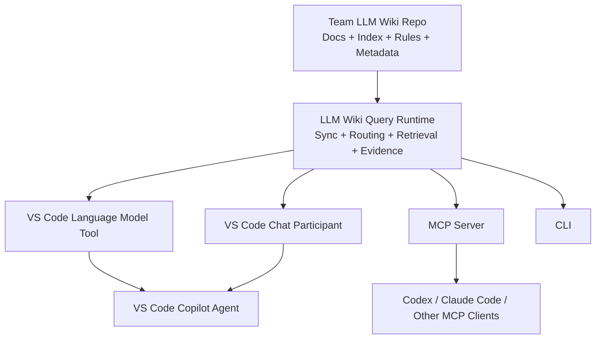
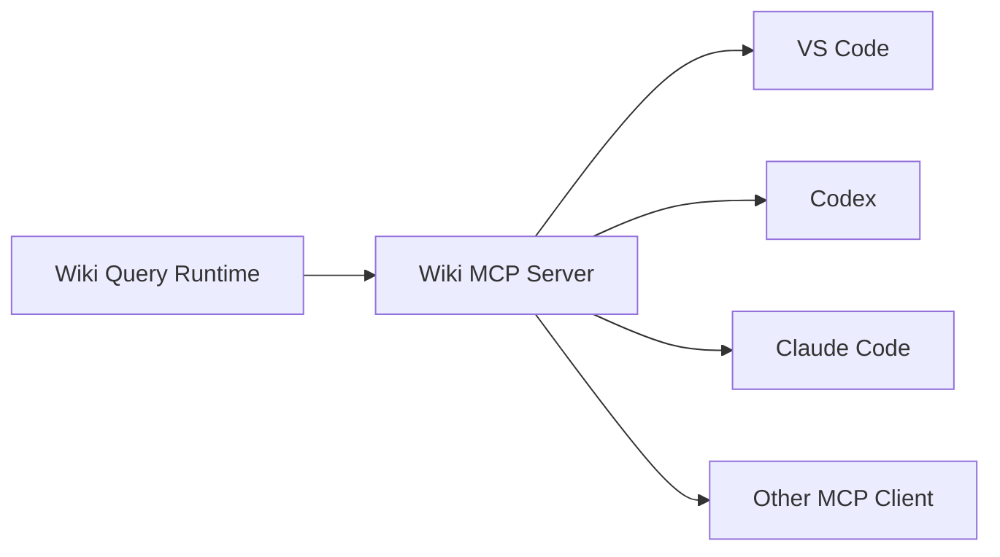

# LLM Wiki Search Runtime 初次技术调研报告

> 状态：Initial Technical Research / Architecture Exploration  
> 目标读者：后续在 Codex 中继续细化方案、产出 ADR / Design Doc 并尝试实现的开发者  
> 调研时间：2026-08-18  
> 范围：团队基于 GitHub Repo 管理的 LLM Wiki，面向 VS Code Copilot Chat，并为后续 Codex / Claude Code / MCP 等客户端保留扩展空间

---

## 0. 文档目的

本文将本轮关于 **LLM Wiki Search Runtime** 的讨论整理为一份可继续工程化的初次技术调研报告。

当前团队已经有一个基于 GitHub Repo 管理的 **LLM Wiki**。Wiki 中通常保存：

- Runbook
- Troubleshooting
- 概念 / 原理说明
- 团队约定
- 索引文件
- Agent 使用规则
- 可能已经存在的搜索、索引或辅助脚本

已知该 Repo **不是单纯的一堆 Markdown 文档**：它已经存在基础的检索方案，有 `index`，也有 `agent.md` / `AGENTS.md` 一类的 Agent 指令或协议文件。

因此，本项目的目标不是“重新做一个 Wiki”，也不是“从零做一个通用 RAG 系统”，而是增加一个稳定、可复用、可被 Agent 调用的 **Search / Query Runtime 层**。

核心目标可以概括为：

1. 获取 Wiki Repo 的最新资料；
2. 读取并遵守 Repo 中已有的检索规则、索引与 Agent 协议；
3. 根据用户问题检索 Wiki；
4. 将高质量、可引用、版本明确的 evidence 返回给上层 Agent；
5. 首先支持 VS Code Copilot Chat；
6. 设计上不绑定 VS Code，后续可以复用到 Codex、Claude Code、MCP Client、CLI 等环境。

本文更接近 **技术调研 + 初步架构设计草案**，不是最终 Design Doc。实现前仍应针对实际 Wiki Repo 结构、脚本语言、权限模型和规模做进一步验证。

---

# 1. Executive Summary

## 1.1 最核心的架构判断

这个项目最适合被定义为：

> **LLM Wiki Query Runtime / Retrieval Runtime：一个负责同步、理解 Wiki 查询协议、执行检索并构建证据包的受信任运行时。**

它位于 Wiki Repo 和各种 Agent Client 之间：



**不要把所有检索逻辑直接写在 VS Code Language Model Tool 里面。**

正确关系是：

```text
Wiki Retrieval Core / Runtime
          │
          ├── VS Code Language Model Tool Adapter
          ├── Chat Participant Adapter
          ├── CLI Adapter
          └── MCP Adapter
```

因此：

> **只有一份核心搜索实现，可以有多个调用入口。**

---

## 1.2 VS Code 首选入口

第一阶段最推荐：

```text
Custom Agent
    +
Language Model Tool
    +
LLM Wiki Query Runtime
```

其中：

- **Custom Agent**：定义“什么时候检索、怎样回答、哪些工具可用”；
- **Language Model Tool**：把 Wiki Query Runtime 暴露给 Copilot Agent；
- **Query Runtime**：真正同步 Repo、解析规则、执行 BM25 / Top-K / Vector / Hybrid Search；
- **LLM Wiki Repo**：保存知识、索引、Agent 规则和声明式检索策略。

这是最有扩展性的 VS Code 方案。

如果未来有严格要求：

> “任何 Wiki 问题都必须程序级保证先检索，绝不能由模型跳过 Tool。”

则额外提供：

```text
@teamWikiStrict Chat Participant
```

Chat Participant 自己掌控端到端流程，可在代码中先执行 Runtime 检索，再调用模型生成答案。

---

## 1.3 Language Model Tool 与 Repo 搜索脚本的最终关系

它们**不应该是两套相同实现**。

推荐职责：

```text
Repo / Runtime Search Implementation
    = 怎么搜索 Wiki

Language Model Tool
    = 怎么让 Copilot 调用这项能力
```

例如：

```ts
async invoke(options, token) {
    const evidence = await wikiRuntime.query({
        question: options.input.question,
        topK: options.input.topK ?? 8
    });

    return toLanguageModelToolResult(evidence);
}
```

这里 `wikiRuntime.query()` 才是业务核心。

**不要出现：**

```text
Repo scripts/search.py      实现一套 BM25
VS Code Tool                又实现一套 BM25
MCP Server                  再实现一套 BM25
```

否则很快发生检索行为漂移。

---

## 1.4 MVP 建议

第一版暂时不要做：

- Docker / 容器化本地 Runtime
- 独立 Vector DB 服务
- Kubernetes
- 远程索引服务
- GitHub Webhook
- 多租户
- 复杂 Reranker
- 大规模 Embedding Pipeline

建议先实现：

```text
GitHub Repo Sync
    ↓
Repo Protocol / Index Loader
    ↓
Markdown Section Index
    ↓
BM25 / FTS + Wiki Metadata Weighting
    ↓
Top-K Evidence
    ↓
wiki_query Language Model Tool
    ↓
Team Wiki Custom Agent
```

先验证检索准确率和实际工作流，再决定是否增加 Vector Search、MCP、Chat Participant。

---

# 2. 背景与问题定义

## 2.1 当前团队资产

根据讨论，当前已有：

- 一个团队级 LLM Wiki GitHub Repo；
- Wiki 中保存 Runbook、Troubleshooting、概念等内容；
- 已有基础索引；
- 已有 Agent 使用规则，例如 `agent.md` / `AGENTS.md`；
- 已经存在某种基础检索方案或搜索脚本；
- Wiki 以 GitHub Repo 作为知识版本控制和协作管理基础。

因此，本项目应该最大化复用已有 Repo 协议，而不是绕过它重新生成一套独立的数据库知识库。

---

## 2.2 主要使用场景

典型用户问题：

```text
部署以后出现 502 应该怎么排查？
```

```text
某个内部服务 timeout 的标准 troubleshooting 流程是什么？
```

```text
团队为什么采用这个 authentication 设计？
```

```text
这个 Runbook 对回滚有什么前置要求？
```

预期系统：

1. 确认本地 Wiki 是否足够新；
2. 必要时拉取最新 Repo；
3. 理解 Wiki 已定义的查询 / 索引规则；
4. 根据问题确定搜索范围；
5. 执行检索；
6. 读取最终相关页面或章节；
7. 返回 evidence；
8. Agent 基于 evidence 回答，并给出路径 / 行号 / Commit。

---

# 3. 项目目标与非目标

## 3.1 Goals

### G1. Freshness

尽可能确保回答基于最新或明确标记版本的 Wiki。

回答必须能知道：

```text
repository
branch
commitSha
synchronizedAt
stale
```

---

### G2. Repo-native

充分利用 Wiki Repo 已存在的：

- Index
- Metadata
- Aliases
- Tags
- AGENTS.md
- 查询规则
- 页面关系
- 现有搜索实现

而不是把 Repo 当成“无结构 Markdown 数据集”。

---

### G3. Retrieval-first

对于团队内部知识类问题，默认先检索，再回答。

在 Custom Agent 模式中属于 Agent policy。

在 Strict Chat Participant 模式中可以升级为程序级强制。

---

### G4. Evidence-first

Runtime 不应该主要输出“答案”，而应该输出：

> **结构化证据包（Evidence Package）**

让上层 Agent 负责最终自然语言回答。

---

### G5. Single Retrieval Implementation

核心搜索行为只能维护一份。

CLI、VS Code Tool、MCP 等入口必须复用同一个 Core / Runtime。

---

### G6. Client-independent

VS Code 是第一个客户端，不应成为 Runtime 的内部依赖。

长期可以支持：

- VS Code Copilot
- Codex
- Claude Code
- Copilot CLI
- 其他 MCP Client
- CLI
- HTTP service（如果未来有需求）

---

### G7. Local-first

初期优先本地执行：

- 降低部署成本；
- 避免增加团队基础设施；
- 复用 Git；
- 让 Wiki 内容自然保持 Git 版本语义；
- 在网络短暂异常时支持缓存。

---

## 3.2 Non-goals

第一阶段不追求：

- 通用企业知识库平台；
- 替代 GitHub；
- 替代 Wiki Repo 已有规范；
- 万级 / 百万级文档高并发服务；
- 自动生成 Wiki 内容；
- 自动执行任意 Repo 代码；
- 完整 Agent 编排平台；
- 复杂 GraphRAG；
- 自研通用 Vector DB。

---

# 4. 关键概念分层

建议明确四层。

## 4.1 Knowledge Layer：LLM Wiki Repo

负责“知识是什么”。

```text
team-llm-wiki/
├── AGENTS.md
├── index.md
├── runbooks/
├── troubleshooting/
├── concepts/
├── ...
└── existing search/index assets
```

这里是 Source of Truth。

---

## 4.2 Query Protocol Layer：Wiki 自描述规则

负责“这个 Wiki 应该怎样被查询”。

可能包括：

```text
AGENTS.md
QUERYING.md
index.md
llm-wiki.yaml       # 建议增加
aliases.yaml
metadata/frontmatter
```

应尽可能将**确定性配置**与**自然语言 Agent 指令**区分开。

推荐：

```text
llm-wiki.yaml
    = machine-executable / deterministic configuration

AGENTS.md
    = semantic Agent behavior / reasoning instructions

index.md
    = knowledge navigation
```

---

## 4.3 Runtime Layer：LLM Wiki Query Runtime

负责：

```text
sync
loadProtocol
build/updateIndex
routeQuery
search
read
followLinks
rerank
buildEvidence
```

这是本项目真正的核心。

---

## 4.4 Adapter Layer

负责把 Runtime 暴露给不同客户端。

```text
VS Code LM Tool
Chat Participant
MCP Server
CLI
HTTP API
```

Adapter 应尽量“薄”。

---

# 5. VS Code AI 扩展方案分析

截至 2026-08，VS Code 官方将 AI 扩展能力明确区分为不同机制。

---

## 5.1 Language Model Tool

VS Code Extension 可以通过：

```json
contributes.languageModelTools
```

声明 Tool，再通过：

```ts
vscode.lm.registerTool(...)
```

注册实现。

Tool 可以被 Agent 在 agentic workflow 中自动调用。

它适合：

- 查询数据库；
- 调 API；
- 调内部知识库；
- 查询 Wiki；
- 与 VS Code API 深度集成。

### 对本项目的意义

我们可以暴露：

```text
teamWiki_query
teamWiki_search
teamWiki_read
teamWiki_sync
```

给 Copilot Agent。

### 优势

- 原生融入 Agent Tool Calling；
- 与 Custom Agent 配合自然；
- 可以被其他 Agent 复用；
- 可以通过 `#tool` 显式引用；
- Tool 可以访问 Extension Host 能力；
- Marketplace 分发方便。

### 限制

是否调用 Tool 最终属于模型的 Agent Loop 决策。

即使 Agent Instructions 写：

```text
MUST invoke teamWiki_query before answering
```

也不是程序级硬保证。

因此：

> Custom Agent + Tool = 强策略约束，但不是强制中间件。

---

# 6. Custom Agent + Tool 方案

## 6.1 Custom Agent 的职责

Custom Agent 是 `.agent.md` 配置。

它定义：

- Role / Persona
- Instructions
- Tools
- Model
- Subagents
- Handoffs
- 其他工作流约束

它不应该实现实际 BM25。

概念：

```text
Agent = Policy
Tool  = Capability Adapter
Core  = Domain Logic
Repo  = Data + Query Protocol
```

---

## 6.2 推荐 Custom Agent

示例：

```md
---
name: Team Wiki
description: Search the team's LLM Wiki for runbooks, troubleshooting guides, and technical concepts.
tools:
  - team-wiki_query
  - team-wiki_search
  - team-wiki_read
---

# Team Wiki Agent

For every team-specific operational or technical question:

1. Invoke #tool:team-wiki_query before answering.
2. Treat returned Wiki evidence as the source of truth.
3. Preserve warnings, prerequisites, and ordered runbook steps.
4. Cite project-specific claims using returned path and line range.
5. Include or retain the Wiki commit used by the query.
6. If evidence is insufficient, say so explicitly.
7. Do not invent undocumented team procedures.

Use #tool:team-wiki_search and #tool:team-wiki_read when:
- the first query returns weak evidence;
- relevant pages conflict;
- deeper investigation is required;
- linked concepts need to be followed.
```

---

## 6.3 为什么 Custom Agent + Tool 适合做主入口

它具有更好的“能力组合扩展性”。

未来可以允许：

```text
Team Wiki Tool
+
Workspace code search
+
GitHub Issue / PR
+
Terminal
+
Edit
+
Test
+
Subagents
```

例如：

```text
Wiki 查询规范
   ↓
分析当前代码是否符合规范
   ↓
修改代码
   ↓
运行测试
```

这正是普通 Chat Participant 较难自然扩展到的 agentic coding workflow。

---

# 7. Chat Participant 方案

Chat Participant 是扩展提供的领域助手，通过：

```text
@teamWiki
```

调用。

它和 Tool 的核心区别：

```text
Language Model Tool
    → 是 Agent 编排中的一项能力

Chat Participant
    → 自己掌控整次用户请求的编排
```

因此 Participant 可以在代码中明确：

```text
收到用户问题
    ↓
await runtime.sync()
    ↓
await runtime.query()
    ↓
构造 Prompt
    ↓
调用模型
    ↓
渲染结果
```

这样就能做到：

> **不检索就不生成。**

---

## 7.1 Participant 的适用场景

适合：

- 必须强制 retrieval-before-answer；
- 合规性要求高；
- 需要高度可控引用；
- 需要定制 UI；
- 需要 slash command；
- 需要 follow-up buttons；
- 需要严格缓存 / stale policy；
- 需要自己控制上下文 token budget。

---

## 7.2 Participant 与 Custom Agent 对比

| 维度 | Custom Agent + Tool | Chat Participant |
|---|---|---|
| 强制检索 | 模型策略约束 | 程序级控制 |
| Agent 生态 | 强 | 相对弱 |
| Tool 组合 | 强 | 需自行编排 |
| Subagent | 原生 Agent 能力 | 自己实现 |
| Handoff | Custom Agent 支持 | 需要自己设计 |
| UI 控制 | 中 | 强 |
| Debug 确定性 | 中 | 高 |
| 复用 Tool | 强 | 通常是专用入口 |
| Coding workflow | 更自然 | 更偏领域问答 |
| 严格知识问答 | 较好 | 最好 |

---

## 7.3 推荐决策

不是二选一。

长期建议：

```text
                    Wiki Query Runtime
                          │
             ┌────────────┴────────────┐
             ▼                         ▼
       Language Model Tool        Chat Participant
             │                         │
       Team Wiki Agent             @teamWikiStrict
```

- `Team Wiki Agent`：日常主入口；
- `@teamWikiStrict`：严格检索入口。

但 MVP 可先不实现 Participant。

---

# 8. MCP 方案

如果未来希望支持：

- Codex
- Claude Code
- VS Code
- Copilot CLI
- 其他 Agent Host

则 Runtime 应可进一步暴露成 MCP Server。



可以提供：

```text
wiki_sync
wiki_query
wiki_search
wiki_read
```

如果采用 MCP，VS Code 中甚至可以让 Custom Agent 直接使用 MCP Tool，而不再额外实现一套 Language Model Tool。

---

# 9. 是否需要容器

初期基本不需要。

桌面 VS Code 扩展运行在 Extension Host，Node.js 侧可以完成：

- HTTP；
- 文件读写；
- Git 子进程；
- 索引；
- Repo 缓存；
- Tool 注册。

因此：

```text
Docker ≠ 这个项目的基础要求
```

容器会增加：

- Docker 安装要求；
- Windows 企业环境兼容问题；
- 镜像生命周期；
- 端口管理；
- 安全审核；
- 启动成本。

只有在以下场景才值得重新评估：

- Runtime 有复杂 Python / native dependency；
- 需要严格环境隔离；
- 团队已经标准化 Dev Container；
- 需要远程集中服务。

---

# 10. Repo 拉取 / 同步策略

## 10.1 方案 A：Local Git Clone

推荐桌面版 MVP 优先考虑。

初次：

```bash
git clone --depth 1 ...
```

如果文档目录明确，可以 sparse checkout：

```text
README.md
AGENTS.md
index.md
runbooks/**
troubleshooting/**
concepts/**
```

本地缓存：

```text
VS Code globalStorage/
└── team-llm-wiki/
    ├── repo/
    ├── index/
    └── metadata.json
```

---

## 10.2 方案 B：GitHub REST API

适合：

- 不希望依赖本地 Git；
- Repo 较小；
- 未来要做 Web Extension；
- 只拉少量文件。

可以通过远程 Commit / Tree / Contents API 做同步。

GitHub 官方也支持 `ETag` / `If-None-Match` 条件请求：

```text
GET remote metadata
If-None-Match: "<etag>"
```

未变化时返回：

```text
304 Not Modified
```

正确授权的 304 条件请求不会消耗 primary REST API rate limit。

---

## 10.3 推荐的 Query-time Freshness 流程

不要每次问题都完整执行 `git pull`。

```text
query()
  ↓
lastSyncCheck < TTL ?
  ├── yes → 使用当前版本
  └── no
       ↓
    checkRemoteRevision()
       ↓
    same commit?
       ├── yes → update checkedAt
       └── no
            ↓
          fetch/update
            ↓
          incremental index
```

---

## 10.4 一致性模式

建议提供：

```yaml
freshness:
  mode: balanced
```

三种模式：

### strict

```text
无法确认远程最新版本
    → 不回答
```

### balanced

```text
尝试确认最新版本
    ↓
失败
    ↓
使用缓存
    ↓
明确 stale 警告
```

推荐默认。

### offline

```text
完全使用本地缓存
```

---

# 11. Repo 规则与 Runtime 规则边界

这是整个设计最关键的边界之一。

---

## 11.1 不推荐：所有规则硬编码在 Extension

如果：

```text
docs 路径
权重
分类
alias
deprecated pages
query routing
```

全部写进插件，则每次 Wiki 结构变化都要重新发 VSIX。

---

## 11.2 不推荐：Repo 可任意控制执行代码

另一个极端是：

```text
git pull 最新 Repo
    ↓
自动执行 scripts/search.py
```

没有额外控制。

这有明显供应链 / 本地代码执行风险。

即使 Repo 是团队私有 Repo，也不应该默认把“知识内容更新”等价于“本地执行代码更新”。

---

## 11.3 推荐原则

> **Code controls execution. Repo controls configuration.**

也就是：

### Repo 决定

- Content paths
- Index paths
- Category
- Tags
- Alias
- Weight
- Search routing
- Deprecated
- Page relationships
- Query policy
- Agent semantic instructions

### Runtime 决定

- 怎么解析 YAML；
- 怎么 tokenize；
- BM25 如何实现；
- Vector Search 如何实现；
- Score 如何归一化；
- 如何 merge；
- 如何验证返回 DTO；
- 如何限制资源；
- 如何执行安全策略。

---

# 12. 建议增加 `llm-wiki.yaml`

如果现有 Wiki 没有统一机器 Manifest，可以考虑增加。

示例：

```yaml
version: 1

wiki:
  name: Team LLM Wiki
  defaultBranch: main

protocol:
  instructions:
    - AGENTS.md
    - QUERYING.md

indexes:
  primary:
    path: index.md
  troubleshooting:
    path: troubleshooting/index.md
  runbooks:
    path: runbooks/index.md
  concepts:
    path: concepts/index.md

content:
  include:
    - "runbooks/**/*.md"
    - "troubleshooting/**/*.md"
    - "concepts/**/*.md"

  exclude:
    - "**/archive/**"
    - "**/drafts/**"

retrieval:
  strategy: hybrid
  topK: 8
  rerankTopK: 4

  weights:
    title: 4.0
    alias: 3.0
    tags: 2.5
    heading: 2.0
    body: 1.0

routing:
  troubleshooting:
    include:
      - "troubleshooting/**"
      - "runbooks/**"

  runbook:
    include:
      - "runbooks/**"

  concept:
    include:
      - "concepts/**"

freshness:
  mode: balanced
  checkTtlSeconds: 60

citations:
  requirePath: true
  requireLineRange: true
  requireCommitSha: true
```

这只是设计草案，最终字段应以现有 Repo 结构为准。

---

