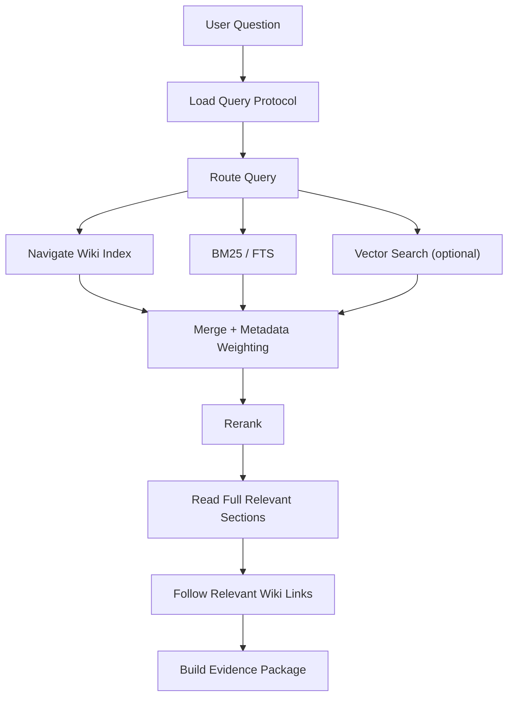
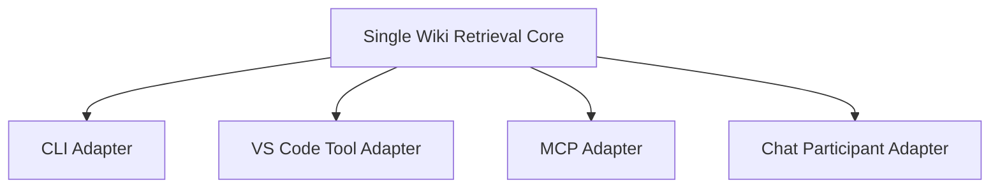

# 13. Retrieval Pipeline

不建议把 LLM Wiki 简化成：

```text
Question → Vector Search → Top-K → Answer
```

更推荐：



---

# 14. Query Routing

Wiki 本身有明显领域：

```text
troubleshooting
runbooks
concepts
```

因此可以先进行低成本 routing。

例如：

```text
502 / timeout / error / failed
→ troubleshooting + runbooks

how to / rollback / deploy / restart
→ runbooks

what is / why / difference / architecture
→ concepts
```

但不要把 routing 仅硬编码成英文关键词。

最终 routing 可以组合：

```text
manifest rules
+ path taxonomy
+ tags
+ aliases
+ index structure
+ lightweight classifier
```

第一版可以无 LLM。

---

# 15. Index-first Retrieval

既然 Wiki 已经存在 Index，那么 Index 应被视作高价值结构信息。

它可以帮助：

- 找到 canonical page；
- 确定分类；
- 减少错误召回；
- 识别父子页面；
- 找到 recommended entrypoint；
- 找到 related pages。

Index 不一定是最终 evidence，但应该影响检索排序。

例如可以增加：

```text
indexReferencedBoost
canonicalBoost
```

---

# 16. BM25 / Full Text Search

第一版强烈建议保留 BM25 / FTS。

Runbook / Troubleshooting 中很多查询具有高词法精度：

```text
HTTP 502
CrashLoopBackOff
ORA-12514
ERR_CONNECTION_RESET
具体内部服务名
告警 Code
配置 Key
日志 Pattern
```

这类搜索 BM25 / exact match 往往比单纯 Vector Search 更稳定。

建议初始 scoring：

```text
score =
    bodyBM25
  + titleExact * W_title
  + aliasExact * W_alias
  + tagMatch * W_tag
  + headingMatch * W_heading
  + domainMatch * W_domain
  + indexReference * W_index
```

权重应该通过 evaluation 调整，而不是长期使用拍脑袋常量。

---

# 17. Vector Search

Vector Search 适用于：

- 用户用词与文档不同；
- 中英文表达差异；
- 语义型概念问题；
- 同义表达；
- 用户描述一个症状但没有准确关键词。

但不推荐：

```text
Vector Search only
```

最终更适合：

```text
Hybrid =
  lexical recall
  + semantic recall
  + Wiki structural metadata
```

---

# 18. Hybrid Merge

建议不要简单把 BM25 score 和 cosine similarity 直接相加，因为尺度不同。

更稳妥的第一版可以使用 rank-based merge，例如 Reciprocal Rank Fusion 思路：

```text
BM25 ranks
Vector ranks
Index ranks
    ↓
rank fusion
    ↓
metadata boost
```

或者做显式归一化。

伪代码：

```ts
function hybridMerge(
  lexical: SearchHit[],
  semantic: SearchHit[],
  indexHits: SearchHit[]
): SearchHit[] {
  const merged = reciprocalRankFuse([
    lexical,
    semantic,
    indexHits
  ]);

  return merged
    .map(hit => applyWikiMetadataBoost(hit))
    .sort((a, b) => b.score - a.score);
}
```

---

# 19. Rerank

第一阶段不一定需要专门 Reranker Model。

可以先规则 rerank：

```text
canonical page
title exact match
domain match
tag match
deprecated penalty
index reference
freshness metadata
page type
```

以后再测试模型 Reranker。

---

# 20. Chunking

建议 Markdown 以 Heading-aware 方式切分，而不是固定字符硬切。

模型：

```ts
interface DocumentChunk {
  id: string;
  path: string;
  pageTitle: string;
  headingPath: string[];
  startLine: number;
  endLine: number;
  content: string;
  metadata: Record<string, unknown>;
}
```

原则：

1. 优先 section boundary；
2. 太大 section 再 token-aware split；
3. 保留父级 heading；
4. 保留 path；
5. 保留 line range；
6. 保留 metadata；
7. 允许少量 overlap。

初始 chunk 可测试：

```text
500 ~ 1000 tokens
```

但不要把它固化为不可调整常数。

---

# 21. Search 不等于 Read

这点非常重要。

`Top-K chunk` 适合定位，但 Runbook 的完整语义往往包含：

- Preconditions
- Warning
- Ordered steps
- Rollback
- Verification
- Stop condition

因此建议拆分：

```text
search
    → 找候选

read
    → 读取候选的完整 section / page
```

Agent 如果只拿到一个中间 chunk，可能错误执行缺失上下文的步骤。

---

# 22. Link Expansion / Wiki Navigation

如果 Wiki 已经有：

```text
see also
related
depends on
parent
runbook
troubleshooting link
```

应利用。

典型：

```text
search → page A
         ↓
     page A says:
     "See runbook B before changing..."
         ↓
     read B
```

第一版可以限制：

```text
maxLinkDepth = 1
maxExpandedPages = 3
```

避免失控。

---

# 23. Evidence Package

Runtime 最重要的输出不是文本答案，而是结构化 Evidence。

建议：

```ts
interface WikiEvidencePackage {
  repository: string;
  branch: string;
  commitSha: string;
  synchronizedAt: string;

  stale: boolean;
  query: string;

  routing?: {
    domains: string[];
    reason?: string;
  };

  matches: WikiEvidence[];

  diagnostics?: RetrievalDiagnostics;
}

interface WikiEvidence {
  id: string;

  path: string;
  title: string;
  headingPath: string[];

  startLine: number;
  endLine: number;

  content: string;

  score: number;

  retrievalMethods: Array<
    | 'index'
    | 'exact'
    | 'bm25'
    | 'vector'
    | 'metadata'
    | 'link'
  >;

  metadata?: {
    tags?: string[];
    deprecated?: boolean;
    canonical?: boolean;
  };
}
```

---

# 24. Tool Design

建议同时考虑四个 Tool，但 MVP 可只先公开高级 Tool。

---

## 24.1 `wiki_query`

Agent 日常调用的主 Tool。

输入：

```json
{
  "question": "Deployment 后出现 502，按什么顺序排查？",
  "topK": 8
}
```

内部：

```text
sync/check freshness
load protocol
route query
search
rerank
read
optional link expansion
build evidence
```

---

## 24.2 `wiki_search`

用于更细粒度 Agentic Search。

输入：

```json
{
  "query": "ingress upstream 502",
  "domains": ["troubleshooting", "runbooks"],
  "topK": 8
}
```

---

## 24.3 `wiki_read`

读取页面 / section。

```json
{
  "path": "troubleshooting/api/502.md",
  "heading": "Check upstream"
}
```

---

## 24.4 `wiki_sync`

手工、诊断或管理用途。

```json
{
  "force": false
}
```

返回：

```json
{
  "previousCommit": "...",
  "currentCommit": "...",
  "changed": true,
  "changedFiles": 7,
  "indexUpdated": true
}
```

---

# 25. 为什么 `wiki_query` 应该是原子 Tool

如果第一版只暴露：

```text
wiki_sync
wiki_search
wiki_read
```

然后完全依赖模型串联：

```text
sync → search → read
```

模型可能：

- 忘记 sync；
- search 完就直接回答；
- read 错页面；
- 没处理 stale。

因此对主路径推荐：

```text
wiki_query
```

内部把关键一致性操作原子化。

同时保留 search/read 作为高级工具。

---

# 26. Language Model Tool Adapter

Tool 应该尽量薄。

示意：

```ts
interface WikiQueryToolInput {
  question: string;
  topK?: number;
}

class WikiQueryTool
  implements vscode.LanguageModelTool<WikiQueryToolInput> {

  constructor(
    private readonly runtime: WikiQueryRuntime
  ) {}

  async invoke(
    options: vscode.LanguageModelToolInvocationOptions<WikiQueryToolInput>,
    token: vscode.CancellationToken
  ): Promise<vscode.LanguageModelToolResult> {

    const question = options.input.question?.trim();

    if (!question) {
      throw new Error('Question must not be empty.');
    }

    const result = await this.runtime.query(
      {
        question,
        topK: options.input.topK ?? 8
      },
      token
    );

    return new vscode.LanguageModelToolResult([
      new vscode.LanguageModelTextPart(
        JSON.stringify(result, null, 2)
      )
    ]);
  }
}
```

它不应该知道 BM25 公式，也不应该复制 Repo Query Algorithm。

---

# 27. Tool Manifest 示例

```json
{
  "contributes": {
    "languageModelTools": [
      {
        "name": "team-wiki_query",
        "displayName": "Query Team LLM Wiki",
        "modelDescription": "Synchronizes if necessary and retrieves authoritative evidence from the configured Team LLM Wiki. Use it before answering team-specific questions about runbooks, troubleshooting, internal concepts, procedures, or architecture. Returns repository commit, file paths, line ranges, and relevant evidence.",
        "userDescription": "Search the Team LLM Wiki.",
        "canBeReferencedInPrompt": true,
        "toolReferenceName": "teamWiki",
        "icon": "$(book)",
        "inputSchema": {
          "type": "object",
          "properties": {
            "question": {
              "type": "string",
              "description": "A self-contained question to retrieve evidence for."
            },
            "topK": {
              "type": "number",
              "description": "Maximum number of primary evidence sections.",
              "default": 8
            }
          },
          "required": ["question"]
        }
      }
    ]
  }
}
```

---

# 28. Existing Repo Script 与 Language Model Tool 的关系

这是讨论中最需要明确的设计。

假设 Wiki 目前已有：

```text
scripts/wiki_query.py
```

那么有三种演进方案。

---

## 28.1 方案 A：Tool 直接执行 Repo Script

MVP 最快。

```text
LM Tool
  ↓
spawn python scripts/wiki_query.py
  ↓
JSON stdout
```

Repo Script 提供稳定 JSON contract：

```bash
python scripts/wiki_query.py \
  --query "..." \
  --top-k 8 \
  --format json
```

### 优点

- 复用最快；
- 不重写已有检索；
- CLI / Copilot 基本一致。

### 缺点

- 需要 Python/runtime dependency；
- 子进程；
- Repo script 可能跟内容一起更新；
- 自动执行最新 Repo 代码存在安全问题；
- VS Code Web 不适用。

### 适合作为

```text
Prototype / internal MVP
```

---

## 28.2 方案 B：提取 Shared Core Library

长期推荐。

如果已有检索逻辑是 TS/JS，尤其适合：

```text
packages/core
packages/cli
packages/vscode-extension
packages/mcp-server
```

所有入口：

```ts
import { WikiRuntime } from '@team/llm-wiki-runtime';
```

### 优点

- 真正单实现；
- 类型安全；
- 无 subprocess；
- 好测试；
- 可以严格版本化。

### 缺点

- 需要重构；
- Python 现有实现需要迁移或跨语言封装。

---

## 28.3 方案 C：Existing Search Runtime → MCP Server

如果现有脚本以 Python 实现，而且未来明显会被多个 Agent Client 使用：

```text
Python Wiki Runtime
     ↓
MCP Server
     ↓
VS Code / Codex / Claude Code
```

此时 VS Code 不一定需要自定义 Language Model Tool。

Custom Agent 可以直接调用 MCP Tool。

### 优点

- Core 仍然只有一份；
- 跨客户端；
- Python 生态可保留。

### 缺点

- 增加 MCP process 生命周期；
- 安装和配置复杂度稍高；
- 本地安全、认证和升级需要设计。

---

# 29. 核心原则：Only One Retrieval Core

错误：

```text
scripts/search.py
  └── BM25 v1

extension/WikiQueryTool.ts
  └── BM25 v2

mcp/server.py
  └── BM25 v3
```

正确：



**“只有一份”指的是只有一份检索业务逻辑，不是只有一个源文件或一个调用入口。**

---

# 30. Runtime 接口草案

```ts
export interface WikiQueryRuntime {
  sync(
    options?: SyncOptions,
    token?: CancellationToken
  ): Promise<WikiVersion>;

  search(
    request: WikiSearchRequest,
    token?: CancellationToken
  ): Promise<WikiSearchResult>;

  read(
    request: WikiReadRequest,
    token?: CancellationToken
  ): Promise<WikiDocument>;

  query(
    request: WikiQueryRequest,
    token?: CancellationToken
  ): Promise<WikiEvidencePackage>;

  status(): Promise<WikiRuntimeStatus>;
}
```

---

# 31. Runtime 内部组件

```text
WikiQueryRuntime
│
├── RepositorySynchronizer
│   ├── GitProvider
│   └── GitHubApiProvider
│
├── WikiProtocolLoader
│   ├── ManifestLoader
│   ├── AgentRulesLoader
│   └── IndexLoader
│
├── ContentLoader
│
├── MarkdownParser
│
├── SearchIndex
│
├── QueryRouter
│
├── ExactRetriever
├── Bm25Retriever
├── VectorRetriever
├── IndexNavigator
│
├── HybridRanker
├── Reranker
│
├── WikiReader
├── LinkExpander
│
├── EvidenceBuilder
└── CitationBuilder
```

---

# 32. Runtime Query 伪代码

```ts
async function query(
  request: WikiQueryRequest,
  token: CancellationToken
): Promise<WikiEvidencePackage> {

  const version = await freshnessManager.ensureFreshEnough(token);

  const protocol = await protocolLoader.load(version);

  const queryPlan = queryRouter.plan(
    request.question,
    protocol
  );

  const lexicalHits = await bm25.search({
    query: queryPlan.searchQuery,
    filters: queryPlan.filters,
    limit: 20
  });

  const indexHits = await indexNavigator.search({
    query: queryPlan.searchQuery,
    domains: queryPlan.domains
  });

  let vectorHits: SearchHit[] = [];

  if (protocol.retrieval.vectorEnabled) {
    vectorHits = await vector.search({
      query: queryPlan.searchQuery,
      filters: queryPlan.filters,
      limit: 20
    });
  }

  const merged = hybridRanker.merge({
    lexicalHits,
    indexHits,
    vectorHits,
    protocol
  });

  const reranked = reranker.rank(
    merged,
    request.topK ?? protocol.retrieval.topK
  );

  const documents = await wikiReader.readRelevantSections(
    reranked,
    token
  );

  const expanded = await linkExpander.expand(
    documents,
    {
      maxDepth: 1,
      maxPages: 3
    },
    token
  );

  return evidenceBuilder.build({
    version,
    question: request.question,
    queryPlan,
    documents: [...documents, ...expanded]
  });
}
```

---

