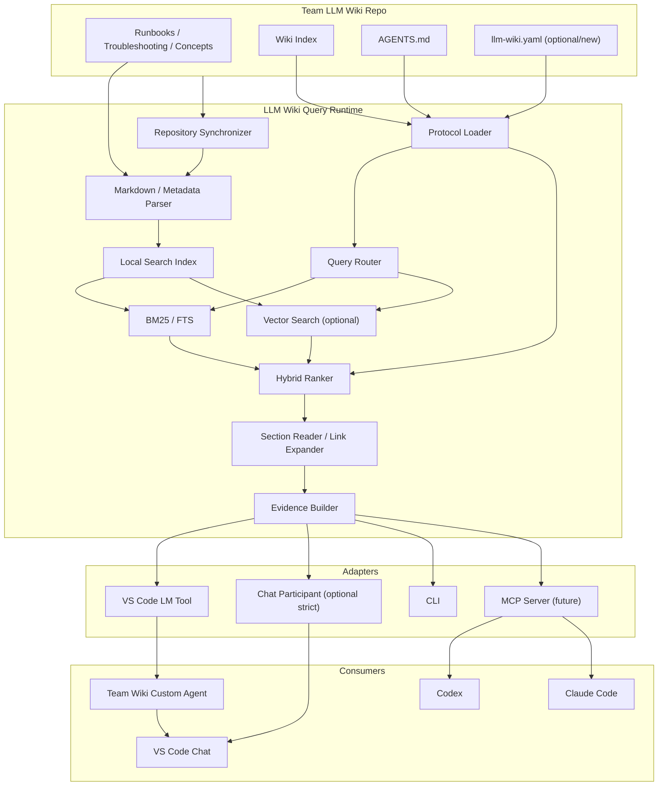

# 76. 推荐开发阶段

## Phase 0：Repo Discovery

在 Codex 中先读取真实 Team LLM Wiki：

- 实际目录；
- Index 格式；
- `agent.md` / `AGENTS.md`；
- 现有搜索脚本；
- 脚本语言；
- 现有输出；
- Repo 大小；
- 文档数量；
- 是否私有；
- GitHub Enterprise；
- 是否已有 metadata schema。

产出：

```text
CURRENT_STATE.md
```

---

## Phase 1：Define Contract

优先定义：

```text
WikiEvidencePackage
WikiSearchResult
WikiVersion
WikiManifest
```

以及：

```text
CLI JSON contract
```

不要先写 VS Code UI。

---

## Phase 2：Runtime MVP

完成：

```text
sync
parse
index
bm25
query
evidence
```

CLI 可运行：

```bash
llm-wiki query "..."
```

---

## Phase 3：VS Code Language Model Tool

实现：

```text
team-wiki_query
```

Custom Agent：

```text
Team Wiki
```

验证真实 Copilot Chat。

---

## Phase 4：Evaluation

建立至少几十条真实团队 Query。

比较：

```text
existing search
BM25
BM25 + metadata
Hybrid
```

之后再决定 Vector。

---

## Phase 5：Advanced Tools

增加：

```text
wiki_search
wiki_read
wiki_sync
```

以及：

```text
debug retrieval
```

---

## Phase 6：Strict Participant（按需）

如果 Tool adherence 不够可靠，再增加：

```text
@teamWikiStrict
```

---

## Phase 7：MCP（按需）

当确认需要多客户端：

```text
Wiki Runtime
  ↓
MCP Adapter
```

---

# 77. MVP Acceptance Criteria

建议至少达到：

### Sync

- [ ] 能配置 Team Wiki Repo；
- [ ] 初次 clone / fetch；
- [ ] 能检测 remote revision；
- [ ] 有 balanced cache fallback；
- [ ] Tool Result 带 Commit SHA。

### Index

- [ ] 能解析实际 Wiki 文档；
- [ ] Heading-aware chunk；
- [ ] 支持 include/exclude；
- [ ] 支持现有 Index；
- [ ] BM25 baseline。

### Query

- [ ] `wiki_query` 返回结构化 evidence；
- [ ] Top-K 有 path / heading / lines；
- [ ] 不返回 deprecated page 作为默认 Top-1（除非真正相关或显式查询）；
- [ ] 支持 cancellation。

### VS Code

- [ ] 注册 Language Model Tool；
- [ ] 提供 Team Wiki Custom Agent；
- [ ] Agent 能基于 Tool 结果回答；
- [ ] 回答能引用 Wiki source。

### Quality

- [ ] 至少一组真实 Query benchmark；
- [ ] 记录 Recall@K；
- [ ] 重要 Runbook 查询 Top-3 命中率可接受。

---

# 78. 需要 Codex 下一步重点回答的问题

以下问题不应该在初次调研中猜测，应该直接检查真实 Repo。

## Repo

1. 实际 LLM Wiki Repo 文件结构是什么？
2. Index 是 Markdown、JSON、YAML 还是自定义格式？
3. `agent.md` / `AGENTS.md` 的确切位置和语义是什么？
4. 当前 search scripts 是什么语言？
5. 当前 search script 的 input/output contract 是什么？
6. 当前 indexing 是否已经预计算？
7. 是否已有 embeddings？
8. 文档规模是多少？
9. 是否存在 frontmatter / tags / aliases？
10. 是否有 page relationships？

## Security

11. Repo 是否私有？
12. GitHub.com 还是 GitHub Enterprise？
13. 用户机器是否能执行 Python？
14. 团队是否允许 Extension 自动执行 Repo code？
15. 是否有企业 VS Code extension policy？

## UX

16. Team Wiki 应该是独立 Agent 还是主要作为普通 Copilot Agent Tool？
17. “必须检索”的 adherence 要求多严格？
18. 是否需要 offline？
19. 是否需要打开 Wiki source 的 UI button？

## Architecture

20. Runtime 是否应独立 Repo？
21. Existing script 是继续使用还是抽 Core？
22. 是否有明确的未来 MCP 需求？
23. 是否需要同时支持 Windows / macOS / Linux？
24. 是否需要 vscode.dev？

---

# 79. 建议让 Codex 首先执行的任务

建议下一轮不要直接让 Codex“开始实现完整插件”。

先给它以下任务：

```text
Read the existing Team LLM Wiki repository in depth.

Focus on:
1. repository structure;
2. existing index design;
3. AGENTS.md / agent instructions;
4. existing retrieval/search scripts;
5. search script inputs and outputs;
6. metadata conventions;
7. current dependencies;
8. update/index generation workflow.

Then compare the current implementation with the attached
"LLM Wiki Search Runtime Initial Technical Research" document.

Produce:
- CURRENT_STATE.md
- GAP_ANALYSIS.md
- ARCHITECTURE_DECISIONS.md
- IMPLEMENTATION_PLAN.md

Do not implement yet.

For every proposed new component, explicitly state whether it:
- reuses an existing component,
- wraps an existing component,
- refactors an existing component,
- or introduces genuinely new logic.

Do not duplicate existing retrieval logic.
```

这是很重要的约束：

> **先做 Current State / Gap Analysis，再写 Runtime。**

---

# 80. Architecture Decision Candidates

后续可以通过 ADR 固化。

建议至少：

```text
ADR-001 Runtime boundary
ADR-002 Repo sync strategy
ADR-003 Runtime language
ADR-004 Existing search script integration
ADR-005 Search index implementation
ADR-006 Retrieval strategy
ADR-007 Evidence schema
ADR-008 VS Code integration model
ADR-009 MCP adoption
ADR-010 Trusted code vs Repo configuration
```

---

# 81. 初步推荐 ADR 倾向

### ADR-001

**Decision:** Retrieval Core independent from VS Code Adapter.

### ADR-002

**Decision:** Local-first Git cache + freshness check.

### ADR-003

**Decision:** 根据 existing search implementation 决定语言，不因 VS Code 强行重写。

### ADR-004

**Decision:** Single retrieval implementation.

### ADR-005

**Decision:** BM25 / FTS baseline first.

### ADR-006

**Decision:** Wiki-aware hybrid retrieval, Vector optional.

### ADR-007

**Decision:** Runtime returns structured evidence, not final answer.

### ADR-008

**Decision:** Custom Agent + Language Model Tool as primary VS Code path.

### ADR-009

**Decision:** MCP deferred until cross-client demand is confirmed.

### ADR-010

**Decision:** Runtime code is trusted/versioned; Repo primarily controls data and declarative retrieval policy.

---

# 82. 最终推荐架构



---

# 83. 核心设计原则汇总

### Principle 1 — Wiki is the source of truth

不要把 Wiki 复制成一个无法对应 Commit 的黑盒知识库。

---

### Principle 2 — Retrieval core is single-source

BM25 / Hybrid / Top-K 逻辑只能维护一份。

---

### Principle 3 — Adapter is thin

VS Code Tool 不应该成为 Search Engine。

---

### Principle 4 — Retrieval before generation

团队事实优先查 Wiki。

---

### Principle 5 — Evidence before answer

Runtime 返回证据，上层 Agent 回答。

---

### Principle 6 — Version every answer

Evidence 必须对应明确 Repo revision。

---

### Principle 7 — Use Wiki structure

Index、Metadata、Aliases、Links 是第一等检索信号。

---

### Principle 8 — BM25 is a baseline, not a fallback

技术 Wiki 需要词法检索。

---

### Principle 9 — Vector is additive

Vector Search 是 semantic recall 补充，不应完全替代精确搜索。

---

### Principle 10 — Code controls execution, Repo controls policy/data

避免知识更新隐式变成任意本地代码更新。

---

### Principle 11 — Prefer local-first MVP

先验证价值，再增加服务端基础设施。

---

### Principle 12 — Make failure explicit

无法同步、Evidence 不足、来源冲突、缓存 stale 都必须显式呈现。

---

# 84. 官方 VS Code / GitHub 能力校准

本次调研在整理阶段对以下当前官方能力重新做了核对：

## VS Code Language Model Tool

官方当前明确支持 Extension 通过 `contributes.languageModelTools` + `vscode.lm.registerTool` 将领域 Tool 加入 Agent workflow。

参考：

- Visual Studio Code — Language Model Tool API  
  https://code.visualstudio.com/api/extension-guides/ai/tools

- Visual Studio Code — Contribution Points / `languageModelTools`  
  https://code.visualstudio.com/api/references/contribution-points

---

## VS Code Custom Agent

当前 Custom Agent 使用 `.agent.md`，可配置：

- instructions
- tools
- model
- subagents
- handoffs
- visibility

Tools 可以包含 extension-contributed tools 和 MCP tools。

参考：

- Visual Studio Code — Custom agents in VS Code  
  https://code.visualstudio.com/docs/agent-customization/custom-agents

---

## Chat Participant

官方明确区分：

- Tool：由模型 / Agent 编排调用；
- Participant：自己处理整个用户 prompt 和 orchestration。

参考：

- Visual Studio Code — Chat Participant API  
  https://code.visualstudio.com/api/extension-guides/ai/chat

- Visual Studio Code — AI Extensibility Overview  
  https://code.visualstudio.com/api/extension-guides/ai/ai-extensibility-overview

---

## MCP

VS Code 当前将 MCP Tool 与 built-in Tool、extension-contributed Tool 作为不同 Tool 来源。

参考：

- Visual Studio Code — MCP developer guide  
  https://code.visualstudio.com/api/extension-guides/ai/mcp

---

## GitHub Conditional Request

GitHub REST API 支持 ETag / Last-Modified 条件请求。正确授权下，如果返回 `304 Not Modified`，该请求不计入 primary REST rate limit。

参考：

- GitHub Docs — Best practices for using the REST API  
  https://docs.github.com/en/rest/using-the-rest-api/best-practices-for-using-the-rest-api

---

# 85. 最终建议

如果现在马上进入 Codex 继续设计，不建议直接从“做 VS Code 插件”开始。

真正的实现顺序应该是：

```text
Step 1
深入读取现有 LLM Wiki Repo

Step 2
确认已有 search/index/runtime 能力

Step 3
定义稳定 Evidence / Query Contract

Step 4
确保检索逻辑只有一份

Step 5
实现或抽取 Wiki Query Runtime

Step 6
提供 CLI 验证 Runtime

Step 7
增加 VS Code Language Model Tool Adapter

Step 8
增加 Team Wiki Custom Agent

Step 9
通过真实 Query Dataset 评估搜索质量

Step 10
根据结果决定 Vector / Chat Participant / MCP
```

最值得坚持的一句话是：

> **Do not build a VS Code search engine. Build a reusable LLM Wiki Query Runtime, then expose it to VS Code through a thin Language Model Tool adapter.**

这可以让当前的 VS Code Copilot Chat 需求成为第一个落地点，而不是把整个架构锁死在 VS Code 中。

---

# 86. 下一阶段预期产物

建议下一阶段在 Codex 中最终形成：

```text
docs/
├── CURRENT_STATE.md
├── GAP_ANALYSIS.md
├── REQUIREMENTS.md
├── ARCHITECTURE.md
├── RETRIEVAL_DESIGN.md
├── SECURITY.md
├── IMPLEMENTATION_PLAN.md
└── adr/
    ├── 001-runtime-boundary.md
    ├── 002-sync-strategy.md
    ├── 003-runtime-language.md
    ├── 004-retrieval-core.md
    └── ...
```

在这些文档完成之前，避免过早绑定：

- Vector DB；
- Python vs TypeScript；
- MCP；
- 独立服务；
- Chat Participant；
- 容器。

应该先让真实 Repo 现状决定设计。

---

# Appendix A — 最小 Runtime API 草案

```ts
export interface WikiVersion {
  repository: string;
  branch: string;
  commitSha: string;
  synchronizedAt: string;
  stale: boolean;
}

export interface WikiSearchRequest {
  query: string;
  domains?: string[];
  topK?: number;
}

export interface WikiReadRequest {
  path: string;
  heading?: string;
}

export interface WikiQueryRequest {
  question: string;
  topK?: number;
}

export interface WikiEvidence {
  id: string;
  path: string;
  title: string;
  headingPath: string[];
  startLine: number;
  endLine: number;
  content: string;
  score: number;
  retrievalMethods: string[];
}

export interface WikiEvidencePackage extends WikiVersion {
  query: string;
  matches: WikiEvidence[];
}

export interface WikiQueryRuntime {
  sync(options?: {
    force?: boolean;
  }): Promise<WikiVersion>;

  search(
    request: WikiSearchRequest
  ): Promise<WikiEvidencePackage>;

  read(
    request: WikiReadRequest
  ): Promise<WikiEvidence>;

  query(
    request: WikiQueryRequest
  ): Promise<WikiEvidencePackage>;
}
```

---

# Appendix B — Minimal VS Code Tool Adapter

```ts
import * as vscode from 'vscode';
import {
  WikiQueryRuntime,
  WikiEvidencePackage
} from '@team/llm-wiki-runtime';

interface WikiQueryInput {
  question: string;
  topK?: number;
}

export class WikiQueryTool
  implements vscode.LanguageModelTool<WikiQueryInput> {

  constructor(
    private readonly runtime: WikiQueryRuntime
  ) {}

  async invoke(
    options: vscode.LanguageModelToolInvocationOptions<WikiQueryInput>,
    token: vscode.CancellationToken
  ): Promise<vscode.LanguageModelToolResult> {

    const question = options.input.question?.trim();

    if (!question) {
      throw new Error(
        'Wiki query question must not be empty.'
      );
    }

    const result: WikiEvidencePackage =
      await this.runtime.query({
        question,
        topK: options.input.topK ?? 8
      });

    return new vscode.LanguageModelToolResult([
      new vscode.LanguageModelTextPart(
        JSON.stringify(result, null, 2)
      )
    ]);
  }
}
```

---

# Appendix C — Existing Python Script Adapter 草案

如果当前 Repo 已有 Python Search：

```ts
import { spawn } from 'node:child_process';

async function runExistingWikiSearch(
  repoPath: string,
  question: string,
  topK: number,
  token: vscode.CancellationToken
): Promise<WikiEvidencePackage> {

  return await new Promise((resolve, reject) => {

    const child = spawn(
      'python',
      [
        'scripts/wiki_query.py',
        '--query',
        question,
        '--top-k',
        String(topK),
        '--format',
        'json'
      ],
      {
        cwd: repoPath,
        shell: false,
        windowsHide: true
      }
    );

    let stdout = '';
    let stderr = '';

    child.stdout.setEncoding('utf8');
    child.stderr.setEncoding('utf8');

    child.stdout.on('data', chunk => {
      stdout += chunk;
    });

    child.stderr.on('data', chunk => {
      stderr += chunk;
    });

    const disposable =
      token.onCancellationRequested(() => {
        child.kill();
      });

    child.on('error', error => {
      disposable.dispose();
      reject(error);
    });

    child.on('close', code => {
      disposable.dispose();

      if (code !== 0) {
        reject(
          new Error(
            `Wiki search exited with ${code}: ${stderr}`
          )
        );
        return;
      }

      try {
        const parsed = JSON.parse(stdout);

        // TODO:
        // validate parsed with a stable schema
        // before returning it.

        resolve(parsed);
      } catch (error) {
        reject(
          new Error(
            `Invalid Wiki search JSON: ${String(error)}`
          )
        );
      }
    });
  });
}
```

这只是过渡 Adapter，不应该演变成第二套 Search Engine。

---

# Appendix D — Codex Continuation Prompt 草案

```text
We are designing an LLM Wiki Search Runtime for an existing
team-managed GitHub LLM Wiki.

Read this technical research document first, then deeply inspect
the actual Wiki repository.

Important architectural constraint:

There must be exactly one canonical retrieval implementation.
Do not duplicate BM25, ranking, routing, indexing, or evidence
construction logic inside the VS Code Language Model Tool.

The VS Code tool should be a thin adapter around the retrieval
runtime or the existing canonical search implementation.

First produce:

1. CURRENT_STATE.md
2. GAP_ANALYSIS.md
3. ARCHITECTURE_DECISIONS.md
4. IMPLEMENTATION_PLAN.md

Do not implement before those documents are complete.

For each current search/index component, determine whether the
new design should:

- reuse it unchanged;
- wrap it;
- refactor it into a reusable core;
- replace it, with explicit justification.

Investigate in particular:

- current index design;
- AGENTS.md / agent rules;
- current retrieval scripts;
- script input/output contracts;
- content metadata;
- update/index workflows;
- dependencies and runtime language;
- repository size;
- security implications of executing repository scripts.

Prefer a local-first architecture unless the actual repository
or operating constraints justify a service.

Treat VS Code Copilot as the first adapter, not as the owner of
the retrieval architecture.
```

---

**End of initial research report.**
